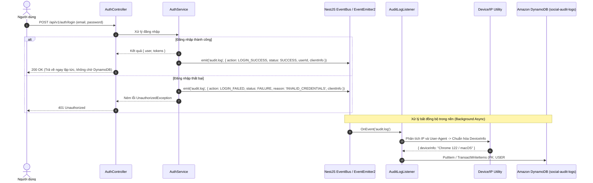

# Thiết kế cơ bản (Basic Design): Module Audit Logs (Lưu trữ độc quyền trên Amazon DynamoDB)

Tài liệu thiết kế cơ bản cho hệ thống ghi vết kiểm toán (**Audit Log System**), chịu trách nhiệm theo dõi, ghi nhận và lưu trữ toàn bộ các thao tác nhạy cảm liên quan đến danh tính và an ninh tài khoản (**Đăng nhập, Đăng xuất, Đổi mật khẩu, Cấp lại token**) cho hệ thống Social Network API. 

Toàn bộ dữ liệu kiểm toán được lưu trữ **độc quyền trên Amazon DynamoDB** (`social-audit-logs`), tận dụng khả năng co giãn không giới hạn (Serverless Auto-scaling), độ trễ đọc/ghi < 10ms và tính năng tự động thu hồi dữ liệu qua **Time-To-Live (TTL)**.

---

## 1. Tổng quan & Mục tiêu

Hệ thống **Audit Logs** đóng vai trò là xương sống cho việc giám sát an ninh (Security Monitoring), phát hiện xâm nhập (Intrusion Detection) và đáp ứng các tiêu chuẩn an toàn thông tin:
- **Ghi nhận toàn bộ thao tác xác thực & bảo mật tài khoản**:
  - `LOGIN_SUCCESS`: Đăng nhập thành công.
  - `LOGIN_FAILED`: Đăng nhập thất bại (ghi nhận lý do: sai mật khẩu, tài khoản không tồn tại, tài khoản bị khóa).
  - `LOGOUT`: Đăng xuất khỏi hệ thống.
  - `REFRESH_TOKEN`: Cấp mới Access Token bằng Refresh Token.
  - `CHANGE_PASSWORD_SUCCESS`: Đổi mật khẩu thành công.
  - `CHANGE_PASSWORD_FAILED`: Đổi mật khẩu thất bại.
  - `FORGOT_PASSWORD_REQUEST`: Yêu cầu gửi mã đặt lại mật khẩu.
  - `RESET_PASSWORD_SUCCESS`: Đặt lại mật khẩu thành công.
- **Thu thập ngữ cảnh toàn diện (Contextual Metadata)**:
  - Địa chỉ IP thực của người dùng (`ip_address`).
  - Chuỗi định danh thiết bị & trình duyệt (`user_agent`, `device_info`).
  - Thời gian thực hiện chuẩn UTC (`created_at`).
  - Dữ liệu bổ sung dạng JSON (`metadata`).
- **Nguyên tắc kiến trúc cốt lõi**:
  - **Lưu trữ độc quyền trên Amazon DynamoDB**: Toàn bộ thao tác ghi và đọc nhật ký kiểm toán tương tác trực tiếp với bảng DynamoDB `social-audit-logs` (được cấu hình và triển khai qua SST), hoàn toàn không lưu vào PostgreSQL nhằm tránh phình to cơ sở dữ liệu quan hệ chính.
  - **Phi chặn (Non-blocking & Asynchronous)**: Ghi log hoàn toàn bất đồng bộ thông qua Event Bus (`EventEmitter2`), tách biệt micro-task trong nền, không làm tăng độ trễ (latency) của API đăng nhập.
  - **Tính bất biến (Append-Only / Tamper-Proof)**: Dữ liệu audit log chỉ được phép thêm mới (`PutItem`) và truy vấn (`Query`/`GetItem`), cấm hoàn toàn hành vi sửa đổi (`UpdateItem`) hoặc xóa thủ công (`DeleteItem`) thông qua chính sách phân quyền IAM Policy.
  - **Tự động hết hạn (Native DynamoDB TTL)**: Thuộc tính `ttl` (Unix timestamp) giúp DynamoDB tự động dọn dẹp các bản ghi quá 90 ngày với chi phí 0 đồng.

---

## 2. Mô hình dữ liệu trên Amazon DynamoDB (Single-Table Design)

Bảng DynamoDB sử dụng tài nguyên đã định nghĩa trong `sst.config.ts`:
- **Tên bảng**: `social-audit-logs` (biến môi trường `AWS_DYNAMODB_AUDIT_LOG_TABLE_NAME`).
- **Partition Key (PK)**: `String (S)`
- **Sort Key (SK)**: `String (S)`
- **TTL**: Thuộc tính `ttl` (Number - Epoch timestamp tính bằng giây).

### 2.1. Cấu trúc Partition Key (PK) & Sort Key (SK)

| Thực thể / Mục đích truy vấn | Partition Key (PK) | Sort Key (SK) | Các thuộc tính dữ liệu khác (Attributes) |
| :--- | :--- | :--- | :--- |
| **Lịch sử người dùng** *(User Audit Timeline)* | `USER#{userId}` | `LOG#{createdAt}#{logId}` | `logId`, `userId`, `identifier`, `category`, `action`, `status`, `ipAddress`, `userAgent`, `deviceInfo`, `failureReason`, `metadata`, `createdAt`, `ttl` |
| **Lịch sử đăng nhập ẩn danh / thất bại** *(Identifier Timeline)* | `IDENTIFIER#{identifier}` | `LOG#{createdAt}#{logId}` | Tương tự bản ghi User |
| **Tra cứu trực tiếp theo ID** *(Direct Lookup by Log ID)* | `LOG#{logId}` | `METADATA` | Toàn bộ thông tin chi tiết của bản ghi kiểm toán |
| **Dòng thời gian hệ thống theo tháng** *(Admin Timeline)* | `SYSTEM_LOGS#{YYYY-MM}` | `TIMESTAMP#{createdAt}#{logId}` | Toàn bộ thông tin bản ghi phục vụ Admin tra cứu theo tháng |
| **Bộ đếm phát hiện Brute-Force** *(Security Sliding Window)* | `FAILED#{identifier}` | `TIMESTAMP#{createdAt}#{logId}` | `identifier`, `ipAddress`, `createdAt`, `ttl` (15 phút) |
| **Bộ đếm IP bất thường** *(IP Anomaly Counter)* | `FAILED_IP#{ipAddress}` | `TIMESTAMP#{createdAt}#{logId}` | `identifier`, `ipAddress`, `createdAt`, `ttl` (15 phút) |

---

### 2.2. Các Enums liên quan

```typescript
export enum AuditCategory {
  AUTH = 'AUTH',
  ACCOUNT_SECURITY = 'ACCOUNT_SECURITY',
  ADMIN_ACTION = 'ADMIN_ACTION',
}

export enum AuditAction {
  LOGIN_SUCCESS = 'LOGIN_SUCCESS',
  LOGIN_FAILED = 'LOGIN_FAILED',
  LOGOUT = 'LOGOUT',
  REFRESH_TOKEN = 'REFRESH_TOKEN',
  CHANGE_PASSWORD_SUCCESS = 'CHANGE_PASSWORD_SUCCESS',
  CHANGE_PASSWORD_FAILED = 'CHANGE_PASSWORD_FAILED',
  FORGOT_PASSWORD_REQUEST = 'FORGOT_PASSWORD_REQUEST',
  RESET_PASSWORD_SUCCESS = 'RESET_PASSWORD_SUCCESS',
}

export enum AuditStatus {
  SUCCESS = 'SUCCESS',
  FAILURE = 'FAILURE',
}
```

---

## 3. Kiến trúc luồng xử lý phi chặn (Asynchronous Architecture)



---

## 4. Đặc tả API Endpoints

Tiền tố chung: `/api/v1/audit-logs`

### 4.1. `GET /api/v1/audit-logs/me`
- **Mô tả**: Cho phép người dùng đang đăng nhập xem lịch sử bảo mật cá nhân (các lần đăng nhập gần đây, đổi mật khẩu).
- **Quyền truy cập**: Authenticated (`Bearer <accessToken>`).
- **Query Params**:
  - `limit`: Số bản ghi (mặc định: `10`, tối đa: `50`).
  - `cursor`: Chuỗi con trỏ DynamoDB (`LastEvaluatedKey` mã hóa base64) cho trang tiếp theo.
- **DynamoDB Operation**: `QueryCommand`:
  - `PK = USER#{userId} AND SK begins_with "LOG#"`
  - `ScanIndexForward = false` (sắp xếp giảm dần theo thời gian)
- **Response**: `200 OK`

---

### 4.2. `GET /api/v1/audit-logs` (Dành cho Quản trị viên - Admin Portal)
- **Mô tả**: Xem và lọc nhật ký kiểm toán trong hệ thống.
- **Quyền truy cập**: Authenticated & Role `ADMIN` (`@Roles('ADMIN')`).
- **Query Params**:
  - `userId`: Lọc theo ID người dùng (`PK = USER#{userId}`).
  - `identifier`: Tìm kiếm theo email (`PK = IDENTIFIER#{identifier}`).
  - `month`: Tháng cần tra cứu (định dạng `YYYY-MM`, mặc định tháng hiện tại: `PK = SYSTEM_LOGS#{YYYY-MM}`).
  - `action`: Lọc theo hành động (`LOGIN_FAILED`, `CHANGE_PASSWORD_SUCCESS`,...).
  - `status`: Lọc theo kết quả (`SUCCESS`, `FAILURE`).
  - `ipAddress`: Lọc theo địa chỉ IP nghi vấn.
  - `limit`: Số bản ghi mỗi trang (mặc định: `20`, tối đa: `100`).
  - `cursor`: Chuỗi con trỏ DynamoDB phân trang.
- **Response**: `200 OK`

---

### 4.3. `GET /api/v1/audit-logs/:id`
- **Mô tả**: Xem chi tiết 1 bản ghi kiểm toán kèm toàn bộ chuỗi metadata.
- **Quyền truy cập**: Authenticated (`ADMIN` hoặc chính chủ sở hữu bản ghi log).
- **DynamoDB Operation**: `GetCommand`:
  - `Key: { PK: "LOG#" + id, SK: "METADATA" }` (Truy xuất tức thời O(1))
- **Response**: `200 OK`

---

## 5. Quy chuẩn an ninh & Hiệu năng Amazon DynamoDB

1. **Bảo toàn dữ liệu kiểm toán (Tamper-Proof IAM Policy)**:
   - AWS IAM Role của ứng dụng (`social-api-role`) chỉ được cấp các quyền `dynamodb:PutItem`, `dynamodb:GetItem`, `dynamodb:Query`, `dynamodb:Scan` trên ARN bảng `arn:aws:dynamodb:*:table/social-audit-logs`.
   - Quyền `dynamodb:DeleteItem` và `dynamodb:UpdateItem` bị **DENY** tuyệt đối.
2. **Cơ chế phát hiện Brute-Force tốc độ cao**:
   - Dựa trên item `FAILED#{identifier}` với TTL = 15 phút:
   - Khi có sự kiện `LOGIN_FAILED`, thực hiện `QueryCommand` đếm số bản ghi trong 10 phút gần nhất.
   - Nếu `>= 5` lần đăng nhập thất bại -> Gắn cờ cảnh báo an ninh và kích hoạt Rate Limiter.
3. **Quản lý vòng đời dữ liệu tự động (Zero-Cost TTL Cleanup)**:
   - Mọi bản ghi kiểm toán đều có trường `ttl = Math.floor(Date.now() / 1000) + (90 * 86400)`.
   - DynamoDB tự động thu hồi và giải phóng dung lượng bản ghi cũ sau 90 ngày mà không tiêu tốn Read/Write Capacity Unit (RCU/WCU).
