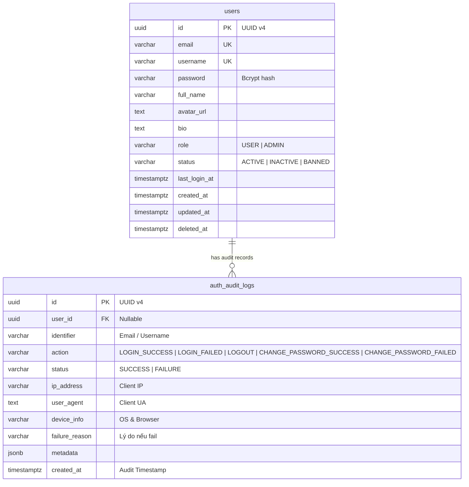
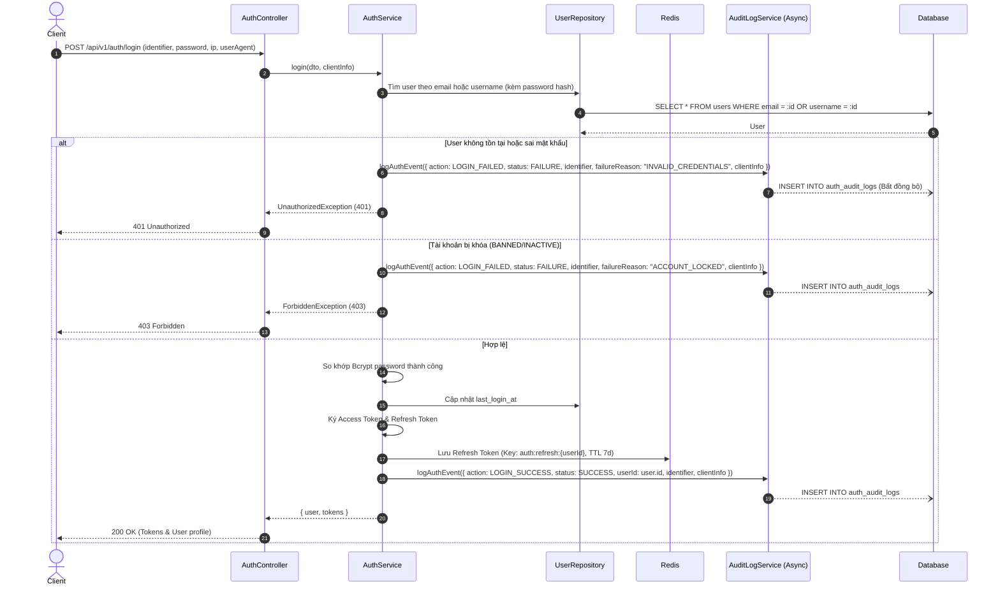
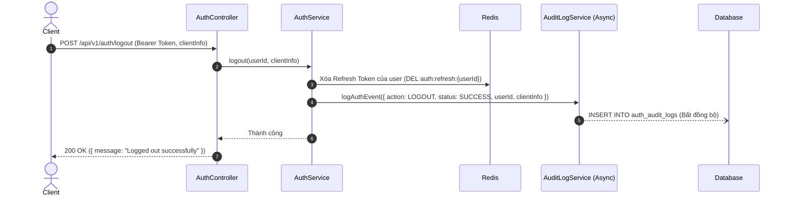
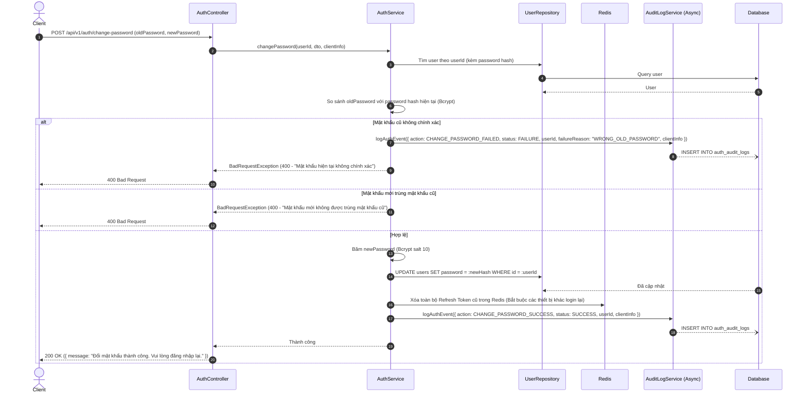

# Thiết kế cơ bản (Basic Design): Module Authentication & Audit Log

Tài liệu thiết kế cơ bản cho chức năng xác thực người dùng (**Authentication - Login, Register, Logout, Change Password**), mô hình dữ liệu người dùng (**User Model**) và hệ thống ghi vết kiểm toán bảo mật (**Auth Audit Log**) cho hệ thống Social Network API.

---

## 1. Tổng quan & Mục tiêu

Module **Authentication** chịu trách nhiệm quản lý danh tính, phiên truy cập và bảo mật tài khoản người dùng:
- Cung cấp cơ chế đăng ký tài khoản mới (`Register`) với xác thực dữ liệu chặt chẽ.
- Cung cấp cơ chế đăng nhập (`Login`) cấp phát cặp token **JWT (Access Token & Refresh Token)**.
- Quản lý trạng thái phiên làm việc, hỗ trợ làm mới token (`Refresh Token`) và đăng xuất (`Logout`) thông qua Redis.
- Cung cấp chức năng đổi mật khẩu (`Change Password`) an toàn, tự động thu hồi (revoke) các phiên đăng nhập cũ.
- **Hệ thống Ghi vết kiểm toán (Auth Audit Log)**:
  - Tự động ghi nhận mọi thao tác nhạy cảm liên quan đến danh tính: `LOGIN_SUCCESS`, `LOGIN_FAILED`, `LOGOUT`, `CHANGE_PASSWORD_SUCCESS`, `CHANGE_PASSWORD_FAILED`.
  - Thu thập đầy đủ thông tin: địa chỉ IP (`ip_address`), tác nhân người dùng (`user_agent`), thiết bị (`device_info`), thời điểm thực hiện và lý do lỗi (nếu thất bại).
  - Vận hành theo cơ chế phi chặn (Asynchronous / Non-blocking) đảm bảo không gây suy giảm hiệu năng của các luồng xử lý chính.

---

## 2. Mô hình dữ liệu (Data Model)

Kế thừa cấu trúc từ `BaseEntity` (`id` UUID v4, `created_at`, `updated_at`, `deleted_at`).

### 2.1. Bảng `users`
Kế thừa cấu trúc từ `BaseEntity` (`id` UUID, `created_at`, `updated_at`, `deleted_at`).

| Tên cột | Kiểu dữ liệu | Bắt buộc | Khóa / Chỉ mục | Mô tả / Giá trị mặc định |
| :--- | :--- | :---: | :---: | :--- |
| `id` | UUID | Có | PK | Khóa chính tự sinh (UUID v4) |
| `email` | VARCHAR(255) | Có | Unique, Index | Email đăng nhập & liên lạc |
| `username` | VARCHAR(50) | Có | Unique, Index | Định danh duy nhất trên mạng xã hội (@username) |
| `password` | VARCHAR(255) | Có | - | Mật khẩu đã băm (Bcrypt), ẩn mặc định (`select: false`) |
| `full_name` | VARCHAR(100) | Có | - | Tên hiển thị người dùng |
| `avatar_url` | TEXT | Không | - | URL ảnh đại diện |
| `bio` | TEXT | Không | - | Tiểu sử / Giới thiệu bản thân |
| `role` | VARCHAR(20) | Có | - | Vai trò: `USER`, `ADMIN` (mặc định: `USER`) |
| `status` | VARCHAR(20) | Có | Index | Trạng thái: `ACTIVE`, `INACTIVE`, `BANNED` (mặc định: `ACTIVE`) |
| `last_login_at` | TIMESTAMPTZ | Không | - | Thời gian đăng nhập gần nhất |
| `created_at` | TIMESTAMPTZ | Có | - | Thời gian tạo tài khoản |
| `updated_at` | TIMESTAMPTZ | Có | - | Thời gian cập nhật gần nhất |
| `deleted_at` | TIMESTAMPTZ | Không | - | Thời gian xóa mềm (soft delete) |

---

### 2.2. Bảng `auth_audit_logs` (Nhật ký kiểm toán bảo mật)

Ghi nhận toàn bộ thao tác liên quan đến đăng nhập, đăng xuất và đổi mật khẩu:

| Tên cột | Kiểu dữ liệu | Bắt buộc | Khóa / Chỉ mục | Mô tả / Giá trị mặc định |
| :--- | :--- | :---: | :---: | :--- |
| `id` | UUID | Có | PK | Khóa chính tự sinh (UUID v4) |
| `user_id` | UUID | Không | FK, Index | ID người dùng thực hiện (null nếu login thất bại không rõ user) |
| `identifier` | VARCHAR(255) | Có | Index | Email hoặc username người dùng nhập khi thực hiện hành động |
| `action` | VARCHAR(50) | Có | Index | Hành vi: `LOGIN_SUCCESS`, `LOGIN_FAILED`, `LOGOUT`, `CHANGE_PASSWORD_SUCCESS`, `CHANGE_PASSWORD_FAILED` |
| `status` | VARCHAR(20) | Có | Index | Kết quả thao tác: `SUCCESS`, `FAILURE` |
| `ip_address` | VARCHAR(45) | Có | - | Địa chỉ IP của Client (IPv4 hoặc IPv6) |
| `user_agent` | TEXT | Không | - | Chuỗi User-Agent từ Header trình duyệt/app |
| `device_info` | VARCHAR(150) | Không | - | Tên thiết bị/hệ điều hành rút trích (ví dụ: `iOS App`, `Chrome / macOS`) |
| `failure_reason` | VARCHAR(255) | Không | - | Lý do lỗi (ví dụ: `INVALID_CREDENTIALS`, `ACCOUNT_BANNED`, `WRONG_OLD_PASSWORD`) |
| `metadata` | JSONB | Không | - | Dữ liệu phụ trợ bổ sung |
| `created_at` | TIMESTAMPTZ | Có | Index (DESC) | Thời điểm ghi nhận bản ghi nhật ký |

---

### 2.3. Các Enums liên quan

```typescript
export enum UserRole {
  USER = 'USER',
  ADMIN = 'ADMIN',
}

export enum UserStatus {
  ACTIVE = 'ACTIVE',
  INACTIVE = 'INACTIVE',
  BANNED = 'BANNED',
}

export enum AuthAuditAction {
  LOGIN_SUCCESS = 'LOGIN_SUCCESS',
  LOGIN_FAILED = 'LOGIN_FAILED',
  LOGOUT = 'LOGOUT',
  CHANGE_PASSWORD_SUCCESS = 'CHANGE_PASSWORD_SUCCESS',
  CHANGE_PASSWORD_FAILED = 'CHANGE_PASSWORD_FAILED',
}

export enum AuditStatus {
  SUCCESS = 'SUCCESS',
  FAILURE = 'FAILURE',
}
```

---

### 2.4. Sơ đồ thực thể quan hệ (ERD)



---

## 3. Luồng xử lý nghiệp vụ & Audit Logging

### 3.1. Luồng Đăng nhập (Login) kèm Ghi nhận Audit Log



---

### 3.2. Luồng Đăng xuất (Logout) kèm Ghi nhận Audit Log



---

### 3.3. Luồng Đổi mật khẩu (Change Password) kèm Ghi nhận Audit Log



---

## 4. Đặc tả API Endpoints

Tất cả các route tuân thủ tiền tố chung: `/api/v1/auth`

### 4.1. `POST /api/v1/auth/register`
- **Mô tả**: Đăng ký người dùng mới.
- **Quyền truy cập**: Public (`@Public()`).
- **Request Body**:
  ```json
  {
    "email": "user@example.com",
    "username": "user123",
    "password": "StrongPassword@123",
    "fullName": "Nguyen Van A"
  }
  ```
- **Response**: `201 Created`

---

### 4.2. `POST /api/v1/auth/login`
- **Mô tả**: Đăng nhập lấy cặp JWT token. Tự động ghi lại `auth_audit_logs` (thành công hoặc thất bại).
- **Quyền truy cập**: Public (`@Public()`).
- **Request Body**:
  ```json
  {
    "identifier": "user@example.com",
    "password": "StrongPassword@123"
  }
  ```
- **Response**: `200 OK`
  ```json
  {
    "statusCode": 200,
    "data": {
      "user": {
        "id": "b6a82741-2cbe-4c4f-a9cb-b61005d58ff3",
        "email": "user@example.com",
        "username": "user123",
        "fullName": "Nguyen Van A",
        "avatarUrl": null,
        "role": "USER",
        "status": "ACTIVE"
      },
      "tokens": {
        "accessToken": "eyJhbGciOi...",
        "refreshToken": "eyJhbGciOi...",
        "expiresIn": 900
      }
    }
  }
  ```

---

### 4.3. `POST /api/v1/auth/change-password`
- **Mô tả**: Đổi mật khẩu tài khoản đang đăng nhập. Hủy toàn bộ token cũ và ghi vết vào `auth_audit_logs`.
- **Quyền truy cập**: Authenticated (`Bearer <accessToken>`).
- **Request Body**:
  ```json
  {
    "oldPassword": "StrongPassword@123",
    "newPassword": "NewStrongPassword@456"
  }
  ```
- **Validation**:
  - `oldPassword`: không được để trống.
  - `newPassword`: tối thiểu 8 ký tự, gồm ít nhất 1 chữ hoa, 1 chữ thường, 1 chữ số, 1 ký tự đặc biệt, không trùng `oldPassword`.
- **Response**: `200 OK`
  ```json
  {
    "statusCode": 200,
    "data": {
      "message": "Đổi mật khẩu thành công. Các phiên đăng nhập trước đó đã được thu hồi."
    }
  }
  ```

---

### 4.4. `POST /api/v1/auth/logout`
- **Mô tả**: Đăng xuất, hủy phiên Redis và ghi vết vào `auth_audit_logs`.
- **Quyền truy cập**: Authenticated (`Bearer <accessToken>`).
- **Response**: `200 OK`
  ```json
  {
    "statusCode": 200,
    "data": {
      "message": "Logged out successfully"
    }
  }
  ```

---

### 4.5. `GET /api/v1/auth/audit-logs`
- **Mô tả**: Xem lịch sử các thao tác bảo mật (đăng nhập, đổi mật khẩu, đăng xuất) của tài khoản hiện tại.
- **Quyền truy cập**: Authenticated (`Bearer <accessToken>`).
- **Query Params**:
  - `page`: Trang (mặc định: `1`).
  - `limit`: Số bản ghi (mặc định: `10`).
- **Response**: `200 OK`
  ```json
  {
    "statusCode": 200,
    "data": {
      "items": [
        {
          "id": "e9b110a2-11cf-49b8-a764-98124801fe1a",
          "action": "LOGIN_SUCCESS",
          "status": "SUCCESS",
          "ipAddress": "14.241.23.10",
          "deviceInfo": "Chrome / macOS",
          "createdAt": "2026-10-02T19:00:00.000Z"
        },
        {
          "id": "c1f7a220-410a-4fa4-9a87-321ba68194de",
          "action": "CHANGE_PASSWORD_SUCCESS",
          "status": "SUCCESS",
          "ipAddress": "14.241.23.10",
          "deviceInfo": "Chrome / macOS",
          "createdAt": "2026-10-02T18:45:00.000Z"
        },
        {
          "id": "84a921d0-30aa-4efb-88cb-11239801ecb2",
          "action": "LOGIN_FAILED",
          "status": "FAILURE",
          "failureReason": "INVALID_CREDENTIALS",
          "ipAddress": "113.161.40.55",
          "deviceInfo": "Unknown Device / Linux",
          "createdAt": "2026-10-02T18:30:00.000Z"
        }
      ],
      "meta": {
        "totalItems": 15,
        "currentPage": 1,
        "totalPages": 2
      }
    }
  }
  ```

---

## 5. Quy chuẩn kỹ thuật & Bảo mật Audit Log

1. **Hiệu năng phi chặn (Non-blocking & Asynchronous)**:
   - Việc ghi bản ghi vào bảng `auth_audit_logs` được thực hiện thông qua cơ chế bất đồng bộ (ví dụ: NestJS `EventEmitter2` phát ra event `@OnEvent('auth.audit')` hoặc đưa vào Redis Queue/AWS SQS worker).
   - Đảm bảo lỗi khi ghi log database không làm gián đoạn luồng trả về kết quả đăng nhập / đổi mật khẩu cho client.
2. **Thu thập thông tin thiết bị**:
   - Trích xuất địa chỉ IP thực từ `req.headers['x-forwarded-for']` hoặc `req.socket.remoteAddress`.
   - Phân tích User-Agent để phát hiện bất thường: hệ điều hành lạ, phiên đăng nhập từ IP khác biệt đột ngột để cảnh báo người dùng.
3. **Bảo toàn dữ liệu kiểm toán (Tamper-Proof & Retention)**:
   - Các bản ghi trong `auth_audit_logs` chỉ cho phép quyền `INSERT` và `SELECT`, nghiêm cấm `UPDATE` hoặc `DELETE` trực tiếp để đảm bảo tính pháp lý và tính toàn vẹn của dữ liệu kiểm toán.
   - Định kỳ có chính sách sao lưu và lưu trữ sang kho lạnh (S3 Glacier) sau 90 ngày hoặc 1 năm.
