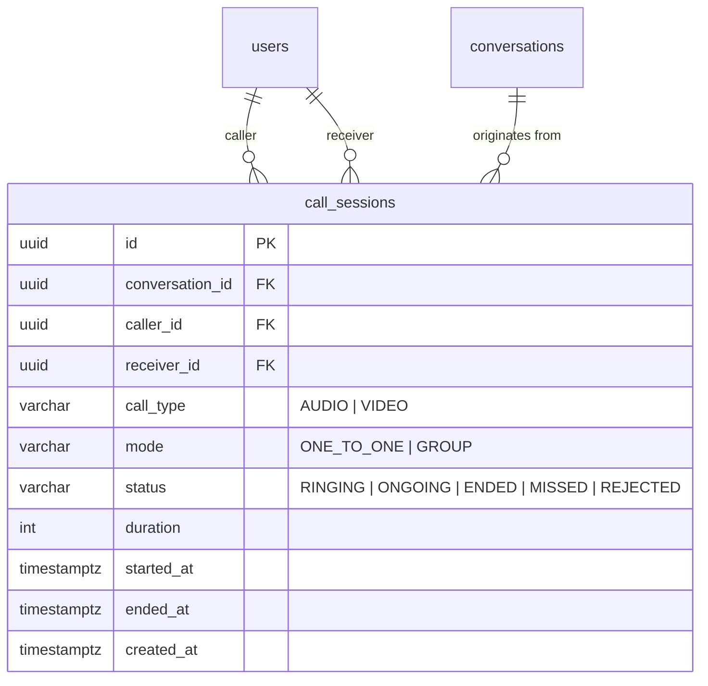
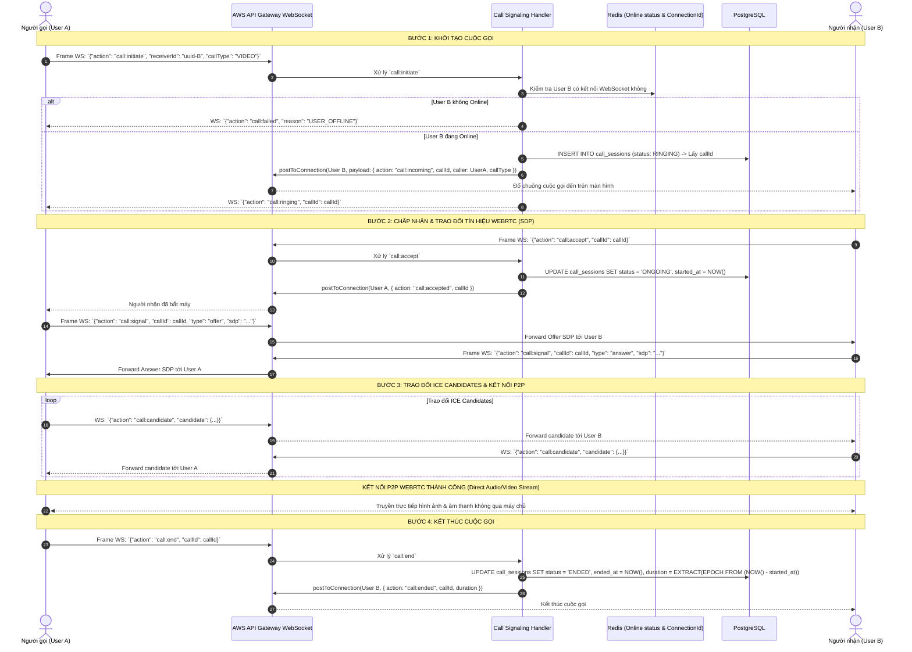

# Thiết kế cơ bản (Basic Design): Module Call Video (Cuộc gọi Video 1-1 & Nhóm qua WebRTC & AWS WebSocket Signaling)

Tài liệu thiết kế cơ bản cho chức năng gọi thoại và gọi video trực tuyến (**Audio & Video Call**), kết hợp giữa công nghệ **WebRTC (Peer-to-Peer Streaming)** và cơ chế truyền phát tín hiệu (**Signaling via AWS API Gateway WebSocket**).

---

## 1. Tổng quan & Mục tiêu

Module **Call Video** cho phép người dùng thực hiện các cuộc gọi thoại/video chất lượng cao, độ trễ cực thấp:
- **Cuộc gọi 1-1 (Direct Call)**: Giữa 2 người bạn trên hệ thống.
- **Cuộc gọi Nhóm (Group Call)**: Trong nhóm chat chung (hỗ trợ mở rộng).
- **WebRTC (Real-time Communication)**: Luồng âm thanh và hình ảnh truyền trực tiếp giữa các thiết bị (Peer-to-Peer), đảm bảo tính riêng tư và không tốn băng thông truyền media của máy chủ.
- **AWS API Gateway WebSocket Signaling**: Đóng vai trò máy chủ định tuyến tín hiệu ban đầu (Signaling Server):
  - Thông báo cuộc gọi đến thời gian thực (`call:incoming`).
  - Phản hồi nhận cuộc gọi (`call:accept`) hoặc từ chối (`call:reject`).
  - Trao đổi cấu hình mạng và codec (SDP Offer / SDP Answer).
  - Trao đổi địa chỉ kết nối mạng (ICE Candidates qua STUN/TURN server).
  - Báo kết thúc cuộc gọi (`call:end`).
- **Lưu trữ Lịch sử cuộc gọi**: Ghi nhận thời lượng cuộc gọi, trạng thái kết thúc (thành công, cuộc gọi nhỡ, từ chối).

---

## 2. Mô hình dữ liệu (Data Model)

### 2.1. Bảng `call_sessions` (Phiên cuộc gọi)

Kế thừa `BaseEntity` (`id` UUID v4, `created_at`, `updated_at`, `deleted_at`).

| Tên cột | Kiểu dữ liệu | Bắt buộc | Khóa / Chỉ mục | Mô tả / Giá trị mặc định |
| :--- | :--- | :---: | :---: | :--- |
| `id` | UUID | Có | PK | Khóa chính tự sinh (UUID v4) |
| `conversation_id` | UUID | Không | FK, Index | ID hội thoại chat liên kết (nếu gọi từ cửa sổ chat) |
| `caller_id` | UUID | Có | FK, Index | Người khởi tạo cuộc gọi (tham chiếu `users.id`) |
| `receiver_id` | UUID | Không | FK, Index | Người nhận (đối với cuộc gọi 1-1, tham chiếu `users.id`) |
| `call_type` | VARCHAR(20) | Có | - | Phân loại: `AUDIO`, `VIDEO` (mặc định: `VIDEO`) |
| `mode` | VARCHAR(20) | Có | - | Chế độ: `ONE_TO_ONE`, `GROUP` (mặc định: `ONE_TO_ONE`) |
| `status` | VARCHAR(20) | Có | Index | Trạng thái: `RINGING`, `ONGOING`, `ENDED`, `MISSED`, `REJECTED`, `BUSY` |
| `started_at` | TIMESTAMPTZ | Không | - | Thời điểm người nhận bắt máy bắt đầu nói chuyện |
| `ended_at` | TIMESTAMPTZ | Không | - | Thời điểm kết thúc cuộc gọi |
| `duration` | INT | Có | - | Thời lượng cuộc gọi tính bằng giây (mặc định: `0`) |
| `created_at` | TIMESTAMPTZ | Có | Index (DESC) | Thời điểm bắt đầu đổ chuông |

### 2.2. Các Enums liên quan

```typescript
export enum CallType {
  AUDIO = 'AUDIO',
  VIDEO = 'VIDEO',
}

export enum CallMode {
  ONE_TO_ONE = 'ONE_TO_ONE',
  GROUP = 'GROUP',
}

export enum CallStatus {
  RINGING = 'RINGING',     // Đang đổ chuông
  ONGOING = 'ONGOING',     // Đang trong cuộc gọi
  ENDED = 'ENDED',         // Đã kết thúc bình thường
  MISSED = 'MISSED',       // Cuộc gọi nhỡ (người nhận không bắt máy sau timeout 45s)
  REJECTED = 'REJECTED',   // Người nhận từ chối cuộc gọi
  BUSY = 'BUSY',           // Người nhận đang bận cuộc gọi khác
}
```

### 2.3. Sơ đồ thực thể quan hệ (ERD)



---

## 3. Luồng xử lý nghiệp vụ & WebSocket WebRTC Signaling

Toàn bộ quá trình trao đổi tín hiệu ban đầu (Signaling) được thực hiện thông qua **AWS API Gateway WebSocket**:



---

## 4. Đặc tả WebSocket Signaling Routes & REST APIs

### 4.1. WebSocket Signaling Routes

| Action | Chiều | Mô tả | Payload mẫu |
| :--- | :---: | :--- | :--- |
| `call:initiate` | Client -> Server | Bắt đầu gọi cho một người | `{"action": "call:initiate", "receiverId": "...", "callType": "VIDEO"}` |
| `call:incoming` | Server -> Client | Thông báo cho người nhận có chuông đến | `{"action": "call:incoming", "callId": "...", "caller": {...}, "callType": "VIDEO"}` |
| `call:accept` | Client -> Server | Người nhận đồng ý bắt máy | `{"action": "call:accept", "callId": "..."}` |
| `call:reject` | Client -> Server | Người nhận từ chối cuộc gọi | `{"action": "call:reject", "callId": "..."}` |
| `call:signal` | Client -> Server -> Client | Chuyển tiếp SDP Offer/Answer | `{"action": "call:signal", "callId": "...", "type": "offer/answer", "sdp": "..."}` |
| `call:candidate` | Client -> Server -> Client | Chuyển tiếp ICE Candidate | `{"action": "call:candidate", "callId": "...", "candidate": {...}}` |
| `call:end` | Client -> Server | Dập máy kết thúc cuộc gọi | `{"action": "call:end", "callId": "..."}` |

---

### 4.2. REST Endpoints (Lịch sử cuộc gọi: `/api/v1/calls`)

#### 4.2.1. `GET /api/v1/calls/history`
- **Mô tả**: Lấy danh sách lịch sử cuộc gọi (gọi đi, gọi đến, cuộc gọi nhỡ).
- **Quyền truy cập**: Authenticated (`Bearer <accessToken>`).
- **Query Params**: `page=1`, `limit=20`.
- **Response**: `200 OK`
  ```json
  {
    "statusCode": 200,
    "data": {
      "items": [
        {
          "id": "31b288a1-87aa-4251-863a-2184ef47a982",
          "caller": {
            "id": "b6a82741-2cbe-4c4f-a9cb-b61005d58ff3",
            "fullName": "Nguyen Van A",
            "avatarUrl": "https://..."
          },
          "receiver": {
            "id": "78a9c140-5b43-41bb-aef3-018274cbef01",
            "fullName": "Tran Thi B",
            "avatarUrl": "https://..."
          },
          "callType": "VIDEO",
          "status": "ENDED",
          "duration": 245,
          "startedAt": "2026-10-02T18:10:00.000Z",
          "endedAt": "2026-10-02T18:14:05.000Z",
          "createdAt": "2026-10-02T18:09:45.000Z"
        }
      ],
      "meta": {
        "currentPage": 1,
        "totalItems": 15
      }
    }
  }
  ```

#### 4.2.2. `GET /api/v1/calls/ice-servers`
- **Mô tả**: Cung cấp danh sách cấu hình máy chủ STUN/TURN miễn phí hoặc thương mại (như Coturn, Twilio, Xirsys) để thiết lập kết nối WebRTC qua mạng NAT/Firewall.
- **Quyền truy cập**: Authenticated (`Bearer <accessToken>`).
- **Response**: `200 OK`
  ```json
  {
    "statusCode": 200,
    "data": {
      "iceServers": [
        {
          "urls": "stun:stun.l.google.com:19302"
        },
        {
          "urls": "turn:turn.domain.com:3478",
          "username": "social_user",
          "credential": "auth_token_temp"
        }
      ]
    }
  }
  ```

---

## 5. Xử lý ngoại lệ & Tối ưu thời gian chờ (Timeout Handling)

1. **Ringing Timeout (45 giây)**:
   - Nếu sau 45 giây kể từ khi khởi tạo mà người nhận không bấm Chấp nhận hoặc Từ chối:
     - WebSocket handler tự động chuyển trạng thái cuộc gọi sang `MISSED` (Cuộc gọi nhỡ).
     - Gửi thông báo WebSocket `call:timeout` tới cả 2 phía để dập màn hình chuông.
2. **Xử lý ngắt mạng đột ngột**:
   - Nếu một trong hai bên bị ngắt kết nối WebSocket bất thường trong khi cuộc gọi đang `ONGOING`:
     - Nhận sự kiện `$disconnect` từ API Gateway -> Handler tự động đóng phiên gọi, ghi nhận `ended_at` và gửi thông báo kết thúc cho bên còn lại.
