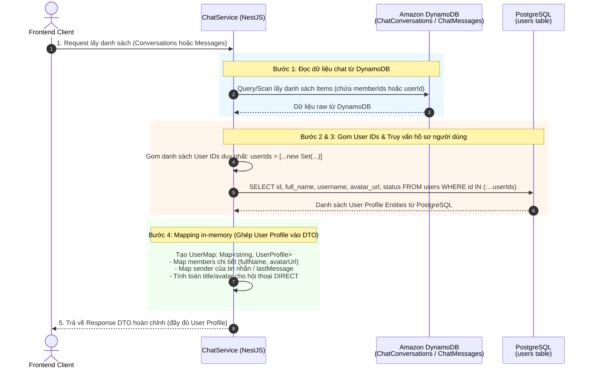
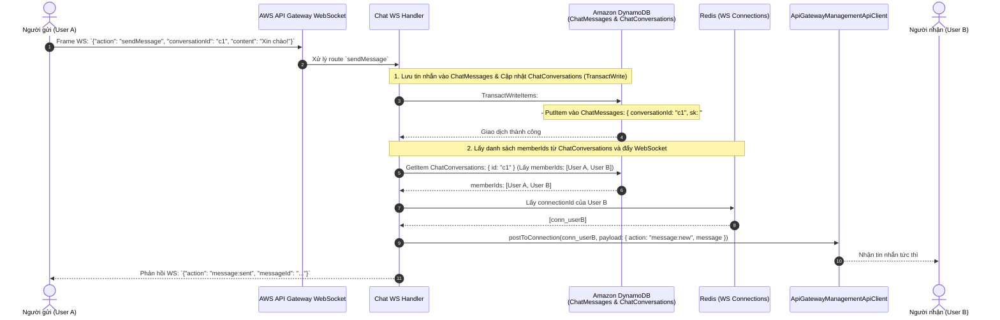
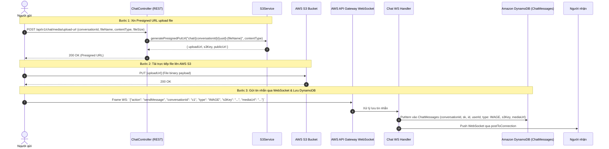

# Thiết kế cơ bản (Basic Design): Module Chat (Lưu trữ Amazon DynamoDB, AWS S3 & AWS WebSocket)

Tài liệu thiết kế cơ bản cho hệ thống nhắn tin tức thời (**Real-time Chat**) hỗ trợ trò chuyện 1-1 và trò chuyện nhóm (Group Chat). Toàn bộ dữ liệu cuộc hội thoại và tin nhắn được lưu trữ trên **Amazon DynamoDB** (NoSQL hiệu năng cao, mở rộng linh hoạt), kết hợp **AWS S3** lưu trữ tệp đa phương tiện và **AWS API Gateway WebSocket** truyền tải thời gian thực.

---

## 1. Tổng quan & Mục tiêu

Module **Chat** được thiết kế phục vụ hàng triệu người dùng đồng thời với độ trễ phản hồi cực thấp:
- **Lưu trữ dữ liệu trên Amazon DynamoDB (Mô hình 2 bảng chuyên biệt)**:
  - Tách biệt thành 2 bảng tối ưu: `ChatConversations` (quản lý thông tin hội thoại và mảng `memberIds`) và `ChatMessages` (lưu trữ lịch sử tin nhắn với `userId` người gửi), tận dụng khả năng tự động co giãn (Auto-scaling), độ trễ đọc/ghi < 10ms ở quy mô lớn.
- **Chiến lược Hybrid Query kết hợp PostgreSQL**:
  - DynamoDB chỉ lưu trữ dữ liệu chat, mảng `memberIds` và `userId` người gửi (không duplicate thông tin cá nhân của user).
  - Khi client query danh sách hội thoại hoặc lịch sử tin nhắn, hệ thống đọc từ DynamoDB, trích xuất danh sách `userId`, sau đó truy vấn sang **PostgreSQL** (`users` table) để lấy hồ sơ người dùng (họ tên, username, avatar) và thực hiện in-memory mapping trước khi trả về API response.
- **AWS S3 (Lưu trữ Media Chat)**:
  - Cung cấp **Presigned URL** cho client tải ảnh, video, tin nhắn thoại (voice audio), file đính kèm trực tiếp lên S3.
- **AWS API Gateway WebSocket**:
  - Quản lý phiên kết nối liên tục qua các route: `$connect`, `$disconnect`, `sendMessage`, `typing`, `markAsRead`.
  - Quản lý `connectionId` của người dùng trên **Redis**.
  - Đẩy tin nhắn tức thời tới các thành viên hội thoại thông qua `ApiGatewayManagementApiClient.postToConnection()`.

---

## 2. Mô hình dữ liệu trên Amazon DynamoDB & Chiến lược Hybrid với PostgreSQL

Hệ thống sử dụng **2 bảng DynamoDB chuyên biệt**: `ChatConversations` và `ChatMessages`. 
- Bảng **`ChatConversations`** lưu danh sách thành viên dưới dạng **một mảng các `userId`** (`memberIds: string[]`).
- Bảng **`ChatMessages`** lưu trữ từng tin nhắn với trường **`userId`** (ID của người gửi tin nhắn).
- Khi query lấy danh sách hội thoại hoặc danh sách tin nhắn, hệ thống áp dụng mô hình **Hybrid Query**: truy vấn dữ liệu từ **DynamoDB**, trích xuất danh sách `userId`, sau đó truy vấn sang **PostgreSQL** (bảng `users`) để lấy thông tin hồ sơ (họ tên, username, avatar) và thực hiện in-memory mapping trước khi trả về API response.

---

### 2.1. Thiết kế Bảng 1: `ChatConversations` (Quản lý Hội thoại)

Bảng lưu trữ thông tin của từng cuộc hội thoại (1-1 hoặc Nhóm). Mỗi item đại diện cho một cuộc hội thoại hoàn chỉnh.

| Tên trường | Kiểu dữ liệu DynamoDB | Vai trò khóa | Mô tả chi tiết |
| :--- | :---: | :---: | :--- |
| `id` | String (S) | **Partition Key (PK)** | UUID định danh duy nhất của cuộc hội thoại |
| `type` | String (S) | Thuộc tính | Loại hội thoại: `DIRECT` (1-1) hoặc `GROUP` (Nhóm) |
| `name` | String (S) | Thuộc tính | Tên nhóm chat (áp dụng khi `type = 'GROUP'`; `null` đối với `DIRECT`) |
| `avatarUrl` | String (S) | Thuộc tính | Ảnh đại diện của nhóm chat (áp dụng cho `GROUP`; `null` đối với `DIRECT`) |
| `memberIds` | List (L) / Array of String | Thuộc tính | **Mảng danh sách các `userId`** tham gia hội thoại (vd: `["uuid-user-1", "uuid-user-2"]`) |
| `lastMessage` | Map (M) | Thuộc tính | Preview tin nhắn mới nhất: `{ id, userId, content, type, createdAt }` |
| `lastMessageAt` | String (S) | Thuộc tính | Thời điểm tin nhắn cuối cùng (ISO8601 string) phục vụ sắp xếp hộp thư |
| `unreadCounts` | Map (M) | Thuộc tính | Số tin chưa đọc theo từng user: `{ [userId]: number }` |
| `createdBy` | String (S) | Thuộc tính | `userId` của người khởi tạo cuộc trò chuyện |
| `createdAt` | String (S) | Thuộc tính | Thời điểm tạo cuộc hội thoại (ISO8601 string) |
| `updatedAt` | String (S) | Thuộc tính | Thời điểm cập nhật cuối cùng (ISO8601 string) |

> **Ưu điểm của mảng `memberIds`**:
> 1. **Kiểm tra quyền thành viên O(1)**: `conversation.memberIds.includes(currentUserId)`.
> 2. **Broadcast WebSocket tức thì**: Đọc ngay danh sách `userId` nhận tin nhắn mà không cần truy vấn bảng phụ `Members`.
> 3. **Truy vấn danh sách hội thoại của người dùng**: Query/Scan DynamoDB kết hợp `FilterExpression: contains(memberIds, :userId)` và sắp xếp theo `lastMessageAt DESC`.

---

### 2.2. Thiết kế Bảng 2: `ChatMessages` (Lịch sử Tin nhắn)

Bảng chuyên biệt phục vụ việc ghi và đọc khối lượng tin nhắn cực lớn với độ trễ phản hồi thấp (< 10ms).

| Tên trường | Kiểu dữ liệu DynamoDB | Vai trò khóa | Mô tả chi tiết |
| :--- | :---: | :---: | :--- |
| `conversationId` | String (S) | **Partition Key (PK)** | UUID của cuộc hội thoại chứa tin nhắn |
| `sk` (`createdAt#id`) | String (S) | **Sort Key (SK)** | Chuỗi kết hợp `{createdAt}#{id}` (ví dụ: `2026-10-03T15:30:00.000Z#uuid-msg`) |
| `id` | String (S) | Thuộc tính | UUID định danh của tin nhắn |
| `userId` | String (S) | Thuộc tính | **`userId` của người gửi tin nhắn** (Sender ID) |
| `type` | String (S) | Thuộc tính | Loại tin nhắn: `TEXT`, `IMAGE`, `VIDEO`, `AUDIO`, `FILE` |
| `content` | String (S) | Thuộc tính | Nội dung tin nhắn văn bản hoặc mô tả file |
| `mediaUrl` | String (S) | Thuộc tính | Đường dẫn tải/xem media trên AWS S3 (nếu có) |
| `s3Key` | String (S) | Thuộc tính | S3 Key lưu trữ file trên S3 bucket |
| `fileName` | String (S) | Thuộc tính | Tên file gốc tải lên |
| `fileSize` | Number (N) | Thuộc tính | Kích thước file (bytes) |
| `replyToId` | String (S) | Thuộc tính | `id` của tin nhắn được reply (nếu có) |
| `isRecalled` | Boolean (BOOL) | Thuộc tính | Trạng thái tin nhắn đã thu hồi (`false`/`true`) |
| `createdAt` | String (S) | Thuộc tính | Thời điểm gửi tin nhắn (ISO8601 string) |

---

### 2.3. Chiến lược Hybrid Query: Kết hợp DynamoDB & PostgreSQL (Mapping Flow)

Do DynamoDB chỉ lưu trữ dữ liệu hội thoại, tin nhắn và định danh `userId` (tránh dư thừa và lỗi thời dữ liệu khi người dùng đổi tên/avatar), hệ thống áp dụng cơ chế **Hybrid Query & In-Memory Mapping**:



#### Quy trình chi tiết cho 2 luồng truy vấn chính:

#### 1. Luồng Lấy danh sách cuộc hội thoại (`GET /api/v1/chat/conversations`):
1. **Truy vấn DynamoDB (`ChatConversations`)**:
   - Lấy danh sách hội thoại mà mảng `memberIds` chứa `currentUserId`.
   - Sắp xếp theo `lastMessageAt DESC` (cuộc hội thoại có tin nhắn mới nhất lên đầu).
2. **Gom tập hợp `userId`**:
   - Thu thập toàn bộ các `userId` từ `memberIds` của tất cả các cuộc hội thoại và `lastMessage.userId`.
   - Khử trùng lặp: `const userIds = Array.from(new Set(allExtractedIds))`.
3. **Truy vấn PostgreSQL (`users` table)**:
   - `SELECT id, full_name, username, avatar_url, status FROM users WHERE id IN (:...userIds)`.
4. **Mapping dữ liệu in-memory**:
   - Khởi tạo `userMap = new Map<string, UserProfile>()`.
   - Chuyển đổi `memberIds: string[]` -> `members: UserProfileDto[]`.
   - **Xử lý hội thoại 1-1 (`DIRECT`)**:
     - Tìm người đối diện: `otherUserId = memberIds.find(id => id !== currentUserId)`.
     - Tự động gán `name = otherUser.fullName` và `avatarUrl = otherUser.avatarUrl` giúp hiển thị giao diện trực quan.
   - Ghép thông tin người gửi vào `lastMessage.sender: { id, fullName, avatarUrl }`.
   - Trích xuất số tin chưa đọc riêng cho người dùng hiện tại: `unreadCount = unreadCounts[currentUserId] || 0`.

#### 2. Luồng Lấy lịch sử tin nhắn trong hội thoại (`GET /api/v1/chat/conversations/:id/messages`):
1. **Truy vấn DynamoDB (`ChatMessages`)**:
   - `Query`: `PK = conversationId`, `ScanIndexForward = false` (lấy tin nhắn mới nhất trước), hỗ trợ phân trang qua `cursor` (`ExclusiveStartKey`).
2. **Gom tập hợp `userId`**:
   - Trích xuất danh sách ID người gửi: `const senderIds = [...new Set(messages.map(m => m.userId))]`.
3. **Truy vấn PostgreSQL (`users` table)**:
   - `SELECT id, full_name, username, avatar_url FROM users WHERE id IN (:...senderIds)`.
4. **Mapping dữ liệu in-memory**:
   - Ghép đối tượng `sender: { id, fullName, username, avatarUrl }` vào từng bản ghi tin nhắn tương ứng với `userId`.

---

### 2.4. TypeScript Interfaces & DTO Models

```typescript
// Enums
export enum ConversationType {
  DIRECT = 'DIRECT',
  GROUP = 'GROUP',
}

export enum MessageType {
  TEXT = 'TEXT',
  IMAGE = 'IMAGE',
  VIDEO = 'VIDEO',
  AUDIO = 'AUDIO',
  FILE = 'FILE',
}

// 1. Data Schema lưu trữ trên DynamoDB: ChatConversations
export interface DynamoChatConversation {
  id: string;                       // PK: UUID
  type: ConversationType;
  name?: string;                    // Tên nhóm (nếu là GROUP)
  avatarUrl?: string;               // Avatar nhóm (nếu là GROUP)
  memberIds: string[];              // Mảng danh sách userId thành viên
  lastMessage?: {
    id: string;
    userId: string;                 // id người gửi tin cuối
    content: string;
    type: MessageType;
    createdAt: string;
  };
  lastMessageAt?: string;           // ISO8601 timestamp để sort
  unreadCounts?: Record<string, number>; // { [userId]: number }
  createdBy: string;                // userId
  createdAt: string;
  updatedAt: string;
}

// 2. Data Schema lưu trữ trên DynamoDB: ChatMessages
export interface DynamoChatMessage {
  conversationId: string;           // PK: UUID
  sk: string;                       // SK: createdAt#id
  id: string;                       // UUID
  userId: string;                   // id người gửi tin nhắn
  type: MessageType;
  content: string;
  mediaUrl?: string;
  s3Key?: string;
  fileName?: string;
  fileSize?: number;
  replyToId?: string;
  isRecalled?: boolean;
  createdAt: string;
}

// 3. User Profile lấy từ PostgreSQL (users table)
export interface UserProfileDto {
  id: string;
  username: string;
  fullName: string;
  avatarUrl?: string | null;
  status: string;
}

// 4. Response DTO trả về Client sau khi mapping Hybrid
export interface ConversationResponseDto {
  id: string;
  type: ConversationType;
  name: string;                     // Với DIRECT: tên của người đối diện; GROUP: tên nhóm
  avatarUrl?: string | null;        // Với DIRECT: avatar của đối phương; GROUP: avatar nhóm
  members: UserProfileDto[];        // Danh sách UserProfile đã mapping từ PostgreSQL
  lastMessage?: {
    id: string;
    content: string;
    type: MessageType;
    createdAt: string;
    sender: UserProfileDto;         // Đã mapping thông tin người gửi
  };
  unreadCount: number;              // Số tin chưa đọc của user đang request
  createdAt: string;
  updatedAt: string;
}

export interface ChatMessageResponseDto {
  id: string;
  conversationId: string;
  type: MessageType;
  content: string;
  mediaUrl?: string;
  s3Key?: string;
  fileName?: string;
  fileSize?: number;
  replyToId?: string;
  isRecalled: boolean;
  createdAt: string;
  sender: UserProfileDto;           // Đã mapping thông tin người gửi từ PostgreSQL
}
```

---

## 3. Luồng xử lý nghiệp vụ & Tương tác DynamoDB

### 3.1. Luồng Gửi tin nhắn Text & Ghi nhận vào DynamoDB



### 3.2. Luồng Gửi tin nhắn Media qua AWS S3 và DynamoDB



---

## 4. Đặc tả API REST & WebSocket Routes

### 4.1. WebSocket Routes (API Gateway WebSocket)

| Route Key | Hướng | Mô tả | Payload mẫu |
| :--- | :---: | :--- | :--- |
| `$connect` | Client -> Server | Khởi tạo kết nối, kèm JWT query param `?token=...` | - |
| `$disconnect` | Client -> Server | Ngắt kết nối, dọn dẹp Redis connection | - |
| `sendMessage` | Client -> Server | Gửi tin nhắn mới (ghi vào DynamoDB) | `{ "action": "sendMessage", "conversationId": "...", "content": "..." }` |
| `typing` | Client -> Server | Báo trạng thái đang gõ | `{ "action": "typing", "conversationId": "...", "isTyping": true }` |
| `markAsRead` | Client -> Server | Đánh dấu đã đọc tin nhắn | `{ "action": "markAsRead", "conversationId": "...", "messageId": "..." }` |
| `message:new` | Server -> Client | Đẩy tin nhắn mới tức thời | Message Object |
| `user:typing` | Server -> Client | Báo người dùng khác đang soạn thảo | `{ "conversationId": "...", "userId": "..." }` |

---

### 4.2. REST Endpoints (Tiền tố: `/api/v1/chat`)

#### 4.2.1. `POST /api/v1/chat/media/upload-url`
- **Mô tả**: Lấy Presigned URL để upload ảnh/video/tệp đính kèm tin nhắn lên AWS S3.
- **Quyền truy cập**: Authenticated (`Bearer <accessToken>`).
- **Request Body**:
  ```json
  {
    "conversationId": "6a9f1a23-45bb-4889-9a2f-1811e9a24c90",
    "fileName": "photo.jpg",
    "contentType": "image/jpeg",
    "fileSize": 2048000
  }
  ```
- **Response**: `200 OK` (uploadUrl, s3Key, fileUrl).

#### 4.2.2. `POST /api/v1/chat/conversations`
- **Mô tả**: Tạo cuộc hội thoại mới (1-1 hoặc nhóm), lưu item mới vào bảng `ChatConversations` với mảng `memberIds: [currentUserId, recipientId]`.
- **Request Body**:
  ```json
  {
    "type": "DIRECT",
    "recipientId": "78a9c140-5b43-41bb-aef3-018274cbef01"
  }
  ```
- **Response**: `201 Created`

#### 4.2.3. `GET /api/v1/chat/conversations`
- **Mô tả**: Lấy danh sách hộp thư hội thoại của người dùng từ DynamoDB `ChatConversations`, sau đó truy vấn PostgreSQL lấy User Profile (`users` table) để mapping thông tin hiển thị (tên, avatar, thành viên chi tiết).
- **Query Params**: `limit=20`, `cursor=...`.
- **Response**: `200 OK` (`ConversationResponseDto[]`).

#### 4.2.4. `GET /api/v1/chat/conversations/:id/messages`
- **Mô tả**: Lấy lịch sử tin nhắn của một cuộc hội thoại từ DynamoDB `ChatMessages` (`PK = conversationId`), sau đó truy vấn PostgreSQL lấy Profile của các `userId` (người gửi) để mapping đối tượng `sender`.
- **Query Params**: `limit=30`, `cursor=...`.
- **Response**: `200 OK` (`ChatMessageResponseDto[]`).

---

## 5. Tối ưu hóa DynamoDB, PostgreSQL & AWS S3

1. **DynamoDB DocumentClient & TransactWriteCommand**:
   - Sử dụng `@aws-sdk/lib-dynamodb` với `TransactWriteCommand` khi gửi tin nhắn để đảm bảo tính nguyên tử (Atomic): ghi tin nhắn vào `ChatMessages` đồng thời cập nhật `lastMessage` và tăng `unreadCounts` trong `ChatConversations`.
2. **Tối ưu Hybrid Query với Redis Cache & DataLoader**:
   - Áp dụng Redis Caching hoặc DataLoader cho các truy vấn `SELECT ... FROM users WHERE id IN (:...userIds)` từ PostgreSQL để giảm thiểu số lượng truy vấn lặp lại đối với cùng một người dùng.
3. **DynamoDB TTL (Time-To-Live)**:
   - Cấu hình thuộc tính `ttl` trên bảng `ChatMessages` (ví dụ sau 1 đến 2 năm) để tự động dọn dẹp các tin nhắn cũ mà không tốn chi phí WCU/RCU.
4. **Quản lý Dead WebSocket Connection**:
   - Khi `postToConnection` trả về `GoneException (410)` -> Xóa ngay `connectionId` khỏi Redis.
