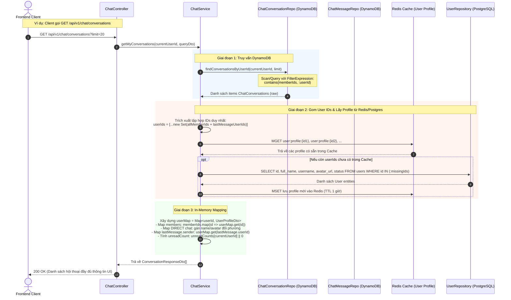

# Thiết kế chi tiết (Detail Design): Module Chat (Amazon DynamoDB 2-Table, AWS S3, AWS WebSocket & Hybrid PostgreSQL Mapping)

Tài liệu thiết kế chi tiết kỹ thuật cho module **Chat** dựa trên [basic-design.md](file:///Users/macos/project/personal/aws/social/social-api/specs/chat/basic-design.md), lưu trữ dữ liệu trò chuyện trên **2 bảng Amazon DynamoDB chuyên biệt** (`ChatConversations` và `ChatMessages`), kết hợp **AWS S3** lưu trữ tệp đa phương tiện, **AWS API Gateway WebSocket** truyền tải thời gian thực và chiến lược **Hybrid Query Mapping với PostgreSQL** (bảng `users`).

---

## 1. Cấu trúc file & thư mục triển khai

Tuân thủ kiến trúc phân tầng NestJS của dự án:

```text
src/
├── common/
│   ├── constants/
│   │   └── module.constant.ts                  # Khai báo tên bảng DynamoDB, WebSocket actions, S3 prefix
│   ├── decorators/
│   │   └── current-user.decorator.ts           # Trích xuất user từ JWT Request
│   └── guards/
│       └── jwt-auth.guard.ts                   # Guard xác thực JWT Bearer
├── integrations/
│   ├── redis/
│   │   └── redis.service.ts                    # Quản lý connectionId của WebSocket clients
│   └── storage/
│       └── s3.service.ts                       # Tạo S3 Presigned URL tải lên và tải xuống
├── modules/
│   ├── user/
│   │   └── services/user.service.ts            # Cung cấp hàm getUsersByIds() để phục vụ Hybrid Mapping
│   └── chat/
│       ├── chat.controller.ts                  # REST API Endpoints (/api/v1/chat/*)
│       ├── chat.module.ts                      # Khai báo ChatModule, imports, providers, controllers
│       ├── services/
│       │   ├── chat.service.ts                 # Nghiệp vụ hội thoại, tin nhắn & Hybrid Mapping Postgres
│       │   ├── chat-ws.service.ts              # Quản lý connection, routing frame và broadcast WebSocket
│       │   └── chat-media.service.ts           # Xử lý xin S3 Presigned URL và xác thực file
│       ├── repositories/
│       │   ├── chat-conversation.repository.ts # Thao tác CRUD/Query bảng ChatConversations (DynamoDB)
│       │   └── chat-message.repository.ts      # Thao tác CRUD/Query/Transact bảng ChatMessages (DynamoDB)
│       ├── interfaces/
│       │   ├── chat-conversation.interface.ts  # DynamoDB Item interface cho ChatConversations
│       │   ├── chat-message.interface.ts       # DynamoDB Item interface cho ChatMessages
│       │   └── chat-ws.interface.ts            # Định dạng Frame gửi/nhận WebSocket
│       └── dto/
│           ├── create-conversation.dto.ts      # DTO tạo hội thoại (1-1 hoặc Group)
│           ├── get-conversations-query.dto.ts  # DTO phân trang lấy danh sách hội thoại
│           ├── get-messages-query.dto.ts       # DTO phân trang lấy tin nhắn (Cursor-based)
│           ├── send-message.dto.ts             # DTO gửi tin nhắn qua REST/WebSocket
│           ├── upload-media-url.dto.ts         # DTO xin presigned URL
│           ├── mark-as-read.dto.ts             # DTO cập nhật đã đọc
│           ├── conversation-response.dto.ts    # DTO Response hội thoại sau mapping PostgreSQL
│           └── chat-message-response.dto.ts    # DTO Response tin nhắn sau mapping PostgreSQL
infra/
└── lambda-handler/
    └── websocket/
        ├── connect.handler.ts                  # Lambda route $connect (lưu connectionId vào Redis)
        ├── disconnect.handler.ts               # Lambda route $disconnect (xóa connectionId)
        └── default.handler.ts                  # Lambda route $default hoặc forward frame vào Service
```

---

## 2. Chi tiết Mô hình Dữ liệu Amazon DynamoDB (2-Table Model)

Hệ thống sử dụng **2 bảng DynamoDB độc lập** thay vì Single-Table Design để tối ưu hóa chi phí, cô lập phân vùng dữ liệu và đảm bảo hiệu năng I/O tốt nhất:

1. Bảng **`ChatConversations`** (`social-chat-conversations`): Quản lý metadata hội thoại, danh sách thành viên (`memberIds: string[]`), tin nhắn cuối và số lượng chưa đọc.
2. Bảng **`ChatMessages`** (`social-chat-messages`): Quản lý toàn bộ lịch sử tin nhắn của từng cuộc trò chuyện, lưu `userId` người gửi.

### 2.1. Bảng 1: `ChatConversations`

- **Tên bảng**: `social-chat-conversations`
- **Partition Key (PK)**: `id` (String - UUID v4)
- **Sort Key (SK)**: Không sử dụng (Simple Primary Key). Mỗi item đại diện cho một cuộc hội thoại.

#### Cấu trúc thuộc tính Item (Schema Attributes):

| Thuộc tính | Kiểu dữ liệu DynamoDB | Bắt buộc | Mặc định | Mô tả chi tiết |
| :--- | :---: | :---: | :---: | :--- |
| `id` | String (S) | Có | - | Khóa chính (PK): UUID v4 của cuộc hội thoại |
| `type` | String (S) | Có | `DIRECT` | Loại hội thoại: `DIRECT` (trò chuyện 1-1) hoặc `GROUP` (nhóm) |
| `name` | String (S) | Không | `null` | Tên nhóm chat (chỉ áp dụng khi `type = 'GROUP'`) |
| `avatarUrl` | String (S) | Không | `null` | URL ảnh đại diện của nhóm chat |
| `memberIds` | List (L) / Array of String | Có | `[]` | **Mảng chứa danh sách các `userId` (String)** tham gia cuộc hội thoại |
| `lastMessage` | Map (M) | Không | `null` | Snapshot tin nhắn mới nhất để hiển thị hộp thư nhanh |
| ├─ `id` | String (S) | Có | - | ID của tin nhắn mới nhất |
| ├─ `userId` | String (S) | Có | - | `userId` của người gửi tin nhắn mới nhất |
| ├─ `content` | String (S) | Có | - | Nội dung tóm tắt của tin nhắn |
| ├─ `type` | String (S) | Có | `TEXT` | Loại tin nhắn (`TEXT`, `IMAGE`, `VIDEO`, v.v.) |
| └─ `createdAt` | String (S) | Có | - | Thời điểm gửi tin nhắn (ISO8601 string) |
| `lastMessageAt` | String (S) | Không | `null` | Timestamp ISO8601 của tin nhắn cuối, dùng sắp xếp danh sách hội thoại |
| `unreadCounts` | Map (M) | Có | `{}` | Số tin nhắn chưa đọc của từng thành viên: `{ [userId]: number }` |
| `createdBy` | String (S) | Có | - | `userId` của người khởi tạo cuộc trò chuyện |
| `createdAt` | String (S) | Có | `now()` | Thời điểm tạo cuộc hội thoại (ISO8601 string) |
| `updatedAt` | String (S) | Có | `now()` | Thời điểm cập nhật cuối cùng (ISO8601 string) |

> **Quy tắc nghiệp vụ của `memberIds`**:
> - Với cuộc hội thoại `DIRECT`: Mảng luôn có đúng **2 phần tử** `[userAId, userBId]`.
> - Với cuộc hội thoại `GROUP`: Mảng chứa từ **2 đến 500 phần tử**.
> - Kiểm tra quyền: Để xác định User có quyền xem/gửi tin nhắn, kiểm tra `conversation.memberIds.includes(currentUserId)`.

---

### 2.2. Bảng 2: `ChatMessages`

- **Tên bảng**: `social-chat-messages`
- **Partition Key (PK)**: `conversationId` (String - UUID của cuộc hội thoại)
- **Sort Key (SK)**: `sk` (String - Composite Key: `{createdAt}#{id}`)
- **TTL Attribute**: `ttl` (Number - Epoch timestamp theo giây, tự động dọn dẹp sau 365 ngày nếu bật TTL)

#### Cấu trúc thuộc tính Item (Schema Attributes):

| Thuộc tính | Kiểu dữ liệu DynamoDB | Bắt buộc | Mặc định | Mô tả chi tiết |
| :--- | :---: | :---: | :---: | :--- |
| `conversationId` | String (S) | Có | - | **Partition Key (PK)**: UUID cuộc hội thoại |
| `sk` | String (S) | Có | - | **Sort Key (SK)**: Định dạng `{createdAt}#{id}` (vd: `2026-10-03T15:30:00.000Z#8f9c1...`) |
| `id` | String (S) | Có | - | UUID v4 của tin nhắn |
| `userId` | String (S) | Có | - | **`userId` của người gửi tin nhắn** (Sender ID) |
| `type` | String (S) | Có | `TEXT` | `TEXT`, `IMAGE`, `VIDEO`, `AUDIO`, `FILE` |
| `content` | String (S) | Không | `""` | Nội dung văn bản của tin nhắn |
| `mediaUrl` | String (S) | Không | `null` | URL công khai / CDN tải file đính kèm trên S3 |
| `s3Key` | String (S) | Không | `null` | Khóa đối tượng file trong S3 bucket |
| `fileName` | String (S) | Không | `null` | Tên gốc của tệp đính kèm |
| `fileSize` | Number (N) | Không | `null` | Kích thước file tính bằng byte |
| `replyToId` | String (S) | Không | `null` | `id` của tin nhắn được phản hồi (Reply message) |
| `isRecalled` | Boolean (BOOL) | Có | `false` | Đánh dấu tin nhắn đã bị thu hồi hay chưa |
| `createdAt` | String (S) | Có | `now()` | Thời điểm tạo tin nhắn (ISO8601 string) |
| `ttl` | Number (N) | Không | `null` | Epoch seconds để DynamoDB TTL tự hủy (sau 1 năm) |

---

## 3. Kiến trúc Hybrid Query & Mapping với PostgreSQL

Hệ thống kết hợp ưu thế của cả hai loại cơ sở dữ liệu:
- **Amazon DynamoDB**: Lưu trữ phi cấu trúc, tốc độ đọc/ghi cao, mở rộng tức thì không tắc nghẽn connection pool. Không lưu trữ thông tin cá nhân của người dùng (tên, avatar) trong DynamoDB để tránh tình trạng dữ liệu không nhất quán khi người dùng đổi avatar hay cập nhật profile.
- **PostgreSQL**: Lưu trữ thực thể `users` chuẩn hóa quan hệ (Single Source of Truth). Cung cấp API nội bộ `getUsersByIds(userIds: string[])` có kết hợp Redis Caching.



---

## 4. Chi tiết Thuật toán & Xử lý nghiệp vụ

### 4.1. Luồng Lấy danh sách hội thoại (`getMyConversations`)

```typescript
async getMyConversations(currentUserId: string, query: GetConversationsQueryDto): Promise<ConversationResponseDto[]> {
  // 1. Query danh sách hội thoại từ DynamoDB ChatConversations
  const rawConversations = await this.conversationRepo.findByMemberId(currentUserId, query.limit);

  if (!rawConversations || rawConversations.length === 0) {
    return [];
  }

  // 2. Thu thập toàn bộ User IDs liên quan
  const userIdSet = new Set<string>();
  for (const conv of rawConversations) {
    conv.memberIds?.forEach(id => userIdSet.add(id));
    if (conv.lastMessage?.userId) {
      userIdSet.add(conv.lastMessage.userId);
    }
  }

  // 3. Lấy thông tin User Profiles từ PostgreSQL (kèm Cache)
  const userMap = await this.getUserProfileMap(Array.from(userIdSet));

  // 4. Mapping dữ liệu thành Response DTO
  return rawConversations.map(conv => {
    const isDirect = conv.type === ConversationType.DIRECT;
    const otherUserId = conv.memberIds.find(id => id !== currentUserId);
    const otherUser = otherUserId ? userMap.get(otherUserId) : null;

    // Xác định tên và avatar hiển thị
    let displayName = conv.name || '';
    let displayAvatar = conv.avatarUrl || null;

    if (isDirect && otherUser) {
      displayName = otherUser.fullName || otherUser.username;
      displayAvatar = otherUser.avatarUrl || null;
    }

    const members: UserProfileDto[] = conv.memberIds
      .map(id => userMap.get(id))
      .filter((u): u is UserProfileDto => !!u);

    return {
      id: conv.id,
      type: conv.type,
      name: displayName,
      avatarUrl: displayAvatar,
      members,
      lastMessage: conv.lastMessage ? {
        id: conv.lastMessage.id,
        content: conv.lastMessage.content,
        type: conv.lastMessage.type,
        createdAt: conv.lastMessage.createdAt,
        sender: userMap.get(conv.lastMessage.userId) || {
          id: conv.lastMessage.userId,
          username: 'unknown',
          fullName: 'Người dùng',
          avatarUrl: null,
          status: 'ACTIVE',
        },
      } : undefined,
      unreadCount: conv.unreadCounts?.[currentUserId] || 0,
      createdAt: conv.createdAt,
      updatedAt: conv.updatedAt,
    };
  });
}
```

---

### 4.2. Luồng Lấy lịch sử tin nhắn (`getConversationMessages`)

```typescript
async getConversationMessages(
  conversationId: string,
  currentUserId: string,
  query: GetMessagesQueryDto,
): Promise<{ items: ChatMessageResponseDto[]; nextCursor?: string }> {
  // 1. Kiểm tra quyền truy cập hội thoại
  const conversation = await this.conversationRepo.findById(conversationId);
  if (!conversation) {
    throw new NotFoundException('Không tìm thấy cuộc hội thoại');
  }
  if (!conversation.memberIds.includes(currentUserId)) {
    throw new ForbiddenException('Bạn không phải là thành viên của cuộc hội thoại này');
  }

  // 2. Query tin nhắn từ DynamoDB ChatMessages
  const { items: rawMessages, nextCursor } = await this.messageRepo.findByConversationId(
    conversationId,
    query.limit || 30,
    query.cursor,
  );

  if (rawMessages.length === 0) {
    return { items: [], nextCursor: undefined };
  }

  // 3. Thu thập danh sách userId của người gửi
  const senderIds = Array.from(new Set(rawMessages.map(m => m.userId)));
  const userMap = await this.getUserProfileMap(senderIds);

  // 4. Mapping dữ liệu thành ChatMessageResponseDto
  const items: ChatMessageResponseDto[] = rawMessages.map(msg => ({
    id: msg.id,
    conversationId: msg.conversationId,
    type: msg.type,
    content: msg.isRecalled ? 'Tin nhắn đã được thu hồi' : msg.content,
    mediaUrl: msg.isRecalled ? undefined : msg.mediaUrl,
    s3Key: msg.isRecalled ? undefined : msg.s3Key,
    fileName: msg.fileName,
    fileSize: msg.fileSize,
    replyToId: msg.replyToId,
    isRecalled: msg.isRecalled,
    createdAt: msg.createdAt,
    sender: userMap.get(msg.userId) || {
      id: msg.userId,
      username: 'unknown',
      fullName: 'Người dùng',
      avatarUrl: null,
      status: 'ACTIVE',
    },
  }));

  return { items, nextCursor };
}
```

---

### 4.3. Luồng Gửi tin nhắn Text & Giao dịch DynamoDB TransactWrite

Khi một tin nhắn mới được gửi qua WebSocket hoặc REST:
1. Tạo message item với `id = randomUUID()`, `createdAt = new Date().toISOString()`, `sk = ${createdAt}#${id}`.
2. Thực hiện lệnh **`TransactWriteCommand`** nguyên tử (Atomic Transaction):
   - **Ghi tin nhắn mới** vào bảng `ChatMessages`.
   - **Cập nhật cuộc hội thoại** trong bảng `ChatConversations`:
     - Cập nhật trường `lastMessage`: `{ id, userId, content, type, createdAt }`.
     - Cập nhật trường `lastMessageAt`: `createdAt`.
     - Cập nhật trường `updatedAt`: `createdAt`.
     - Tăng giá trị `unreadCounts.<recipientId>` thêm 1 đối với tất cả thành viên khác trong `memberIds`.
3. Đọc danh sách `memberIds` từ cuộc hội thoại.
4. Lấy danh sách WebSocket `connectionId` từ Redis cho các thành viên.
5. Gọi `ApiGatewayManagementApiClient.postToConnection()` để push sự kiện `message:new`.

```typescript
async sendMessage(currentUserId: string, dto: SendMessageDto): Promise<ChatMessageResponseDto> {
  const conversation = await this.conversationRepo.findById(dto.conversationId);
  if (!conversation) {
    throw new NotFoundException('Không tìm thấy cuộc hội thoại');
  }
  if (!conversation.memberIds.includes(currentUserId)) {
    throw new ForbiddenException('Bạn không có quyền gửi tin nhắn trong hội thoại này');
  }

  const messageId = randomUUID();
  const now = new Date().toISOString();
  const sk = `${now}#${messageId}`;

  const messageItem: DynamoChatMessage = {
    conversationId: dto.conversationId,
    sk,
    id: messageId,
    userId: currentUserId,
    type: dto.type || MessageType.TEXT,
    content: dto.content || '',
    mediaUrl: dto.mediaUrl,
    s3Key: dto.s3Key,
    fileName: dto.fileName,
    fileSize: dto.fileSize,
    replyToId: dto.replyToId,
    isRecalled: false,
    createdAt: now,
  };

  // Tạo danh sách các thành viên khác để tăng unreadCount
  const otherMembers = conversation.memberIds.filter(id => id !== currentUserId);

  await this.messageRepo.saveMessageWithConversationUpdate(messageItem, otherMembers);

  // Lấy Profile người gửi để tạo response & push realtime
  const userMap = await this.getUserProfileMap([currentUserId]);
  const senderProfile = userMap.get(currentUserId)!;

  const responseDto: ChatMessageResponseDto = {
    ...messageItem,
    sender: senderProfile,
  };

  // Broadcast WebSocket bất đồng bộ qua Redis connections
  this.chatWsService.broadcastToMembers(
    dto.conversationId,
    conversation.memberIds,
    currentUserId,
    {
      action: 'message:new',
      data: responseDto,
    },
  );

  return responseDto;
}
```

---

## 5. Đặc tả Chi tiết REST Endpoints

Tiền tố chung: `/api/v1/chat`

### 5.1. `POST /api/v1/chat/media/upload-url`
- **Mô tả**: Xin Presigned PUT URL tải ảnh, video, audio hoặc tệp đính kèm lên AWS S3 bucket.
- **Xác thực**: Bắt buộc Bearer JWT (`@UseGuards(JwtAuthGuard)`).
- **Request Body**:
  ```json
  {
    "conversationId": "3fa85f64-5717-4562-b3fc-2c963f66afa6",
    "fileName": "sample_video.mp4",
    "contentType": "video/mp4",
    "fileSize": 15420000
  }
  ```
- **Validation Rules**:
  - `conversationId`: UUID, bắt buộc.
  - `fileName`: String, không rỗng, tối đa 255 ký tự.
  - `contentType`: Phải thuộc MIME types được hỗ trợ (ảnh: `image/jpeg`, `image/png`, `image/webp`; video: `video/mp4`, `video/quicktime`; audio: `audio/mpeg`, `audio/wav`, `audio/aac`; tệp: `application/pdf`, v.v.).
  - `fileSize`: Số dương, không vượt quá 50MB (video), 10MB (ảnh), 25MB (tệp).
- **Response**: `200 OK`
  ```json
  {
    "uploadUrl": "https://social-bucket-366518187546.s3.ap-southeast-1.amazonaws.com/chat/3fa85f64.../uuid.mp4?X-Amz-Signature=...",
    "s3Key": "chat/3fa85f64-5717-4562-b3fc-2c963f66afa6/8f9c-uuid.mp4",
    "publicUrl": "https://social-bucket-366518187546.s3.ap-southeast-1.amazonaws.com/chat/3fa85f64-5717-4562-b3fc-2c963f66afa6/8f9c-uuid.mp4",
    "expiresInSeconds": 900
  }
  ```

---

### 5.2. `POST /api/v1/chat/conversations`
- **Mô tả**: Tạo cuộc hội thoại mới (1-1 hoặc Nhóm). Nếu là trò chuyện 1-1 và đã tồn tại cuộc hội thoại giữa 2 người, hệ thống trả về hội thoại hiện có.
- **Request Body**:
  ```json
  {
    "type": "DIRECT",
    "recipientId": "78a9c140-5b43-41bb-aef3-018274cbef01"
  }
  ```
  *Hoặc với Nhóm chat:*
  ```json
  {
    "type": "GROUP",
    "name": "Nhóm Đồng Nghiệp",
    "avatarUrl": "https://s3.../avatar-group.png",
    "memberIds": [
      "78a9c140-5b43-41bb-aef3-018274cbef01",
      "99a1c220-4b11-41bb-beef-018274cbef99"
    ]
  }
  ```
- **Response**: `201 Created`
  ```json
  {
    "id": "c1a9c140-5b43-41bb-aef3-018274cbef55",
    "type": "DIRECT",
    "name": "Nguyễn Văn B",
    "avatarUrl": "https://s3.../avatar-b.jpg",
    "members": [
      {
        "id": "user-a-id",
        "username": "user_a",
        "fullName": "Nguyễn Văn A",
        "avatarUrl": "https://s3.../a.jpg",
        "status": "ACTIVE"
      },
      {
        "id": "78a9c140-5b43-41bb-aef3-018274cbef01",
        "username": "user_b",
        "fullName": "Nguyễn Văn B",
        "avatarUrl": "https://s3.../avatar-b.jpg",
        "status": "ACTIVE"
      }
    ],
    "unreadCount": 0,
    "createdAt": "2026-10-03T15:30:00.000Z",
    "updatedAt": "2026-10-03T15:30:00.000Z"
  }
  ```

---

### 5.3. `GET /api/v1/chat/conversations`
- **Mô tả**: Lấy danh sách hộp thư hội thoại của người dùng đăng nhập. Áp dụng Hybrid Query giữa DynamoDB `ChatConversations` và PostgreSQL `users`.
- **Query Params**:
  - `limit`: Số bản ghi tối đa (mặc định 20, tối đa 50).
  - `cursor`: Chuỗi cursor phân trang.
- **Response**: `200 OK`
  ```json
  {
    "items": [
      {
        "id": "c1a9c140-5b43-41bb-aef3-018274cbef55",
        "type": "DIRECT",
        "name": "Nguyễn Văn B",
        "avatarUrl": "https://s3.../avatar-b.jpg",
        "members": [ ... ],
        "lastMessage": {
          "id": "m1a9c140-...",
          "content": "Chào bạn, hôm nay thế nào?",
          "type": "TEXT",
          "createdAt": "2026-10-03T15:35:00.000Z",
          "sender": {
            "id": "78a9c140-5b43-41bb-aef3-018274cbef01",
            "username": "user_b",
            "fullName": "Nguyễn Văn B",
            "avatarUrl": "https://s3.../avatar-b.jpg"
          }
        },
        "unreadCount": 2,
        "createdAt": "2026-10-03T15:00:00.000Z",
        "updatedAt": "2026-10-03T15:35:00.000Z"
      }
    ],
    "nextCursor": null
  }
  ```

---

### 5.4. `GET /api/v1/chat/conversations/:id/messages`
- **Mô tả**: Lấy lịch sử tin nhắn của cuộc hội thoại, sắp xếp theo thời gian mới nhất trước. Thực hiện kiểm tra quyền thành viên và mapping profile người gửi từ PostgreSQL.
- **Parameters**: `id` (UUID cuộc hội thoại).
- **Query Params**:
  - `limit`: Số tin nhắn (mặc định 30, tối đa 100).
  - `cursor`: Chuỗi cursor mã hóa base64 của DynamoDB `ExclusiveStartKey`.
- **Response**: `200 OK`
  ```json
  {
    "items": [
      {
        "id": "m2a9c140-5b43-41bb-aef3-018274cbef02",
        "conversationId": "c1a9c140-5b43-41bb-aef3-018274cbef55",
        "type": "IMAGE",
        "content": "Ảnh check-in Đà Nẵng",
        "mediaUrl": "https://social-bucket-366518187546.s3.../chat/.../danang.jpg",
        "fileName": "danang.jpg",
        "fileSize": 3450200,
        "isRecalled": false,
        "createdAt": "2026-10-03T15:36:10.000Z",
        "sender": {
          "id": "78a9c140-5b43-41bb-aef3-018274cbef01",
          "username": "user_b",
          "fullName": "Nguyễn Văn B",
          "avatarUrl": "https://s3.../avatar-b.jpg",
          "status": "ACTIVE"
        }
      }
    ],
    "nextCursor": "eyJjb252ZXJzYXRpb25JZCI6...fQ=="
  }
  ```

---

### 5.5. `PATCH /api/v1/chat/conversations/:id/read`
- **Mô tả**: Đánh dấu đã đọc toàn bộ tin nhắn trong cuộc hội thoại (Reset `unreadCounts[currentUserId] = 0` trong DynamoDB `ChatConversations`).
- **Response**: `200 OK`
  ```json
  {
    "success": true,
    "conversationId": "c1a9c140-5b43-41bb-aef3-018274cbef55",
    "unreadCount": 0
  }
  ```

---

## 6. Đặc tả WebSocket Realtime Protocols

Hệ thống sử dụng **AWS API Gateway WebSocket** kết hợp lưu trữ `connectionId` trên **Redis**:
- Khi Client kết nối: `wscat -c "wss://{api-id}.execute-api.ap-southeast-1.amazonaws.com/$default?token={jwtToken}"`
- Lambda `$connect`: Giải mã JWT, lấy `userId`, lưu key Redis `ws:user:{userId}` -> Set of `connectionId`.
- Lambda `$disconnect`: Xóa `connectionId` khỏi Redis.

### 6.1. Client -> Server Action Frames

#### 1. Action: `sendMessage`
```json
{
  "action": "sendMessage",
  "conversationId": "c1a9c140-5b43-41bb-aef3-018274cbef55",
  "content": "Chào bạn nhé!",
  "type": "TEXT",
  "replyToId": null
}
```

#### 2. Action: `typing`
```json
{
  "action": "typing",
  "conversationId": "c1a9c140-5b43-41bb-aef3-018274cbef55",
  "isTyping": true
}
```

#### 3. Action: `markAsRead`
```json
{
  "action": "markAsRead",
  "conversationId": "c1a9c140-5b43-41bb-aef3-018274cbef55"
}
```

---

### 6.2. Server -> Client Event Broadcasts

#### 1. Event: `message:new` (Đẩy tin nhắn mới tức thời)
```json
{
  "event": "message:new",
  "data": {
    "id": "m1a9c140-...",
    "conversationId": "c1a9c140-...",
    "type": "TEXT",
    "content": "Chào bạn nhé!",
    "createdAt": "2026-10-03T15:37:00.000Z",
    "sender": {
      "id": "user-a-id",
      "username": "user_a",
      "fullName": "Nguyễn Văn A",
      "avatarUrl": "https://s3.../avatar-a.jpg"
    }
  }
}
```

#### 2. Event: `user:typing` (Báo người dùng đang soạn thảo)
```json
{
  "event": "user:typing",
  "data": {
    "conversationId": "c1a9c140-...",
    "userId": "user-a-id",
    "isTyping": true
  }
}
```

#### 3. Event: `conversation:read` (Báo đối phương đã xem tin nhắn)
```json
{
  "event": "conversation:read",
  "data": {
    "conversationId": "c1a9c140-...",
    "userId": "user-b-id"
  }
}
```

---

## 7. Chi tiết Triển khai Repositories DynamoDB

### 7.1. `ChatConversationRepository` (`src/modules/chat/repositories/chat-conversation.repository.ts`)

```typescript
import { Injectable, Logger } from '@nestjs/common';
import { ConfigService } from '@nestjs/config';
import { DynamoDBClient } from '@aws-sdk/client-dynamodb';
import {
  DynamoDBDocumentClient,
  GetCommand,
  PutCommand,
  UpdateCommand,
  ScanCommand,
} from '@aws-sdk/lib-dynamodb';
import { DynamoChatConversation } from '../interfaces/chat-conversation.interface';

@Injectable()
export class ChatConversationRepository {
  private readonly logger = new Logger(ChatConversationRepository.name);
  private readonly docClient: DynamoDBDocumentClient;
  private readonly tableName: string;

  constructor(private readonly configService: ConfigService) {
    const region = this.configService.get<string>('aws.dynamodb.region') || 'ap-southeast-1';
    this.tableName = this.configService.get<string>('aws.dynamodb.chatConversationsTable') || 'social-chat-conversations';

    const client = new DynamoDBClient({ region });
    this.docClient = DynamoDBDocumentClient.from(client, {
      marshallOptions: { removeUndefinedValues: true },
    });
  }

  async findById(id: string): Promise<DynamoChatConversation | null> {
    const result = await this.docClient.send(
      new GetCommand({
        TableName: this.tableName,
        Key: { id },
      }),
    );
    return (result.Item as DynamoChatConversation) || null;
  }

  async create(conversation: DynamoChatConversation): Promise<void> {
    await this.docClient.send(
      new PutCommand({
        TableName: this.tableName,
        Item: conversation,
      }),
    );
  }

  async findByMemberId(userId: string, limit = 20): Promise<DynamoChatConversation[]> {
    const result = await this.docClient.send(
      new ScanCommand({
        TableName: this.tableName,
        FilterExpression: 'contains(memberIds, :userId)',
        ExpressionAttributeValues: {
          ':userId': userId,
        },
        Limit: 100, // Quét 100 bản ghi mới nhất để lọc
      }),
    );

    const items = (result.Items as DynamoChatConversation[]) || [];
    // Sắp xếp in-memory theo lastMessageAt giảm dần
    items.sort((a, b) => {
      const timeA = a.lastMessageAt || a.updatedAt;
      const timeB = b.lastMessageAt || b.updatedAt;
      return new Date(timeB).getTime() - new Date(timeA).getTime();
    });

    return items.slice(0, limit);
  }

  async resetUnreadCount(conversationId: string, userId: string): Promise<void> {
    await this.docClient.send(
      new UpdateCommand({
        TableName: this.tableName,
        Key: { id: conversationId },
        UpdateExpression: 'SET unreadCounts.#userId = :zero, updatedAt = :now',
        ExpressionAttributeNames: {
          '#userId': userId,
        },
        ExpressionAttributeValues: {
          ':zero': 0,
          ':now': new Date().toISOString(),
        },
      }),
    );
  }
}
```

---

### 7.2. `ChatMessageRepository` (`src/modules/chat/repositories/chat-message.repository.ts`)

```typescript
import { Injectable, Logger } from '@nestjs/common';
import { ConfigService } from '@nestjs/config';
import { DynamoDBClient } from '@aws-sdk/client-dynamodb';
import {
  DynamoDBDocumentClient,
  QueryCommand,
  TransactWriteCommand,
} from '@aws-sdk/lib-dynamodb';
import { DynamoChatMessage } from '../interfaces/chat-message.interface';

@Injectable()
export class ChatMessageRepository {
  private readonly logger = new Logger(ChatMessageRepository.name);
  private readonly docClient: DynamoDBDocumentClient;
  private readonly messagesTable: string;
  private readonly conversationsTable: string;

  constructor(private readonly configService: ConfigService) {
    const region = this.configService.get<string>('aws.dynamodb.region') || 'ap-southeast-1';
    this.messagesTable = this.configService.get<string>('aws.dynamodb.chatMessagesTable') || 'social-chat-messages';
    this.conversationsTable = this.configService.get<string>('aws.dynamodb.chatConversationsTable') || 'social-chat-conversations';

    const client = new DynamoDBClient({ region });
    this.docClient = DynamoDBDocumentClient.from(client, {
      marshallOptions: { removeUndefinedValues: true },
    });
  }

  async findByConversationId(
    conversationId: string,
    limit = 30,
    cursor?: string,
  ): Promise<{ items: DynamoChatMessage[]; nextCursor?: string }> {
    let exclusiveStartKey: Record<string, any> | undefined;
    if (cursor) {
      try {
        exclusiveStartKey = JSON.parse(Buffer.from(cursor, 'base64').toString('utf-8'));
      } catch (e) {
        this.logger.warn(`Cursor không hợp lệ: ${cursor}`);
      }
    }

    const result = await this.docClient.send(
      new QueryCommand({
        TableName: this.messagesTable,
        KeyConditionExpression: 'conversationId = :cid',
        ExpressionAttributeValues: {
          ':cid': conversationId,
        },
        ScanIndexForward: false, // Lấy tin nhắn mới nhất lên đầu
        Limit: limit,
        ExclusiveStartKey: exclusiveStartKey,
      }),
    );

    const items = (result.Items as DynamoChatMessage[]) || [];
    const nextCursor = result.LastEvaluatedKey
      ? Buffer.from(JSON.stringify(result.LastEvaluatedKey)).toString('base64')
      : undefined;

    return { items, nextCursor };
  }

  async saveMessageWithConversationUpdate(
    message: DynamoChatMessage,
    recipientIds: string[],
  ): Promise<void> {
    const now = message.createdAt;

    // Xây dựng Expression để tăng unreadCount cho từng recipient
    let updateExpression = 'SET lastMessage = :lm, lastMessageAt = :lmat, updatedAt = :now';
    const expressionAttributeNames: Record<string, string> = {};
    const expressionAttributeValues: Record<string, any> = {
      ':lm': {
        id: message.id,
        userId: message.userId,
        content: message.content,
        type: message.type,
        createdAt: now,
      },
      ':lmat': now,
      ':now': now,
      ':one': 1,
    };

    recipientIds.forEach((uid, index) => {
      const alias = `#u_${index}`;
      expressionAttributeNames[alias] = uid;
      // Dùng if_not_exists để khởi tạo unreadCount nếu chưa có
      updateExpression += `, unreadCounts.${alias} = if_not_exists(unreadCounts.${alias}, :zero) + :one`;
    });
    if (recipientIds.length > 0) {
      expressionAttributeValues[':zero'] = 0;
    }

    await this.docClient.send(
      new TransactWriteCommand({
        TransactItems: [
          {
            Put: {
              TableName: this.messagesTable,
              Item: message,
            },
          },
          {
            Update: {
              TableName: this.conversationsTable,
              Key: { id: message.conversationId },
              UpdateExpression: updateExpression,
              ExpressionAttributeNames: Object.keys(expressionAttributeNames).length > 0 ? expressionAttributeNames : undefined,
              ExpressionAttributeValues: expressionAttributeValues,
            },
          },
        ],
      }),
    );
  }
}
```

---

## 8. Bảo mật, Toàn vẹn dữ liệu & Chiến lược Caching

1. **Bảo mật truy cập & Phân quyền chống IDOR**:
   - Mọi thao tác lấy lịch sử tin nhắn, gửi tin nhắn, đánh dấu đã đọc đều bắt buộc kiểm tra:
     `if (!conversation.memberIds.includes(currentUserId)) throw new ForbiddenException();`
   - Ngăn chặn triệt để lỗ hổng đọc lén tin nhắn giữa các người dùng.
2. **Cơ chế Cache User Profile tối ưu Hybrid Query**:
   - Sử dụng Redis cache key `user:profile:{userId}` với TTL = 3600s (1 giờ).
   - Khi người dùng cập nhật hồ sơ (đổi tên, đổi avatar), phát sự kiện `user.profile_updated` để xóa cache `user:profile:{userId}`.
   - Nhờ đó, thao tác mapping từ PostgreSQL đạt tốc độ < 2ms gần như toàn bộ từ Redis bộ nhớ RAM.
3. **Quản lý WebSocket Zombie / Dead Connections**:
   - Khi đẩy WebSocket bằng `ApiGatewayManagementApiClient.postToConnection()`, nếu gặp lỗi `GoneException` (HTTP Status Code 410) -> Tự động xóa `connectionId` khỏi Redis Set của user tương ứng để tránh rác tài nguyên.
4. **Presigned URL S3 Security**:
   - Presigned PUT URL giới hạn thời gian hiệu lực tối đa 15 phút (`expiresIn: 900`).
   - Kiểm tra `Content-Length` và `Content-Type` ngay tại Gateway / Service trước khi cấp URL để ngăn chặn tấn công tải lên file độc hại hoặc file dung lượng khổng lồ.
