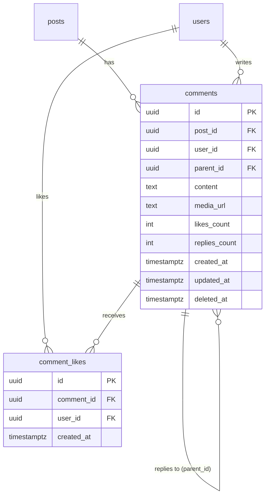
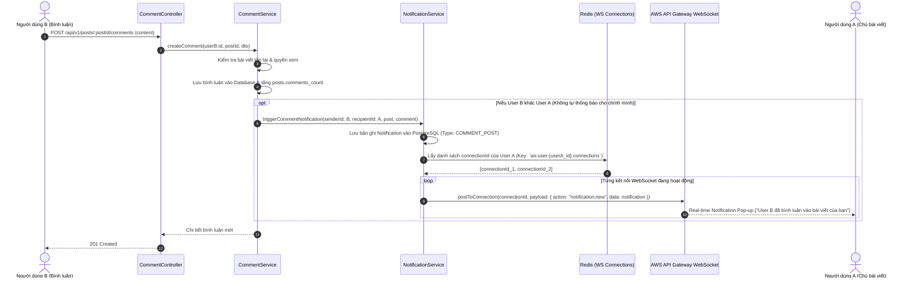
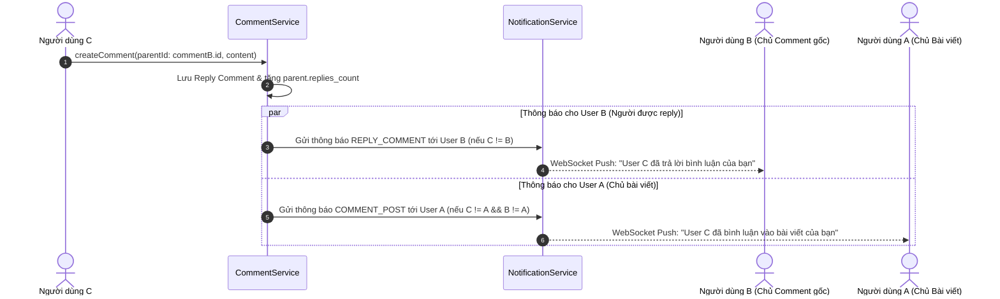

# Thiết kế cơ bản (Basic Design): Module Comment Post (Bình luận bài viết & Real-time Notification)

Tài liệu thiết kế cơ bản cho chức năng bình luận (**Comment & Reply**) trên bài viết và cơ chế kích hoạt thông báo thời gian thực (**Real-time Push Notification via AWS WebSocket**) khi có bình luận mới liên quan đến bài viết của người dùng.

---

## 1. Tổng quan & Mục tiêu

Module **Comment** chịu trách nhiệm cho các cuộc thảo luận dưới bài viết:
- Cho phép người dùng viết bình luận trực tiếp trên bài viết (`Top-level Comment`) hoặc trả lời bình luận của người khác (`Nested Reply`).
- Hỗ trợ đính kèm hình ảnh/sticker (tích hợp qua AWS S3).
- Cung cấp tính năng thích bình luận (`Comment Like`).
- **Tích hợp Thông báo thời gian thực (Real-time Notification via AWS WebSocket)**:
  - Khi người dùng B bình luận vào bài viết của người dùng A, hệ thống tự động lưu thông báo vào Database và đẩy sự kiện WebSocket tức thời đến thiết bị đang kết nối của người dùng A (`postToConnection`).
  - Khi người dùng C trả lời bình luận của người dùng B, thông báo sẽ được gửi cho cả người dùng B (chủ bình luận cha) và người dùng A (chủ bài viết).

---

## 2. Mô hình dữ liệu (Data Model)

### 2.1. Bảng `comments` (Bình luận)

| Tên cột | Kiểu dữ liệu | Bắt buộc | Khóa / Chỉ mục | Mô tả / Giá trị mặc định |
| :--- | :--- | :---: | :---: | :--- |
| `id` | UUID | Có | PK | Khóa chính tự sinh (UUID v4) |
| `post_id` | UUID | Có | FK, Index | ID bài viết được bình luận (tham chiếu `posts.id`) |
| `user_id` | UUID | Có | FK, Index | ID người viết bình luận (tham chiếu `users.id`) |
| `parent_id` | UUID | Không | FK, Index | ID bình luận cha nếu là câu trả lời (tham chiếu `comments.id`) |
| `content` | TEXT | Có | - | Nội dung văn bản bình luận |
| `media_url` | TEXT | Không | - | URL ảnh đính kèm (nếu có, lưu trên AWS S3) |
| `likes_count` | INT | Có | - | Số lượt thích bình luận (mặc định: `0`) |
| `replies_count` | INT | Có | - | Số lượt trả lời bình luận (mặc định: `0`) |
| `created_at` | TIMESTAMPTZ | Có | Index (ASC) | Thời gian tạo bình luận |
| `updated_at` | TIMESTAMPTZ | Có | - | Thời gian chỉnh sửa |
| `deleted_at` | TIMESTAMPTZ | Không | - | Thời gian xóa mềm |

### 2.2. Bảng `comment_likes` (Lượt thích bình luận)

| Tên cột | Kiểu dữ liệu | Bắt buộc | Khóa / Chỉ mục | Mô tả / Giá trị mặc định |
| :--- | :--- | :---: | :---: | :--- |
| `id` | UUID | Có | PK | Khóa chính tự sinh (UUID v4) |
| `comment_id` | UUID | Có | FK, Composite UK | ID bình luận được thích |
| `user_id` | UUID | Có | FK, Composite UK | ID người dùng thích bình luận |
| `created_at` | TIMESTAMPTZ | Có | - | Thời gian thích |

*Ràng buộc duy nhất*: `UNIQUE(comment_id, user_id)`.

### 2.3. Sơ đồ thực thể quan hệ (ERD)



---

## 3. Luồng xử lý nghiệp vụ & WebSocket Notification

### 3.1. Luồng Bình luận & Bắn WebSocket Notification tới Chủ bài viết



### 3.2. Luồng Trả lời bình luận (Reply Comment)



---

## 4. Đặc tả API Endpoints

Tiền tố chung: `/api/v1/posts/:postId/comments`

### 4.1. `POST /api/v1/posts/:postId/comments`
- **Mô tả**: Tạo bình luận mới hoặc trả lời bình luận trước đó.
- **Quyền truy cập**: Authenticated (`Bearer <accessToken>`).
- **Request Body**:
  ```json
  {
    "content": "Bài viết chia sẻ rất hay và chi tiết!",
    "parentId": null,
    "mediaUrl": "https://social-bucket-366518187546.s3.amazonaws.com/comments/..."
  }
  ```
- **Validation**:
  - `content`: chuỗi từ 1 đến 2000 ký tự.
  - `parentId`: UUID hợp lệ (tùy chọn, nếu truyền thì phải trỏ tới comment cùng postId).
- **Response**: `201 Created`
  ```json
  {
    "statusCode": 201,
    "data": {
      "id": "c1f7a220-410a-4fa4-9a87-321ba68194de",
      "postId": "e4b3e811-9a42-4f36-8a71-6c1cf6ec32b9",
      "user": {
        "id": "78a9c140-5b43-41bb-aef3-018274cbef01",
        "username": "user_b",
        "fullName": "Tran Thi B",
        "avatarUrl": "https://..."
      },
      "content": "Bài viết chia sẻ rất hay và chi tiết!",
      "parentId": null,
      "likesCount": 0,
      "repliesCount": 0,
      "isLiked": false,
      "createdAt": "2026-10-02T17:15:00.000Z"
    }
  }
  ```

---

### 4.2. `GET /api/v1/posts/:postId/comments`
- **Mô tả**: Lấy danh sách bình luận cấp 1 của bài viết (hỗ trợ phân trang Cursor).
- **Quyền truy cập**: Authenticated (`Bearer <accessToken>`).
- **Query Params**:
  - `limit`: Số bình luận mỗi trang (mặc định: `10`).
  - `cursor`: UUID comment trước đó để lấy trang kế.
- **Response**: `200 OK`
  ```json
  {
    "statusCode": 200,
    "data": {
      "items": [
        {
          "id": "c1f7a220-410a-4fa4-9a87-321ba68194de",
          "user": {
            "id": "78a9c140-5b43-41bb-aef3-018274cbef01",
            "username": "user_b",
            "fullName": "Tran Thi B",
            "avatarUrl": "https://..."
          },
          "content": "Bài viết chia sẻ rất hay!",
          "likesCount": 2,
          "repliesCount": 1,
          "isLiked": false,
          "createdAt": "2026-10-02T17:15:00.000Z"
        }
      ],
      "pagination": {
        "nextCursor": "c1f7a220-410a-4fa4-9a87-321ba68194de",
        "hasMore": false
      }
    }
  }
  ```

---

### 4.3. `GET /api/v1/comments/:commentId/replies`
- **Mô tả**: Lấy danh sách câu trả lời con của một bình luận.
- **Quyền truy cập**: Authenticated (`Bearer <accessToken>`).
- **Response**: `200 OK` (Danh sách các comments có `parent_id = commentId`).

---

### 4.4. `DELETE /api/v1/comments/:commentId`
- **Mô tả**: Xóa bình luận (chủ bình luận hoặc chủ bài viết có quyền xóa).
- **Quyền truy cập**: Authenticated (`Bearer <accessToken>`).
- **Response**: `200 OK`

---

### 4.5. `POST /api/v1/comments/:commentId/like`
- **Mô tả**: Like / Unlike bình luận.
- **Quyền truy cập**: Authenticated (`Bearer <accessToken>`).
- **Response**: `200 OK`
  ```json
  {
    "statusCode": 200,
    "data": {
      "liked": true,
      "likesCount": 3
    }
  }
  ```

---

## 5. Cấu trúc Payload WebSocket Notification

Khi có sự kiện bình luận mới, AWS WebSocket đẩy gói tin có định dạng:

```json
{
  "event": "NOTIFICATION_RECEIVED",
  "data": {
    "id": "f516a8d0-990a-44c1-84de-c82098b67151",
    "type": "COMMENT_POST",
    "title": "Bình luận mới",
    "message": "Tran Thi B đã bình luận vào bài viết của bạn: 'Bài viết chia sẻ rất hay...'",
    "sender": {
      "id": "78a9c140-5b43-41bb-aef3-018274cbef01",
      "username": "user_b",
      "fullName": "Tran Thi B",
      "avatarUrl": "https://..."
    },
    "referenceId": "e4b3e811-9a42-4f36-8a71-6c1cf6ec32b9",
    "referenceType": "POST",
    "isRead": false,
    "createdAt": "2026-10-02T17:15:02.000Z"
  }
}
```
