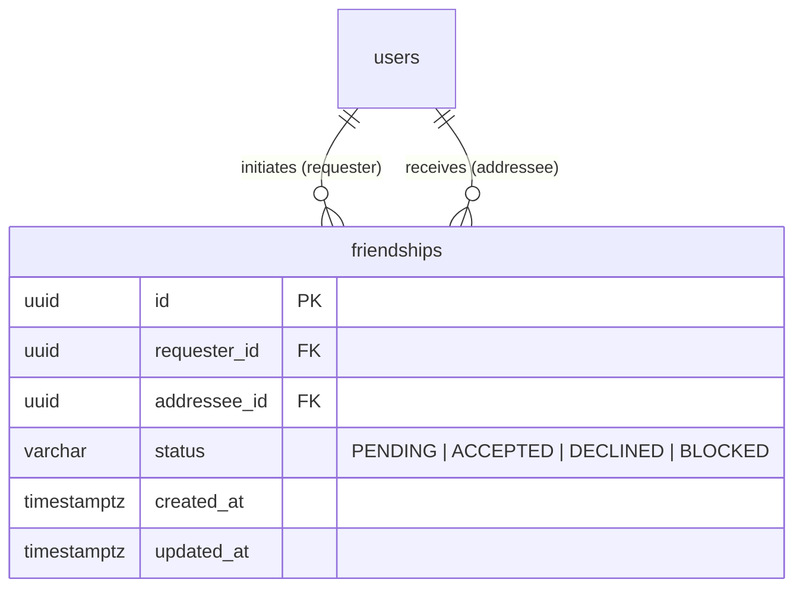
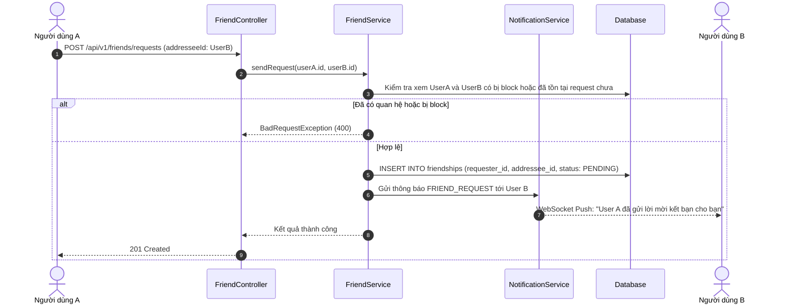
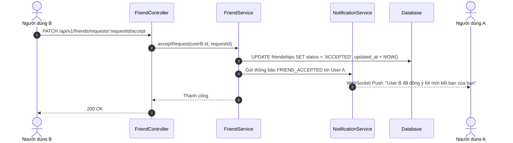

# Thiết kế cơ bản (Basic Design): Module Friend (Quản lý Bạn bè & Mối quan hệ)

Tài liệu thiết kế cơ bản cho chức năng quản lý quan hệ bạn bè (**Friendship Management**) - nền tảng xác định quyền riêng tư bảng tin, danh bạ trò chuyện và làm đối tượng nhận thông báo lập lịch (**Scheduled Notifications to Friends**).

---

## 1. Tổng quan & Mục tiêu

Module **Friend** phụ trách thiết lập và duy trì mạng lưới quan hệ xã hội giữa các tài khoản:
- Cho phép người dùng gửi lời mời kết bạn (`Send Friend Request`).
- Chấp nhận (`Accept`), Từ chối (`Decline`) hoặc Hủy lời mời kết bạn (`Cancel`).
- Hủy kết bạn (`Unfriend`).
- Chặn người dùng (`Block / Unblock`) nhằm ngăn chặn tương tác, bình luận, nhắn tin hoặc gọi video.
- Cung cấp danh sách bạn bè (`Friend List`) phục vụ:
  - Lọc bảng tin bài viết theo quyền riêng tư `FRIENDS`.
  - Phân luồng gửi tin nhắn và cuộc gọi video 1-1.
  - **Làm nguồn người nhận tự động cho tính năng Thông báo lập lịch (Scheduled Notification)** khi một người dùng muốn gửi thông báo đồng loạt cho tất cả hoặc nhóm bạn bè của mình.

---

## 2. Mô hình dữ liệu (Data Model)

### 2.1. Bảng `friendships` (Quan hệ bạn bè)

| Tên cột | Kiểu dữ liệu | Bắt buộc | Khóa / Chỉ mục | Mô tả / Giá trị mặc định |
| :--- | :--- | :---: | :---: | :--- |
| `id` | UUID | Có | PK | Khóa chính tự sinh (UUID v4) |
| `requester_id` | UUID | Có | FK, Index | ID người gửi lời mời kết bạn (tham chiếu `users.id`) |
| `addressee_id` | UUID | Có | FK, Index | ID người nhận lời mời kết bạn (tham chiếu `users.id`) |
| `status` | VARCHAR(20) | Có | Index | Trạng thái quan hệ: `PENDING`, `ACCEPTED`, `DECLINED`, `BLOCKED` |
| `created_at` | TIMESTAMPTZ | Có | - | Thời gian gửi lời mời |
| `updated_at` | TIMESTAMPTZ | Có | - | Thời gian cập nhật trạng thái (ví dụ khi ACCEPTED) |

*Ràng buộc ràng buộc duy nhất & logic*:
- `UNIQUE(requester_id, addressee_id)`.
- Ràng buộc kiểm tra `CHECK(requester_id <> addressee_id)` không cho phép tự kết bạn với chính mình.

### 2.2. Các Enums liên quan

```typescript
export enum FriendshipStatus {
  PENDING = 'PENDING',       // Đang chờ chấp nhận
  ACCEPTED = 'ACCEPTED',     // Đã là bạn bè
  DECLINED = 'DECLINED',     // Đã từ chối lời mời
  BLOCKED = 'BLOCKED',       // Bị chặn
}
```

### 2.3. Sơ đồ thực thể quan hệ (ERD)



---

## 3. Luồng xử lý nghiệp vụ (Business Workflows)

### 3.1. Luồng Gửi lời mời kết bạn (Send Friend Request)



### 3.2. Luồng Chấp nhận lời mời kết bạn (Accept Request)



---

## 4. Đặc tả API Endpoints

Tiền tố chung: `/api/v1/friends`

### 4.1. `POST /api/v1/friends/requests`
- **Mô tả**: Gửi lời mời kết bạn tới người khác.
- **Quyền truy cập**: Authenticated (`Bearer <accessToken>`).
- **Request Body**:
  ```json
  {
    "addresseeId": "78a9c140-5b43-41bb-aef3-018274cbef01"
  }
  ```
- **Response**: `201 Created`
  ```json
  {
    "statusCode": 201,
    "data": {
      "id": "22e11890-a50d-45db-99e6-012984187211",
      "requesterId": "b6a82741-2cbe-4c4f-a9cb-b61005d58ff3",
      "addresseeId": "78a9c140-5b43-41bb-aef3-018274cbef01",
      "status": "PENDING",
      "createdAt": "2026-10-02T17:30:00.000Z"
    }
  }
  ```

---

### 4.2. `PATCH /api/v1/friends/requests/:id/accept`
- **Mô tả**: Chấp nhận lời mời kết bạn.
- **Quyền truy cập**: Authenticated (`Bearer <accessToken>`).
- **Response**: `200 OK`

---

### 4.3. `PATCH /api/v1/friends/requests/:id/decline`
- **Mô tả**: Từ chối lời mời kết bạn.
- **Quyền truy cập**: Authenticated (`Bearer <accessToken>`).
- **Response**: `200 OK`

---

### 4.4. `DELETE /api/v1/friends/:friendUserId`
- **Mô tả**: Hủy kết bạn (Unfriend) với một người dùng.
- **Quyền truy cập**: Authenticated (`Bearer <accessToken>`).
- **Response**: `200 OK`

---

### 4.5. `GET /api/v1/friends`
- **Mô tả**: Lấy danh sách bạn bè hiện tại (phục vụ danh bạ, tạo nhóm chat, chọn bạn bè nhận scheduled notification).
- **Quyền truy cập**: Authenticated (`Bearer <accessToken>`).
- **Query Params**:
  - `page`: Trang (mặc định: `1`).
  - `limit`: Số bản ghi (mặc định: `20`).
  - `search`: Tìm kiếm theo tên hoặc username.
- **Response**: `200 OK`
  ```json
  {
    "statusCode": 200,
    "data": {
      "items": [
        {
          "id": "78a9c140-5b43-41bb-aef3-018274cbef01",
          "username": "user_b",
          "fullName": "Tran Thi B",
          "avatarUrl": "https://...",
          "friendshipSince": "2026-10-02T17:35:00.000Z"
        }
      ],
      "meta": {
        "totalItems": 45,
        "currentPage": 1,
        "totalPages": 3
      }
    }
  }
  ```

---

### 4.6. `GET /api/v1/friends/requests`
- **Mô tả**: Lấy danh sách lời mời kết bạn đang chờ xử lý (`received` hoặc `sent`).
- **Quyền truy cập**: Authenticated (`Bearer <accessToken>`).
- **Query Params**: `type=received` (mặc định) hoặc `type=sent`.
- **Response**: `200 OK`

---

### 4.7. `POST /api/v1/friends/block/:userId`
- **Mô tả**: Chặn một người dùng (cắt đứt quan hệ bạn bè, chặn tin nhắn & cuộc gọi).
- **Quyền truy cập**: Authenticated (`Bearer <accessToken>`).
- **Response**: `200 OK`
