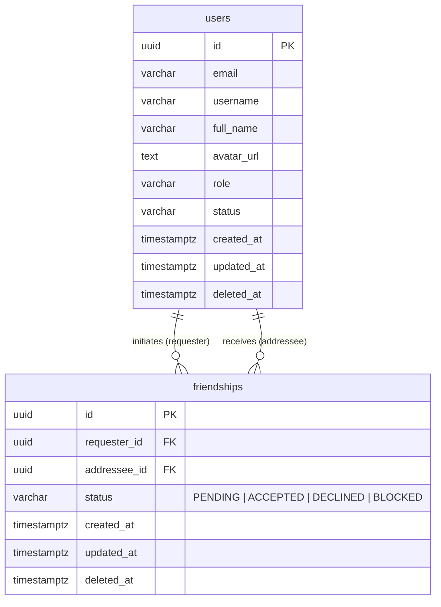

# Thiết kế chi tiết (Detail Design): Module Friend (Quản lý Bạn bè & Mối quan hệ)

Tài liệu thiết kế chi tiết kỹ thuật cho module **Friend** dựa trên [basic-design.md](file:///Users/macos/project/personal/aws/social/social-api/specs/friend/basic-design.md), tuân thủ nguyên tắc kiến trúc và quy ước đặt tên trong [plan.promt.md](file:///Users/macos/project/personal/aws/social/social-api/promts/plan.promt.md) và [implement.promt.md](file:///Users/macos/project/personal/aws/social/social-api/promts/implement.promt.md).

---

## 1. Cấu trúc file & thư mục triển khai

```text
src/
├── database/
│   └── entities/
│       └── friendship.entity.ts               # Entity Friendship kế thừa BaseEntity
├── common/
│   ├── constants/
│   │   └── module.constant.ts                 # Đã có TABLE_NAMES.FRIENDSHIPS: 'friendships'
│   ├── decorators/
│   │   └── current-user.decorator.ts          # Đã có - trích xuất user từ JWT Request
│   ├── guards/
│   │   └── jwt-auth.guard.ts                  # Đã có - xác thực token người dùng
│   └── repositories/
│       └── base.repository.ts                 # Đã có - BaseRepository cho TypeORM
├── modules/
│   └── friend/
│       ├── friend.controller.ts               # Định tuyến /api/v1/friends
│       ├── friend.module.ts                   # Khai báo FriendModule
│       ├── services/
│       │   └── friend.service.ts              # Nghiệp vụ kết bạn, chấp nhận, từ chối, hủy, chặn, danh bạ
│       ├── repositories/
│       │   └── friendship.repository.ts       # Kế thừa BaseRepository<Friendship> (truy vấn 2 chiều, search)
│       └── dto/
│           ├── send-friend-request.dto.ts     # DTO gửi lời mời kết bạn (addresseeId)
│           ├── get-friends-query.dto.ts       # DTO phân trang & tìm kiếm danh sách bạn bè
│           ├── get-friend-requests-query.dto.ts # DTO lấy danh sách lời mời (type: received | sent)
│           ├── get-blocked-users-query.dto.ts # DTO phân trang danh sách người dùng bị chặn
│           ├── friendship-response.dto.ts     # DTO chi tiết bản ghi friendship
│           ├── friend-user-response.dto.ts    # DTO thông tin bạn bè kèm thời điểm kết bạn
│           └── friendship-status-response.dto.ts # DTO kiểm tra trạng thái tương tác giữa 2 người dùng
```

---

## 2. Chi tiết Entities & Database Schema

### 2.1. Cập nhật `src/common/constants/module.constant.ts`
Trong file `src/common/constants/module.constant.ts` đã có:
```typescript
export const TABLE_NAMES = {
  USERS: 'users',
  ROLES: 'roles',
  USER_ROLES: 'user_roles',
  POSTS: 'posts',
  POST_MEDIA: 'post_media',
  POST_LIKES: 'post_likes',
  COMMENTS: 'comments',
  LIKES: 'likes',
  FOLLOWS: 'follows',
  FRIENDSHIPS: 'friendships',
} as const;
```

### 2.2. Enums
Đặt tại `src/database/entities/friendship.entity.ts`:
```typescript
export enum FriendshipStatus {
  PENDING = 'PENDING',       // Đang chờ người nhận phản hồi
  ACCEPTED = 'ACCEPTED',     // Đã đồng ý kết bạn (bạn bè hai chiều)
  DECLINED = 'DECLINED',     // Đã từ chối lời mời
  BLOCKED = 'BLOCKED',       // Đã bị chặn (requester_id chặn addressee_id)
}

export enum FriendRequestType {
  RECEIVED = 'received',     // Lời mời gửi đến người dùng hiện tại
  SENT = 'sent',             // Lời mời người dùng hiện tại đã gửi đi
}
```

### 2.3. Entity `Friendship`: `src/database/entities/friendship.entity.ts`
Kế thừa [BaseEntity](file:///Users/macos/project/personal/aws/social/social-api/src/shared/base.entity.ts) (`id: string (UUID)`, `createdAt`, `updatedAt`, `deletedAt`).

```typescript
import {
  Entity,
  Column,
  Index,
  ManyToOne,
  JoinColumn,
  Check,
  Unique,
} from 'typeorm';
import { BaseEntity } from '../../shared/base.entity';
import { TABLE_NAMES } from '../../common/constants/module.constant';
import { User } from './user.entity';

export enum FriendshipStatus {
  PENDING = 'PENDING',
  ACCEPTED = 'ACCEPTED',
  DECLINED = 'DECLINED',
  BLOCKED = 'BLOCKED',
}

@Entity({ name: TABLE_NAMES.FRIENDSHIPS || 'friendships' })
@Unique('uq_friendships_requester_addressee', ['requesterId', 'addresseeId'])
@Check('chk_friendships_no_self_friend', '"requester_id" <> "addressee_id"')
@Index('idx_friendships_requester_status', ['requesterId', 'status'])
@Index('idx_friendships_addressee_status', ['addresseeId', 'status'])
@Index('idx_friendships_status_created', ['status', 'createdAt'])
export class Friendship extends BaseEntity {
  @Index()
  @Column({ type: 'uuid', name: 'requester_id' })
  requesterId: string;

  @ManyToOne(() => User, { onDelete: 'CASCADE' })
  @JoinColumn({ name: 'requester_id' })
  requester: User;

  @Index()
  @Column({ type: 'uuid', name: 'addressee_id' })
  addresseeId: string;

  @ManyToOne(() => User, { onDelete: 'CASCADE' })
  @JoinColumn({ name: 'addressee_id' })
  addressee: User;

  @Column({
    type: 'varchar',
    length: 20,
    enum: FriendshipStatus,
    default: FriendshipStatus.PENDING,
  })
  status: FriendshipStatus;
}
```

### 2.4. Sơ đồ thực thể quan hệ (ERD)



---

## 3. Data Transfer Objects (DTO)

### 3.1. `src/modules/friend/dto/send-friend-request.dto.ts`
```typescript
import { ApiProperty } from '@nestjs/swagger';
import { IsNotEmpty, IsUUID } from 'class-validator';

export class SendFriendRequestDto {
  @ApiProperty({
    description: 'UUID của người dùng nhận lời mời kết bạn',
    example: '78a9c140-5b43-41bb-aef3-018274cbef01',
  })
  @IsUUID('4', { message: 'addresseeId phải là một UUID hợp lệ' })
  @IsNotEmpty({ message: 'addresseeId không được để trống' })
  addresseeId: string;
}
```

### 3.2. `src/modules/friend/dto/get-friends-query.dto.ts`
```typescript
import { ApiPropertyOptional } from '@nestjs/swagger';
import { Type } from 'class-transformer';
import { IsIn, IsInt, IsOptional, IsString, Max, Min } from 'class-validator';

export class GetFriendsQueryDto {
  @ApiPropertyOptional({
    description: 'Số thứ tự trang (bắt đầu từ 1)',
    example: 1,
    default: 1,
  })
  @IsOptional()
  @Type(() => Number)
  @IsInt()
  @Min(1)
  page?: number = 1;

  @ApiPropertyOptional({
    description: 'Số lượng bạn bè trên mỗi trang (tối đa 100)',
    example: 20,
    default: 20,
  })
  @IsOptional()
  @Type(() => Number)
  @IsInt()
  @Min(1)
  @Max(100)
  limit?: number = 20;

  @ApiPropertyOptional({
    description: 'Từ khóa tìm kiếm theo họ tên (fullName) hoặc tên người dùng (username)',
    example: 'nguyen van a',
  })
  @IsOptional()
  @IsString()
  search?: string;

  @ApiPropertyOptional({
    description: 'Sắp xếp theo trường',
    enum: ['createdAt', 'fullName', 'username'],
    default: 'createdAt',
  })
  @IsOptional()
  @IsIn(['createdAt', 'fullName', 'username'])
  sortBy?: 'createdAt' | 'fullName' | 'username' = 'createdAt';

  @ApiPropertyOptional({
    description: 'Chiều sắp xếp',
    enum: ['ASC', 'DESC', 'asc', 'desc'],
    default: 'DESC',
  })
  @IsOptional()
  @IsIn(['ASC', 'DESC', 'asc', 'desc'])
  sortDir?: 'ASC' | 'DESC' | 'asc' | 'desc' = 'DESC';
}
```

### 3.3. `src/modules/friend/dto/get-friend-requests-query.dto.ts`
```typescript
import { ApiPropertyOptional } from '@nestjs/swagger';
import { Type } from 'class-transformer';
import { IsEnum, IsInt, IsOptional, Max, Min } from 'class-validator';
import { FriendRequestType } from '../../../database/entities/friendship.entity';

export class GetFriendRequestsQueryDto {
  @ApiPropertyOptional({
    description: 'Loại lời mời: "received" (nhận được) hoặc "sent" (đã gửi đi)',
    enum: FriendRequestType,
    default: FriendRequestType.RECEIVED,
  })
  @IsOptional()
  @IsEnum(FriendRequestType, {
    message: 'type phải là "received" hoặc "sent"',
  })
  type?: FriendRequestType = FriendRequestType.RECEIVED;

  @ApiPropertyOptional({
    description: 'Số trang',
    example: 1,
    default: 1,
  })
  @IsOptional()
  @Type(() => Number)
  @IsInt()
  @Min(1)
  page?: number = 1;

  @ApiPropertyOptional({
    description: 'Số lượng mục trên trang',
    example: 20,
    default: 20,
  })
  @IsOptional()
  @Type(() => Number)
  @IsInt()
  @Min(1)
  @Max(100)
  limit?: number = 20;
}
```

### 3.4. `src/modules/friend/dto/get-blocked-users-query.dto.ts`
```typescript
import { ApiPropertyOptional } from '@nestjs/swagger';
import { Type } from 'class-transformer';
import { IsInt, IsOptional, Max, Min } from 'class-validator';

export class GetBlockedUsersQueryDto {
  @ApiPropertyOptional({
    description: 'Số trang',
    example: 1,
    default: 1,
  })
  @IsOptional()
  @Type(() => Number)
  @IsInt()
  @Min(1)
  page?: number = 1;

  @ApiPropertyOptional({
    description: 'Số lượng bản ghi trên một trang',
    example: 20,
    default: 20,
  })
  @IsOptional()
  @Type(() => Number)
  @IsInt()
  @Min(1)
  @Max(100)
  limit?: number = 20;
}
```

### 3.5. `src/modules/friend/dto/friend-user-response.dto.ts`
```typescript
import { ApiProperty, ApiPropertyOptional } from '@nestjs/swagger';

export class FriendUserItemDto {
  @ApiProperty({ description: 'ID người dùng (bạn bè)', example: '78a9c140-5b43-41bb-aef3-018274cbef01' })
  id: string;

  @ApiProperty({ description: 'Tên tài khoản người dùng', example: 'user_b' })
  username: string;

  @ApiProperty({ description: 'Họ và tên đầy đủ', example: 'Trần Thị B' })
  fullName: string;

  @ApiPropertyOptional({ description: 'Ảnh đại diện người dùng', example: 'https://cdn.social.com/avatars/user_b.jpg' })
  avatarUrl?: string | null;

  @ApiPropertyOptional({ description: 'Tiểu sử cá nhân', example: 'Lập trình viên yêu thích công nghệ' })
  bio?: string | null;

  @ApiProperty({ description: 'ID bản ghi quan hệ bạn bè', example: '22e11890-a50d-45db-99e6-012984187211' })
  friendshipId: string;

  @ApiProperty({ description: 'Thời điểm bắt đầu trở thành bạn bè', example: '2026-10-02T17:35:00.000Z' })
  friendshipSince: Date;
}

export class PaginationMetaDto {
  @ApiProperty({ example: 45 })
  totalItems: number;

  @ApiProperty({ example: 1 })
  currentPage: number;

  @ApiProperty({ example: 20 })
  pageSize: number;

  @ApiProperty({ example: 3 })
  totalPages: number;
}

export class FriendListResponseDto {
  @ApiProperty({ type: [FriendUserItemDto] })
  items: FriendUserItemDto[];

  @ApiProperty({ type: PaginationMetaDto })
  meta: PaginationMetaDto;
}
```

### 3.6. `src/modules/friend/dto/friendship-response.dto.ts`
```typescript
import { ApiProperty, ApiPropertyOptional } from '@nestjs/swagger';
import { FriendshipStatus } from '../../../database/entities/friendship.entity';

export class UserSummaryDto {
  @ApiProperty({ example: '78a9c140-5b43-41bb-aef3-018274cbef01' })
  id: string;

  @ApiProperty({ example: 'user_b' })
  username: string;

  @ApiProperty({ example: 'Trần Thị B' })
  fullName: string;

  @ApiPropertyOptional({ example: 'https://cdn.social.com/avatars/user_b.jpg' })
  avatarUrl?: string | null;
}

export class FriendshipResponseDto {
  @ApiProperty({ example: '22e11890-a50d-45db-99e6-012984187211' })
  id: string;

  @ApiProperty({ example: 'b6a82741-2cbe-4c4f-a9cb-b61005d58ff3' })
  requesterId: string;

  @ApiProperty({ example: '78a9c140-5b43-41bb-aef3-018274cbef01' })
  addresseeId: string;

  @ApiProperty({ enum: FriendshipStatus, example: FriendshipStatus.PENDING })
  status: FriendshipStatus;

  @ApiPropertyOptional({ type: UserSummaryDto })
  requester?: UserSummaryDto;

  @ApiPropertyOptional({ type: UserSummaryDto })
  addressee?: UserSummaryDto;

  @ApiProperty({ example: '2026-10-02T17:30:00.000Z' })
  createdAt: Date;

  @ApiProperty({ example: '2026-10-02T17:30:00.000Z' })
  updatedAt: Date;
}

export class FriendRequestListResponseDto {
  @ApiProperty({ type: [FriendshipResponseDto] })
  items: FriendshipResponseDto[];

  @ApiProperty({ type: PaginationMetaDto })
  meta: PaginationMetaDto;
}
```

### 3.7. `src/modules/friend/dto/friendship-status-response.dto.ts`
DTO phục vụ hiển thị trạng thái nút kết bạn trên giao diện cá nhân (Profile Page), bảng tin hoặc hội thoại chat:
```typescript
import { ApiProperty, ApiPropertyOptional } from '@nestjs/swagger';
import { FriendshipStatus } from '../../../database/entities/friendship.entity';

export type FriendshipDirection = 'outgoing' | 'incoming' | 'none';

export class FriendshipStatusResponseDto {
  @ApiProperty({ description: 'ID người dùng mục tiêu', example: '78a9c140-5b43-41bb-aef3-018274cbef01' })
  targetUserId: string;

  @ApiProperty({ description: 'Đã là bạn bè hay chưa', example: true })
  isFriend: boolean;

  @ApiProperty({
    description: 'Trạng thái mối quan hệ hiện tại',
    enum: [...Object.values(FriendshipStatus), 'NONE'],
    example: FriendshipStatus.ACCEPTED,
  })
  status: FriendshipStatus | 'NONE';

  @ApiProperty({
    description: 'Hướng của lời mời ("outgoing": tôi gửi đi, "incoming": người đó gửi đến tôi, "none": không có)',
    example: 'outgoing',
    enum: ['outgoing', 'incoming', 'none'],
  })
  direction: FriendshipDirection;

  @ApiProperty({ description: 'Người dùng hiện tại có chặn người này không', example: false })
  isBlockedByMe: boolean;

  @ApiProperty({ description: 'Người dùng hiện tại có bị người này chặn không', example: false })
  isBlockedByThem: boolean;

  @ApiPropertyOptional({
    description: 'ID của lời mời kết bạn (nếu đang ở trạng thái PENDING)',
    example: '22e11890-a50d-45db-99e6-012984187211',
  })
  requestId?: string | null;
}
```

---

## 4. Chi tiết Repositories

### `FriendshipRepository`: `src/modules/friend/repositories/friendship.repository.ts`
Kế thừa [BaseRepository](file:///Users/macos/project/personal/aws/social/social-api/src/common/repositories/base.repository.ts)<Friendship>.

```typescript
import { Injectable } from '@nestjs/common';
import { InjectRepository } from '@nestjs/typeorm';
import { Repository, SelectQueryBuilder } from 'typeorm';
import { BaseRepository } from '../../../common/repositories/base.repository';
import {
  Friendship,
  FriendshipStatus,
  FriendRequestType,
} from '../../../database/entities/friendship.entity';
import { GetFriendsQueryDto } from '../dto/get-friends-query.dto';
import { GetFriendRequestsQueryDto } from '../dto/get-friend-requests-query.dto';
import { GetBlockedUsersQueryDto } from '../dto/get-blocked-users-query.dto';
import { FriendUserItemDto, PaginationMetaDto } from '../dto/friend-user-response.dto';

@Injectable()
export class FriendshipRepository extends BaseRepository<Friendship> {
  constructor(
    @InjectRepository(Friendship)
    private readonly friendshipRepo: Repository<Friendship>,
  ) {
    super(friendshipRepo);
  }

  /**
   * Tìm mối quan hệ bất kỳ giữa 2 người dùng (bất kể chiều requester/addressee)
   */
  async findRelationshipBetween(
    user1Id: string,
    user2Id: string,
  ): Promise<Friendship | null> {
    return this.friendshipRepo.findOne({
      where: [
        { requesterId: user1Id, addresseeId: user2Id },
        { requesterId: user2Id, addresseeId: user1Id },
      ],
      relations: ['requester', 'addressee'],
    });
  }

  /**
   * Tìm lời mời kết bạn PENDING gửi từ requester tới addressee
   */
  async findPendingRequest(
    requesterId: string,
    addresseeId: string,
  ): Promise<Friendship | null> {
    return this.friendshipRepo.findOne({
      where: {
        requesterId,
        addresseeId,
        status: FriendshipStatus.PENDING,
      },
    });
  }

  /**
   * Kiểm tra 2 người dùng có phải là bạn bè hay không
   */
  async areFriends(user1Id: string, user2Id: string): Promise<boolean> {
    const count = await this.friendshipRepo.count({
      where: [
        { requesterId: user1Id, addresseeId: user2Id, status: FriendshipStatus.ACCEPTED },
        { requesterId: user2Id, addresseeId: user1Id, status: FriendshipStatus.ACCEPTED },
      ],
    });
    return count > 0;
  }

  /**
   * Kiểm tra xem có bất kỳ ai trong 2 người chặn người còn lại hay không
   */
  async isBlockedBetween(user1Id: string, user2Id: string): Promise<boolean> {
    const count = await this.friendshipRepo.count({
      where: [
        { requesterId: user1Id, addresseeId: user2Id, status: FriendshipStatus.BLOCKED },
        { requesterId: user2Id, addresseeId: user1Id, status: FriendshipStatus.BLOCKED },
      ],
    });
    return count > 0;
  }

  /**
   * Lấy danh sách ID tất cả bạn bè của một người dùng (hỗ trợ Newsfeed và Scheduled Notification)
   */
  async getAllFriendUserIds(userId: string): Promise<string[]> {
    const friendships = await this.friendshipRepo
      .createQueryBuilder('f')
      .select(['f.requesterId', 'f.addresseeId'])
      .where('(f.requesterId = :userId OR f.addresseeId = :userId)', { userId })
      .andWhere('f.status = :status', { status: FriendshipStatus.ACCEPTED })
      .getMany();

    return friendships.map((f) =>
      f.requesterId === userId ? f.addresseeId : f.requesterId,
    );
  }

  /**
   * Lấy danh sách bạn bè có phân trang & tìm kiếm theo họ tên hoặc username
   */
  async getFriendsPaginated(
    userId: string,
    query: GetFriendsQueryDto,
  ): Promise<{ items: FriendUserItemDto[]; meta: PaginationMetaDto }> {
    const page = Math.max(1, Number(query.page) || 1);
    const limit = Math.max(1, Math.min(100, Number(query.limit) || 20));
    const skip = (page - 1) * limit;

    // Join với bảng users theo điều kiện 2 chiều
    const qb = this.friendshipRepo
      .createQueryBuilder('f')
      .innerJoin(
        'users',
        'u',
        'u.id = CASE WHEN f.requester_id = :userId THEN f.addressee_id ELSE f.requester_id END',
        { userId },
      )
      .where('(f.requester_id = :userId OR f.addressee_id = :userId)', { userId })
      .andWhere('f.status = :status', { status: FriendshipStatus.ACCEPTED })
      .andWhere('u.deleted_at IS NULL');

    if (query.search && query.search.trim() !== '') {
      const keyword = `%${query.search.trim().toLowerCase()}%`;
      qb.andWhere('(LOWER(u.full_name) LIKE :keyword OR LOWER(u.username) LIKE :keyword)', {
        keyword,
      });
    }

    // Sắp xếp
    if (query.sortBy === 'fullName') {
      qb.orderBy('u.full_name', query.sortDir?.toUpperCase() === 'ASC' ? 'ASC' : 'DESC');
    } else if (query.sortBy === 'username') {
      qb.orderBy('u.username', query.sortDir?.toUpperCase() === 'ASC' ? 'ASC' : 'DESC');
    } else {
      qb.orderBy('f.updated_at', query.sortDir?.toUpperCase() === 'ASC' ? 'ASC' : 'DESC');
    }

    qb.select([
      'u.id AS id',
      'u.username AS username',
      'u.full_name AS "fullName"',
      'u.avatar_url AS "avatarUrl"',
      'u.bio AS bio',
      'f.id AS "friendshipId"',
      'f.updated_at AS "friendshipSince"',
    ]);

    const totalItems = await qb.getCount();
    const rawItems = await qb.offset(skip).limit(limit).getRawMany();

    const items: FriendUserItemDto[] = rawItems.map((row) => ({
      id: row.id,
      username: row.username,
      fullName: row.fullName,
      avatarUrl: row.avatarUrl || null,
      bio: row.bio || null,
      friendshipId: row.friendshipId,
      friendshipSince: new Date(row.friendshipSince),
    }));

    const totalPages = Math.ceil(totalItems / limit) || 1;

    return {
      items,
      meta: {
        totalItems,
        currentPage: page,
        pageSize: limit,
        totalPages,
      },
    };
  }

  /**
   * Lấy danh sách lời mời kết bạn (được nhận hoặc đã gửi)
   */
  async getFriendRequestsPaginated(
    userId: string,
    query: GetFriendRequestsQueryDto,
  ): Promise<{ items: Friendship[]; meta: PaginationMetaDto }> {
    const page = Math.max(1, Number(query.page) || 1);
    const limit = Math.max(1, Math.min(100, Number(query.limit) || 20));
    const skip = (page - 1) * limit;

    const qb = this.friendshipRepo.createQueryBuilder('f');

    if (query.type === FriendRequestType.SENT) {
      qb.where('f.requester_id = :userId', { userId })
        .andWhere('f.status = :status', { status: FriendshipStatus.PENDING })
        .leftJoinAndSelect('f.addressee', 'addressee');
    } else {
      qb.where('f.addressee_id = :userId', { userId })
        .andWhere('f.status = :status', { status: FriendshipStatus.PENDING })
        .leftJoinAndSelect('f.requester', 'requester');
    }

    qb.orderBy('f.created_at', 'DESC');

    const [items, totalItems] = await qb
      .skip(skip)
      .take(limit)
      .getManyAndCount();

    const totalPages = Math.ceil(totalItems / limit) || 1;

    return {
      items,
      meta: {
        totalItems,
        currentPage: page,
        pageSize: limit,
        totalPages,
      },
    };
  }

  /**
   * Lấy danh sách người dùng bị chặn bởi người dùng hiện tại
   */
  async getBlockedUsersPaginated(
    userId: string,
    query: GetBlockedUsersQueryDto,
  ): Promise<{ items: Friendship[]; meta: PaginationMetaDto }> {
    const page = Math.max(1, Number(query.page) || 1);
    const limit = Math.max(1, Math.min(100, Number(query.limit) || 20));
    const skip = (page - 1) * limit;

    const [items, totalItems] = await this.friendshipRepo.findAndCount({
      where: {
        requesterId: userId,
        status: FriendshipStatus.BLOCKED,
      },
      relations: ['addressee'],
      order: { updatedAt: 'DESC' },
      skip,
      take: limit,
    });

    const totalPages = Math.ceil(totalItems / limit) || 1;

    return {
      items,
      meta: {
        totalItems,
        currentPage: page,
        pageSize: limit,
        totalPages,
      },
    };
  }
}
```

---

## 5. Chi tiết Dịch vụ Nghiệp vụ (Services)

### `FriendService`: `src/modules/friend/services/friend.service.ts`

```typescript
import {
  Injectable,
  NotFoundException,
  BadRequestException,
  ConflictException,
  ForbiddenException,
  Logger,
} from '@nestjs/common';
import { InjectRepository } from '@nestjs/typeorm';
import { Repository } from 'typeorm';
import { FriendshipRepository } from '../repositories/friendship.repository';
import {
  Friendship,
  FriendshipStatus,
  FriendRequestType,
} from '../../../database/entities/friendship.entity';
import { User, UserStatus } from '../../../database/entities/user.entity';
import { SendFriendRequestDto } from '../dto/send-friend-request.dto';
import { GetFriendsQueryDto } from '../dto/get-friends-query.dto';
import { GetFriendRequestsQueryDto } from '../dto/get-friend-requests-query.dto';
import { GetBlockedUsersQueryDto } from '../dto/get-blocked-users-query.dto';
import {
  FriendshipResponseDto,
  FriendRequestListResponseDto,
} from '../dto/friendship-response.dto';
import { FriendListResponseDto } from '../dto/friend-user-response.dto';
import { FriendshipStatusResponseDto } from '../dto/friendship-status-response.dto';

@Injectable()
export class FriendService {
  private readonly logger = new Logger(FriendService.name);

  constructor(
    private readonly friendshipRepository: FriendshipRepository,
    @InjectRepository(User)
    private readonly userRepository: Repository<User>,
  ) {}

  /**
   * 1. Gửi lời mời kết bạn (Send Friend Request)
   */
  async sendFriendRequest(
    requesterId: string,
    dto: SendFriendRequestDto,
  ): Promise<FriendshipResponseDto> {
    const { addresseeId } = dto;

    if (requesterId === addresseeId) {
      throw new BadRequestException('Bạn không thể gửi lời mời kết bạn cho chính mình');
    }

    const addressee = await this.userRepository.findOne({
      where: { id: addresseeId, status: UserStatus.ACTIVE },
    });
    if (!addressee) {
      throw new NotFoundException('Người dùng nhận lời mời không tồn tại hoặc đã bị khóa');
    }

    // Kiểm tra xem đã có mối quan hệ trước đó chưa
    const existing = await this.friendshipRepository.findRelationshipBetween(
      requesterId,
      addresseeId,
    );

    if (existing) {
      if (existing.status === FriendshipStatus.ACCEPTED) {
        throw new ConflictException('Hai người đã là bạn bè của nhau');
      }

      if (existing.status === FriendshipStatus.BLOCKED) {
        if (existing.requesterId === requesterId) {
          throw new BadRequestException(
            'Bạn đang chặn người dùng này. Hãy bỏ chặn trước khi gửi lời mời.',
          );
        } else {
          throw new ForbiddenException('Không thể gửi lời mời tới người dùng này');
        }
      }

      if (existing.status === FriendshipStatus.PENDING) {
        if (existing.requesterId === requesterId) {
          throw new BadRequestException('Bạn đã gửi lời mời kết bạn trước đó, vui lòng chờ đối phương phản hồi');
        } else {
          // Đối phương đã gửi lời mời cho mình trước đó -> Tự động chuyển thành ACCEPTED
          existing.status = FriendshipStatus.ACCEPTED;
          const saved = await this.friendshipRepository.getRepository().save(existing);
          this.dispatchNotification(
            'FRIEND_ACCEPTED',
            requesterId,
            addresseeId,
            'Đã tự động chấp nhận lời mời kết bạn từ đối phương',
          );
          return this.mapToResponse(saved);
        }
      }

      if (existing.status === FriendshipStatus.DECLINED) {
        // Tái tạo lại request: cập nhật requester thành người gửi mới và status = PENDING
        existing.requesterId = requesterId;
        existing.addresseeId = addresseeId;
        existing.status = FriendshipStatus.PENDING;
        const saved = await this.friendshipRepository.getRepository().save(existing);
        this.dispatchNotification(
          'FRIEND_REQUEST',
          requesterId,
          addresseeId,
          'Gửi lời mời kết bạn mới',
        );
        return this.mapToResponse(saved);
      }
    }

    // Tạo mới quan hệ PENDING
    const newFriendship = await this.friendshipRepository.create({
      requesterId,
      addresseeId,
      status: FriendshipStatus.PENDING,
    });

    this.dispatchNotification(
      'FRIEND_REQUEST',
      requesterId,
      addresseeId,
      'Gửi lời mời kết bạn',
    );

    return this.mapToResponse(newFriendship);
  }

  /**
   * 2. Chấp nhận lời mời kết bạn (Accept Request)
   */
  async acceptFriendRequest(
    userId: string,
    requestId: string,
  ): Promise<FriendshipResponseDto> {
    const friendship = await this.friendshipRepository.findById(requestId, {
      relations: ['requester', 'addressee'],
    });

    if (!friendship) {
      throw new NotFoundException('Không tìm thấy lời mời kết bạn');
    }

    if (friendship.addresseeId !== userId) {
      throw new ForbiddenException('Bạn không có quyền chấp nhận lời mời này');
    }

    if (friendship.status === FriendshipStatus.ACCEPTED) {
      throw new BadRequestException('Lời mời đã được chấp nhận trước đó');
    }

    if (friendship.status !== FriendshipStatus.PENDING) {
      throw new BadRequestException('Lời mời kết bạn không ở trạng thái chờ chấp nhận');
    }

    friendship.status = FriendshipStatus.ACCEPTED;
    const updated = await this.friendshipRepository.getRepository().save(friendship);

    this.dispatchNotification(
      'FRIEND_ACCEPTED',
      userId,
      friendship.requesterId,
      'Đã chấp nhận lời mời kết bạn',
    );

    return this.mapToResponse(updated);
  }

  /**
   * 3. Từ chối lời mời kết bạn (Decline Request)
   */
  async declineFriendRequest(
    userId: string,
    requestId: string,
  ): Promise<FriendshipResponseDto> {
    const friendship = await this.friendshipRepository.findById(requestId);

    if (!friendship) {
      throw new NotFoundException('Không tìm thấy lời mời kết bạn');
    }

    if (friendship.addresseeId !== userId) {
      throw new ForbiddenException('Bạn không có quyền từ chối lời mời này');
    }

    if (friendship.status !== FriendshipStatus.PENDING) {
      throw new BadRequestException('Lời mời kết bạn không ở trạng thái chờ xử lý');
    }

    friendship.status = FriendshipStatus.DECLINED;
    const updated = await this.friendshipRepository.getRepository().save(friendship);

    return this.mapToResponse(updated);
  }

  /**
   * 4. Hủy lời mời kết bạn đã gửi (Cancel Request)
   */
  async cancelFriendRequest(
    userId: string,
    requestId: string,
  ): Promise<{ message: string }> {
    const friendship = await this.friendshipRepository.findById(requestId);

    if (!friendship) {
      throw new NotFoundException('Không tìm thấy lời mời kết bạn');
    }

    if (friendship.requesterId !== userId) {
      throw new ForbiddenException('Bạn chỉ có thể hủy lời mời do chính mình gửi');
    }

    if (friendship.status !== FriendshipStatus.PENDING) {
      throw new BadRequestException('Chỉ có thể hủy lời mời đang ở trạng thái chờ phản hồi');
    }

    await this.friendshipRepository.getRepository().remove(friendship);

    return { message: 'Đã hủy lời mời kết bạn thành công' };
  }

  /**
   * 5. Hủy kết bạn (Unfriend)
   */
  async unfriend(
    userId: string,
    friendUserId: string,
  ): Promise<{ message: string }> {
    const friendship = await this.friendshipRepository.findRelationshipBetween(
      userId,
      friendUserId,
    );

    if (!friendship || friendship.status !== FriendshipStatus.ACCEPTED) {
      throw new NotFoundException('Hai người hiện không phải là bạn bè');
    }

    await this.friendshipRepository.getRepository().remove(friendship);

    return { message: 'Đã hủy kết bạn thành công' };
  }

  /**
   * 6. Lấy danh sách bạn bè hiện tại (phục vụ Newsfeed, Chat, và Scheduled Notification)
   */
  async getFriends(
    userId: string,
    query: GetFriendsQueryDto,
  ): Promise<FriendListResponseDto> {
    return this.friendshipRepository.getFriendsPaginated(userId, query);
  }

  /**
   * 7. Lấy danh sách lời mời kết bạn (received hoặc sent)
   */
  async getFriendRequests(
    userId: string,
    query: GetFriendRequestsQueryDto,
  ): Promise<FriendRequestListResponseDto> {
    const { items, meta } =
      await this.friendshipRepository.getFriendRequestsPaginated(userId, query);

    return {
      items: items.map((f) => this.mapToResponse(f)),
      meta,
    };
  }

  /**
   * 8. Chặn một người dùng (Block User)
   */
  async blockUser(
    userId: string,
    targetUserId: string,
  ): Promise<FriendshipResponseDto> {
    if (userId === targetUserId) {
      throw new BadRequestException('Bạn không thể tự chặn chính mình');
    }

    const targetUser = await this.userRepository.findOne({
      where: { id: targetUserId },
    });
    if (!targetUser) {
      throw new NotFoundException('Người dùng mục tiêu không tồn tại');
    }

    let relation = await this.friendshipRepository.findRelationshipBetween(
      userId,
      targetUserId,
    );

    if (relation) {
      if (relation.status === FriendshipStatus.BLOCKED && relation.requesterId === userId) {
        throw new BadRequestException('Bạn đã chặn người dùng này trước đó');
      }

      // Đưa về trạng thái BLOCKED với requesterId = userId (người thực hiện chặn)
      relation.requesterId = userId;
      relation.addresseeId = targetUserId;
      relation.status = FriendshipStatus.BLOCKED;
    } else {
      relation = this.friendshipRepository.getRepository().create({
        requesterId: userId,
        addresseeId: targetUserId,
        status: FriendshipStatus.BLOCKED,
      });
    }

    const saved = await this.friendshipRepository.getRepository().save(relation);
    return this.mapToResponse(saved);
  }

  /**
   * 9. Bỏ chặn người dùng (Unblock User)
   */
  async unblockUser(
    userId: string,
    targetUserId: string,
  ): Promise<{ message: string }> {
    const relation = await this.friendshipRepository.findRelationshipBetween(
      userId,
      targetUserId,
    );

    if (
      !relation ||
      relation.status !== FriendshipStatus.BLOCKED ||
      relation.requesterId !== userId
    ) {
      throw new NotFoundException('Người dùng này không nằm trong danh sách bị bạn chặn');
    }

    await this.friendshipRepository.getRepository().remove(relation);

    return { message: 'Đã bỏ chặn người dùng thành công' };
  }

  /**
   * 10. Lấy danh sách người dùng đang bị chặn
   */
  async getBlockedUsers(
    userId: string,
    query: GetBlockedUsersQueryDto,
  ): Promise<FriendRequestListResponseDto> {
    const { items, meta } =
      await this.friendshipRepository.getBlockedUsersPaginated(userId, query);

    return {
      items: items.map((f) => this.mapToResponse(f)),
      meta,
    };
  }

  /**
   * 11. Kiểm tra trạng thái mối quan hệ giữa người dùng hiện tại và một người dùng khác
   */
  async getFriendshipStatus(
    currentUserId: string,
    targetUserId: string,
  ): Promise<FriendshipStatusResponseDto> {
    if (currentUserId === targetUserId) {
      return {
        targetUserId,
        isFriend: false,
        status: 'NONE',
        direction: 'none',
        isBlockedByMe: false,
        isBlockedByThem: false,
      };
    }

    const relation = await this.friendshipRepository.findRelationshipBetween(
      currentUserId,
      targetUserId,
    );

    if (!relation) {
      return {
        targetUserId,
        isFriend: false,
        status: 'NONE',
        direction: 'none',
        isBlockedByMe: false,
        isBlockedByThem: false,
      };
    }

    const isFriend = relation.status === FriendshipStatus.ACCEPTED;
    const isRequester = relation.requesterId === currentUserId;
    const direction =
      relation.status === FriendshipStatus.PENDING
        ? isRequester
          ? 'outgoing'
          : 'incoming'
        : 'none';

    const isBlockedByMe =
      relation.status === FriendshipStatus.BLOCKED && isRequester;
    const isBlockedByThem =
      relation.status === FriendshipStatus.BLOCKED && !isRequester;

    return {
      targetUserId,
      isFriend,
      status: relation.status,
      direction,
      isBlockedByMe,
      isBlockedByThem,
      requestId:
        relation.status === FriendshipStatus.PENDING ? relation.id : undefined,
    };
  }

  /**
   * 12. Lấy toàn bộ danh sách ID bạn bè (cung cấp nội bộ cho Module Post Feed & Scheduled Notification)
   */
  async getAllFriendIds(userId: string): Promise<string[]> {
    return this.friendshipRepository.getAllFriendUserIds(userId);
  }

  /**
   * Helper chuyển đổi Entity sang DTO chuẩn
   */
  private mapToResponse(f: Friendship): FriendshipResponseDto {
    return {
      id: f.id,
      requesterId: f.requesterId,
      addresseeId: f.addresseeId,
      status: f.status,
      requester: f.requester
        ? {
            id: f.requester.id,
            username: f.requester.username,
            fullName: f.requester.fullName,
            avatarUrl: f.requester.avatarUrl,
          }
        : undefined,
      addressee: f.addressee
        ? {
            id: f.addressee.id,
            username: f.addressee.username,
            fullName: f.addressee.fullName,
            avatarUrl: f.addressee.avatarUrl,
          }
        : undefined,
      createdAt: f.createdAt,
      updatedAt: f.updatedAt,
    };
  }

  /**
   * Helper phát sinh thông báo sự kiện (Notification Dispatcher)
   */
  private dispatchNotification(
    eventType: 'FRIEND_REQUEST' | 'FRIEND_ACCEPTED',
    actorId: string,
    recipientId: string,
    message: string,
  ): void {
    this.logger.log(
      `[Event: ${eventType}] Actor: ${actorId} -> Recipient: ${recipientId} - Msg: ${message}`,
    );
    // Sẵn sàng tích hợp NotificationService hoặc SQS / Redis EventEmitter
  }
}
```

---

## 6. Controller & Định tuyến API

### File: `src/modules/friend/friend.controller.ts`

```typescript
import {
  Controller,
  Get,
  Post,
  Patch,
  Delete,
  Body,
  Param,
  Query,
  UseGuards,
  HttpCode,
  HttpStatus,
  ParseUUIDPipe,
} from '@nestjs/common';
import {
  ApiTags,
  ApiOperation,
  ApiResponse,
  ApiBearerAuth,
  ApiParam,
} from '@nestjs/swagger';
import { JwtAuthGuard } from '../../common/guards/jwt-auth.guard';
import { CurrentUser } from '../../common/decorators/current-user.decorator';
import { FriendService } from './services/friend.service';
import { SendFriendRequestDto } from './dto/send-friend-request.dto';
import { GetFriendsQueryDto } from './dto/get-friends-query.dto';
import { GetFriendRequestsQueryDto } from './dto/get-friend-requests-query.dto';
import { GetBlockedUsersQueryDto } from './dto/get-blocked-users-query.dto';
import {
  FriendshipResponseDto,
  FriendRequestListResponseDto,
} from './dto/friendship-response.dto';
import { FriendListResponseDto } from './dto/friend-user-response.dto';
import { FriendshipStatusResponseDto } from './dto/friendship-status-response.dto';

@ApiTags('Friends')
@ApiBearerAuth()
@UseGuards(JwtAuthGuard)
@Controller('api/v1/friends')
export class FriendController {
  constructor(private readonly friendService: FriendService) {}

  @Post('requests')
  @HttpCode(HttpStatus.CREATED)
  @ApiOperation({ summary: 'Gửi lời mời kết bạn tới người dùng khác' })
  @ApiResponse({
    status: HttpStatus.CREATED,
    description: 'Đã gửi lời mời kết bạn thành công',
    type: FriendshipResponseDto,
  })
  @ApiResponse({ status: HttpStatus.BAD_REQUEST, description: 'Yêu cầu không hợp lệ hoặc đã gửi trước đó' })
  @ApiResponse({ status: HttpStatus.CONFLICT, description: 'Hai người đã là bạn bè' })
  @ApiResponse({ status: HttpStatus.NOT_FOUND, description: 'Không tìm thấy người nhận' })
  @ApiResponse({ status: HttpStatus.FORBIDDEN, description: 'Bị chặn không thể gửi lời mời' })
  async sendRequest(
    @CurrentUser('id') userId: string,
    @Body() dto: SendFriendRequestDto,
  ): Promise<FriendshipResponseDto> {
    return this.friendService.sendFriendRequest(userId, dto);
  }

  @Patch('requests/:id/accept')
  @HttpCode(HttpStatus.OK)
  @ApiOperation({ summary: 'Chấp nhận lời mời kết bạn' })
  @ApiParam({ name: 'id', description: 'ID của lời mời kết bạn (Friendship UUID)' })
  @ApiResponse({
    status: HttpStatus.OK,
    description: 'Chấp nhận lời mời thành công',
    type: FriendshipResponseDto,
  })
  @ApiResponse({ status: HttpStatus.NOT_FOUND, description: 'Không tìm thấy lời mời' })
  @ApiResponse({ status: HttpStatus.FORBIDDEN, description: 'Không có quyền chấp nhận lời mời này' })
  async acceptRequest(
    @CurrentUser('id') userId: string,
    @Param('id', ParseUUIDPipe) requestId: string,
  ): Promise<FriendshipResponseDto> {
    return this.friendService.acceptFriendRequest(userId, requestId);
  }

  @Patch('requests/:id/decline')
  @HttpCode(HttpStatus.OK)
  @ApiOperation({ summary: 'Từ chối lời mời kết bạn' })
  @ApiParam({ name: 'id', description: 'ID của lời mời kết bạn' })
  @ApiResponse({
    status: HttpStatus.OK,
    description: 'Từ chối lời mời thành công',
    type: FriendshipResponseDto,
  })
  @ApiResponse({ status: HttpStatus.NOT_FOUND, description: 'Không tìm thấy lời mời' })
  @ApiResponse({ status: HttpStatus.FORBIDDEN, description: 'Không có quyền từ chối lời mời này' })
  async declineRequest(
    @CurrentUser('id') userId: string,
    @Param('id', ParseUUIDPipe) requestId: string,
  ): Promise<FriendshipResponseDto> {
    return this.friendService.declineFriendRequest(userId, requestId);
  }

  @Delete('requests/:id/cancel')
  @HttpCode(HttpStatus.OK)
  @ApiOperation({ summary: 'Hủy lời mời kết bạn đã gửi đi' })
  @ApiParam({ name: 'id', description: 'ID của lời mời kết bạn' })
  @ApiResponse({ status: HttpStatus.OK, description: 'Đã hủy lời mời kết bạn' })
  @ApiResponse({ status: HttpStatus.NOT_FOUND, description: 'Không tìm thấy lời mời' })
  @ApiResponse({ status: HttpStatus.FORBIDDEN, description: 'Không có quyền hủy lời mời này' })
  async cancelRequest(
    @CurrentUser('id') userId: string,
    @Param('id', ParseUUIDPipe) requestId: string,
  ): Promise<{ message: string }> {
    return this.friendService.cancelFriendRequest(userId, requestId);
  }

  @Delete(':friendUserId')
  @HttpCode(HttpStatus.OK)
  @ApiOperation({ summary: 'Hủy kết bạn (Unfriend) với một người dùng' })
  @ApiParam({ name: 'friendUserId', description: 'UUID của người bạn muốn hủy quan hệ' })
  @ApiResponse({ status: HttpStatus.OK, description: 'Đã hủy kết bạn thành công' })
  @ApiResponse({ status: HttpStatus.NOT_FOUND, description: 'Không tìm thấy quan hệ bạn bè' })
  async unfriend(
    @CurrentUser('id') userId: string,
    @Param('friendUserId', ParseUUIDPipe) friendUserId: string,
  ): Promise<{ message: string }> {
    return this.friendService.unfriend(userId, friendUserId);
  }

  @Get()
  @HttpCode(HttpStatus.OK)
  @ApiOperation({
    summary: 'Lấy danh sách bạn bè hiện tại (kèm tìm kiếm họ tên/username & phân trang)',
  })
  @ApiResponse({
    status: HttpStatus.OK,
    description: 'Danh sách bạn bè',
    type: FriendListResponseDto,
  })
  async getFriends(
    @CurrentUser('id') userId: string,
    @Query() query: GetFriendsQueryDto,
  ): Promise<FriendListResponseDto> {
    return this.friendService.getFriends(userId, query);
  }

  @Get('requests')
  @HttpCode(HttpStatus.OK)
  @ApiOperation({ summary: 'Lấy danh sách lời mời kết bạn (received: nhận được, sent: đã gửi)' })
  @ApiResponse({
    status: HttpStatus.OK,
    description: 'Danh sách lời mời kết bạn',
    type: FriendRequestListResponseDto,
  })
  async getFriendRequests(
    @CurrentUser('id') userId: string,
    @Query() query: GetFriendRequestsQueryDto,
  ): Promise<FriendRequestListResponseDto> {
    return this.friendService.getFriendRequests(userId, query);
  }

  @Get('status/:userId')
  @HttpCode(HttpStatus.OK)
  @ApiOperation({ summary: 'Kiểm tra trạng thái quan hệ bạn bè với một người dùng cụ thể' })
  @ApiParam({ name: 'userId', description: 'UUID của người dùng cần kiểm tra' })
  @ApiResponse({
    status: HttpStatus.OK,
    description: 'Trạng thái mối quan hệ giữa 2 người',
    type: FriendshipStatusResponseDto,
  })
  async getStatus(
    @CurrentUser('id') currentUserId: string,
    @Param('userId', ParseUUIDPipe) targetUserId: string,
  ): Promise<FriendshipStatusResponseDto> {
    return this.friendService.getFriendshipStatus(currentUserId, targetUserId);
  }

  @Post('block/:userId')
  @HttpCode(HttpStatus.OK)
  @ApiOperation({ summary: 'Chặn một người dùng (hủy bạn bè, chặn liên lạc và xem nội dung)' })
  @ApiParam({ name: 'userId', description: 'UUID người dùng muốn chặn' })
  @ApiResponse({
    status: HttpStatus.OK,
    description: 'Chặn người dùng thành công',
    type: FriendshipResponseDto,
  })
  @ApiResponse({ status: HttpStatus.BAD_REQUEST, description: 'Không thể chặn chính mình hoặc đã chặn' })
  @ApiResponse({ status: HttpStatus.NOT_FOUND, description: 'Không tìm thấy người dùng' })
  async blockUser(
    @CurrentUser('id') userId: string,
    @Param('userId', ParseUUIDPipe) targetUserId: string,
  ): Promise<FriendshipResponseDto> {
    return this.friendService.blockUser(userId, targetUserId);
  }

  @Delete('block/:userId')
  @HttpCode(HttpStatus.OK)
  @ApiOperation({ summary: 'Bỏ chặn một người dùng' })
  @ApiParam({ name: 'userId', description: 'UUID người dùng muốn bỏ chặn' })
  @ApiResponse({ status: HttpStatus.OK, description: 'Đã bỏ chặn người dùng thành công' })
  @ApiResponse({ status: HttpStatus.NOT_FOUND, description: 'Người dùng không nằm trong danh sách bị chặn' })
  async unblockUser(
    @CurrentUser('id') userId: string,
    @Param('userId', ParseUUIDPipe) targetUserId: string,
  ): Promise<{ message: string }> {
    return this.friendService.unblockUser(userId, targetUserId);
  }

  @Get('blocks')
  @HttpCode(HttpStatus.OK)
  @ApiOperation({ summary: 'Lấy danh sách người dùng đang bị chặn' })
  @ApiResponse({
    status: HttpStatus.OK,
    description: 'Danh sách người dùng bị chặn',
    type: FriendRequestListResponseDto,
  })
  async getBlockedUsers(
    @CurrentUser('id') userId: string,
    @Query() query: GetBlockedUsersQueryDto,
  ): Promise<FriendRequestListResponseDto> {
    return this.friendService.getBlockedUsers(userId, query);
  }
}
```

---

## 7. Khai báo Module (`src/modules/friend/friend.module.ts`)

```typescript
import { Module } from '@nestjs/common';
import { TypeOrmModule } from '@nestjs/typeorm';
import { Friendship } from '../../database/entities/friendship.entity';
import { User } from '../../database/entities/user.entity';
import { FriendController } from './friend.controller';
import { FriendService } from './services/friend.service';
import { FriendshipRepository } from './repositories/friendship.repository';

@Module({
  imports: [
    TypeOrmModule.forFeature([Friendship, User]),
  ],
  controllers: [FriendController],
  providers: [FriendService, FriendshipRepository],
  exports: [FriendService, FriendshipRepository],
})
export class FriendModule {}
```

---

## 8. Quy chuẩn & Kỹ thuật chi tiết

### 8.1. Thuật toán truy vấn quan hệ bạn bè 2 chiều đối xứng (Symmetric Bidirectional Query)
Trong cơ sở dữ liệu quan hệ, quan hệ bạn bè giữa `User A` và `User B` được lưu trữ dưới dạng **một bản ghi duy nhất** thay vì hai bản ghi nhân đôi. Điều này giảm 50% dung lượng lưu trữ và tránh tình trạng dữ liệu bất nhất (desynchronization).

- Khi `User A` gửi lời mời tới `User B`: `requester_id = A`, `addressee_id = B`, `status = PENDING`.
- Khi `User B` đồng ý: cập nhật bản ghi thành `status = ACCEPTED`.
- Để truy vấn tất cả bạn bè của `User X`:
  ```sql
  SELECT u.id, u.username, u.full_name, u.avatar_url, f.updated_at AS friendship_since
  FROM friendships f
  INNER JOIN users u ON u.id = CASE WHEN f.requester_id = :userId THEN f.addressee_id ELSE f.requester_id END
  WHERE (f.requester_id = :userId OR f.addressee_id = :userId)
    AND f.status = 'ACCEPTED'
    AND u.deleted_at IS NULL;
  ```
- Ràng buộc toàn vẹn:
  1. `UNIQUE(requester_id, addressee_id)`
  2. `CHECK(requester_id <> addressee_id)`
  3. Khi gửi lời mời, kiểm tra cả 2 chiều `(A, B)` và `(B, A)` để tránh trường hợp `A -> B` và `B -> A` cùng tồn tại hai hàng riêng biệt.

### 8.2. Vòng đời chặn người dùng (Block / Unblock Lifecycle)
- **Khi A chặn B:**
  - Nếu đã tồn tại bất kỳ bản ghi quan hệ nào giữa A và B (kể cả đang bạn bè `ACCEPTED`, hoặc `PENDING`, hoặc `DECLINED`), hệ thống sẽ **ghi đè** bản ghi đó thành:
    - `requester_id = A` (người chủ động chặn)
    - `addressee_id = B` (người bị chặn)
    - `status = BLOCKED`
  - Nếu chưa có bản ghi quan hệ nào: Tạo mới hàng `(requester_id = A, addressee_id = B, status = 'BLOCKED')`.
- **Hiệu lực của trạng thái BLOCKED:**
  - Cắt đứt quan hệ bạn bè ngay lập tức (`isFriend = false`).
  - Chặn hiển thị bài viết riêng tư (`FRIENDS`).
  - Chặn gửi tin nhắn 1-1, cuộc gọi video và thông báo lập lịch giữa 2 người.
- **Khi A bỏ chặn B:**
  - Xóa bản ghi `BLOCKED` khỏi bảng `friendships`.
  - Hai người dùng trở về trạng thái chưa từng quen biết (`status = 'NONE'`), có thể gửi lời mời kết bạn mới nếu có nhu cầu.

### 8.3. Tích hợp nguồn nhận cho Thông báo lập lịch (Scheduled Notification) & Feed Privacy
Module **Friend** là trung tâm dữ liệu phân quyền xã hội cho toàn bộ ứng dụng:
1. **News Feed Filtering (Module Post):**
   - Khi `Post.privacy = 'FRIENDS'`, phương thức `getAllFriendIds(authorId)` cung cấp danh sách ID bạn bè để đối chiếu với `currentUserId`.
2. **Scheduled Notifications to Friends (Module Notification):**
   - Người dùng có thể lên lịch gửi thông báo nhắc việc, thiệp mừng hoặc tin nhắn tới "Tất cả bạn bè".
   - `FriendService.getAllFriendIds(userId)` sẽ được gọi để lấy toàn bộ danh sách `friendIds`, sau đó chuyển giao cho Batch Worker/Queue gửi thông báo đồng loạt theo lịch trình.

---

## 9. Ma trận Kiểm thử (Test Cases Matrix)

| STT | Endpoint / Hàm | Kịch bản kiểm thử | Dữ liệu đầu vào | Kỳ vọng kết quả |
| :---: | :--- | :--- | :--- | :--- |
| 1 | `POST /requests` | Gửi lời mời tới chính mình | `addresseeId = currentUserId` | `400 Bad Request` ("Không thể gửi lời mời cho chính mình") |
| 2 | `POST /requests` | Gửi lời mời tới user không tồn tại | `addresseeId = uuid_random` | `404 Not Found` |
| 3 | `POST /requests` | Gửi lời mời thành công | `addresseeId = userB.id` | `201 Created`, status = `PENDING`, phát notification |
| 4 | `POST /requests` | Gửi lời mời khi đã là bạn bè | Đã `ACCEPTED` trước đó | `409 Conflict` ("Hai người đã là bạn bè") |
| 5 | `POST /requests` | Gửi lời mời khi đã gửi trước đó | Đang `PENDING` | `400 Bad Request` ("Đã gửi lời mời trước đó") |
| 6 | `POST /requests` | Gửi lời mời khi đối phương đã gửi cho mình | B đã gửi cho A trước | Tự động chuyển thành `ACCEPTED` (201 Created), emit FRIEND_ACCEPTED |
| 7 | `POST /requests` | Gửi lời mời khi bị đối phương chặn | B đã chặn A | `403 Forbidden` |
| 8 | `PATCH /requests/:id/accept` | Chấp nhận lời mời hợp lệ | `requestId`, `userB` là addressee | `200 OK`, status = `ACCEPTED`, emit FRIEND_ACCEPTED |
| 9 | `PATCH /requests/:id/accept` | Chấp nhận lời mời của người khác | `userC` cố chấp nhận request của `userB` | `403 Forbidden` |
| 10 | `PATCH /requests/:id/decline` | Từ chối lời mời hợp lệ | `requestId`, `userB` là addressee | `200 OK`, status = `DECLINED` |
| 11 | `DELETE /requests/:id/cancel` | Hủy lời mời đã gửi đi | `requestId`, `userA` là requester | `200 OK`, bản ghi PENDING bị xóa |
| 12 | `DELETE /:friendUserId` | Hủy kết bạn (Unfriend) | `userA` unfriend `userB` khi đang là bạn bè | `200 OK`, bản ghi quan hệ bị xóa |
| 13 | `DELETE /:friendUserId` | Hủy kết bạn khi chưa là bạn bè | `userA` unfriend `userC` | `404 Not Found` |
| 14 | `GET /` | Lấy danh sách bạn bè kèm phân trang | `page=1&limit=10` | `200 OK`, trả về danh sách bạn bè kèm thông tin user và meta phân trang |
| 15 | `GET /` | Tìm kiếm bạn bè theo tên/username | `search=nguyen` | `200 OK`, danh sách đã lọc theo keyword |
| 16 | `GET /requests` | Lấy danh sách lời mời nhận được (`received`) | `type=received` | `200 OK`, danh sách các request người khác gửi đến |
| 17 | `GET /requests` | Lấy danh sách lời mời đã gửi (`sent`) | `type=sent` | `200 OK`, danh sách các request mình đã gửi đi |
| 18 | `GET /status/:userId` | Kiểm tra trạng thái quan hệ | `userId` hợp lệ | `200 OK`, trả về `isFriend`, `status`, `direction`, `isBlocked` |
| 19 | `POST /block/:userId` | Chặn người dùng | `targetUserId` | `200 OK`, status = `BLOCKED`, requesterId = blocker |
| 20 | `DELETE /block/:userId` | Bỏ chặn người dùng | `targetUserId` đang bị chặn | `200 OK`, xóa bản ghi BLOCKED |
| 21 | `DELETE /block/:userId` | Bỏ chặn người không bị chặn | `targetUserId` không bị chặn | `404 Not Found` |
| 22 | `GET /blocks` | Lấy danh sách đang bị chặn | `page=1&limit=20` | `200 OK`, danh sách user bị chặn |
