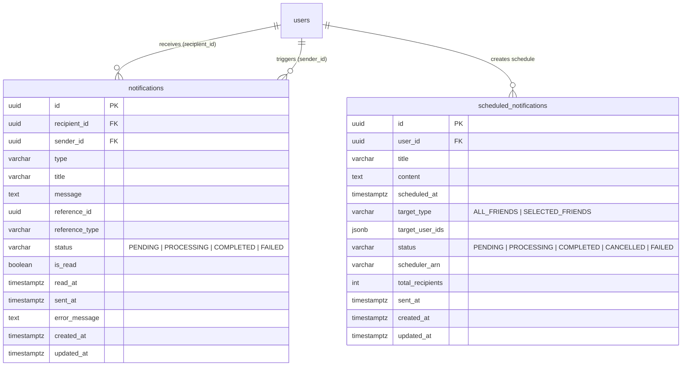
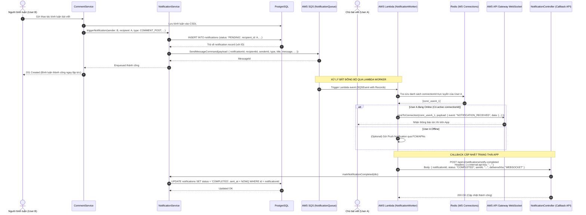
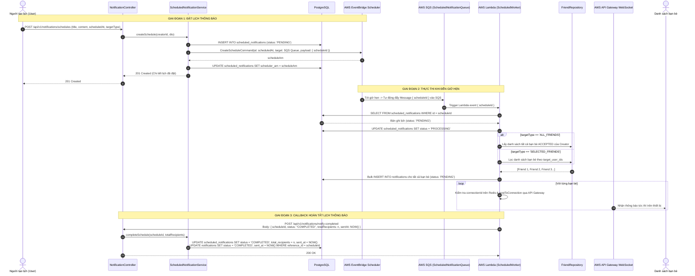

# Thiết kế cơ bản (Basic Design): Module Notification (Event-Driven Queue & Lambda Worker)

Tài liệu thiết kế cơ bản cho hệ thống thông báo (**Notification System**) ứng dụng kiến trúc hướng sự kiện bất đồng bộ (**Asynchronous Event-Driven Architecture**) trên AWS, bao gồm:
1. **Thông báo tương tác thời gian thực (Real-time In-App Notification via SQS + Lambda + WebSocket)**: Khi người dùng tương tác (bình luận, like, kết bạn...), hệ thống đẩy job vào hàng đợi SQS, kích hoạt Lambda Function để bắn tin qua AWS API Gateway WebSocket, sau đó Lambda gọi API `notify-completed` để cập nhật trạng thái thông báo trong hệ thống.
2. **Thông báo lập lịch cho bạn bè (Scheduled Notification to Friends via EventBridge + SQS + Lambda)**: Cho phép người dùng lên lịch gửi thông báo tới bạn bè vào thời điểm xác định trong tương lai, xử lý bất đồng bộ qua hàng đợi và worker Lambda tự động.

---

## 1. Tổng quan & Kiến trúc hướng sự kiện (Event-Driven Architecture)

### 1.1. Mục tiêu
- **Phân tách nghiệp vụ (Decoupling) & Tối ưu thời gian phản hồi (Low Latency)**: Các thao tác chính (bình luận bài viết, like, gửi lời mời kết bạn...) không bị nghẽn (block) bởi việc gửi thông báo. Backend API chỉ cần ghi nhận bản ghi thông báo ở trạng thái chờ và đẩy message vào hàng đợi **AWS SQS Queue** rồi trả kết quả ngay cho người dùng.
- **Xử lý phi máy chủ (Serverless Processing with AWS Lambda)**: **AWS SQS** tự động kích hoạt **AWS Lambda Worker** tiêu thụ message theo lô (batch), tối ưu chi phí và mở rộng quy mô tức thời mà không cần duy trì worker server 24/7.
- **Xác thực hoàn tất gửi thông báo (Callback Loop via `notify-completed`)**: Sau khi Lambda Worker hoàn thành việc gửi frame thông báo qua API Gateway WebSocket (hoặc Push Notification), Worker thực hiện gọi lại API `POST /api/v1/notifications/notify-completed` của Social API để cập nhật trạng thái gửi thành công (`COMPLETED`) hoặc thất bại (`FAILED`).

### 1.2. Sơ đồ kiến trúc tổng quan (High-Level Architecture)

```mermaid
flowchart LR
    ClientA[Client User A] -->|1. Tương tác: Comment/Like/Friend| NestAPI[Social API (NestJS)]
    NestAPI -->|2. Lưu status: PENDING| DB[(PostgreSQL)]
    NestAPI -->|3. Đẩy Job| SQS[AWS SQS: NotificationQueue]
    NestAPI -.->|4. Trả response ngay| ClientA

    SQS -->|5. Trigger Event| Lambda[AWS Lambda: NotificationWorker]
    Lambda -->|6. Lấy connectionId| Redis[(Redis WS Store)]
    Lambda -->|7. Gửi thông báo tức thì| ApiGwWs[AWS API Gateway WebSocket]
    ApiGwWs -->|8. Push Real-time| ClientB[Client User B (Người nhận)]
    
    Lambda -->|9. Gọi API: notify-completed| NestAPI
    NestAPI -->|10. Cập nhật status: COMPLETED| DB
```

---

## 2. Mô hình dữ liệu (Data Model)

### 2.1. Bảng `notifications` (Thông báo người dùng nhận được)

Kế thừa `BaseEntity` (`id` UUID v4, `created_at`, `updated_at`, `deleted_at`).

| Tên cột | Kiểu dữ liệu | Bắt buộc | Khóa / Chỉ mục | Mô tả / Giá trị mặc định |
| :--- | :--- | :---: | :---: | :--- |
| `id` | UUID | Có | PK | Khóa chính tự sinh (UUID v4) |
| `recipient_id` | UUID | Có | FK, Index | Người nhận thông báo (tham chiếu `users.id`) |
| `sender_id` | UUID | Không | FK | Người tạo ra tương tác (tham chiếu `users.id`) |
| `type` | VARCHAR(30) | Có | Index | Phân loại thông báo (xem `NotificationType`) |
| `title` | VARCHAR(255) | Có | - | Tiêu đề thông báo |
| `message` | TEXT | Có | - | Nội dung chi tiết thông báo |
| `reference_id` | UUID | Không | Index | ID thực thể liên quan (ID bài viết, comment, lời mời bạn bè, ...) |
| `reference_type` | VARCHAR(50) | Không | - | Loại thực thể: `POST`, `COMMENT`, `FRIEND_REQUEST`, `SCHEDULE_REMINDER` |
| `status` | VARCHAR(20) | Có | Index | Trạng thái gửi: `PENDING`, `PROCESSING`, `COMPLETED`, `FAILED` (mặc định: `PENDING`) |
| `is_read` | BOOLEAN | Có | Index | Trạng thái người dùng đã xem thông báo chưa (mặc định: `false`) |
| `read_at` | TIMESTAMPTZ | Không | - | Thời điểm người dùng đọc thông báo |
| `sent_at` | TIMESTAMPTZ | Không | - | Thời điểm Worker gửi thông báo thành công |
| `error_message` | TEXT | Không | - | Ghi nhận chi tiết lỗi nếu gửi thất bại |
| `created_at` | TIMESTAMPTZ | Có | Index (DESC) | Thời gian tạo thông báo |
| `updated_at` | TIMESTAMPTZ | Có | - | Thời gian cập nhật gần nhất |

### 2.2. Bảng `scheduled_notifications` (Lịch gửi thông báo cho bạn bè)

| Tên cột | Kiểu dữ liệu | Bắt buộc | Khóa / Chỉ mục | Mô tả / Giá trị mặc định |
| :--- | :--- | :---: | :---: | :--- |
| `id` | UUID | Có | PK | Khóa chính tự sinh (UUID v4) |
| `user_id` | UUID | Có | FK, Index | Người tạo lịch thông báo (tham chiếu `users.id`) |
| `title` | VARCHAR(255) | Có | - | Tiêu đề thông báo gửi bạn bè |
| `content` | TEXT | Có | - | Nội dung thông báo gửi bạn bè |
| `scheduled_at` | TIMESTAMPTZ | Có | Index | Thời điểm dự kiến phát thông báo (UTC) |
| `target_type` | VARCHAR(20) | Có | - | Đối tượng: `ALL_FRIENDS`, `SELECTED_FRIENDS` |
| `target_user_ids` | JSONB | Không | - | Mảng UUID danh sách bạn bè nếu chọn `SELECTED_FRIENDS` |
| `status` | VARCHAR(20) | Có | Index | Trạng thái: `PENDING`, `PROCESSING`, `COMPLETED`, `CANCELLED`, `FAILED` |
| `scheduler_arn` | VARCHAR(500) | Không | - | ARN của schedule trên AWS EventBridge Scheduler |
| `total_recipients` | INT | Không | - | Tổng số bạn bè đã nhận thông báo |
| `sent_at` | TIMESTAMPTZ | Không | - | Thời điểm thực tế đã phát tán thông báo |
| `created_at` | TIMESTAMPTZ | Có | - | Thời gian tạo lịch |
| `updated_at` | TIMESTAMPTZ | Có | - | Thời gian cập nhật |

### 2.3. Các Enums liên quan

```typescript
export enum NotificationType {
  COMMENT_POST = 'COMMENT_POST',           // Có bình luận mới vào bài viết của mình
  REPLY_COMMENT = 'REPLY_COMMENT',         // Có người trả lời bình luận của mình
  LIKE_POST = 'LIKE_POST',                 // Có người thích bài viết của mình
  FRIEND_REQUEST = 'FRIEND_REQUEST',       // Lời mời kết bạn mới
  FRIEND_ACCEPTED = 'FRIEND_ACCEPTED',     // Lời mời kết bạn được chấp nhận
  SCHEDULED_REMINDER = 'SCHEDULED_REMINDER'// Thông báo hẹn giờ từ một người bạn
}

export enum NotificationStatus {
  PENDING = 'PENDING',                     // Đã tạo bản ghi, đang nằm trong Queue chờ xử lý
  PROCESSING = 'PROCESSING',               // Lambda Worker đang tiếp nhận và gửi
  COMPLETED = 'COMPLETED',                 // Đã gửi thông báo thành công tới người nhận
  FAILED = 'FAILED',                       // Gửi thất bại sau các lần retry
}

export enum ScheduleTargetType {
  ALL_FRIENDS = 'ALL_FRIENDS',
  SELECTED_FRIENDS = 'SELECTED_FRIENDS',
}

export enum ScheduleNotificationStatus {
  PENDING = 'PENDING',
  PROCESSING = 'PROCESSING',
  COMPLETED = 'COMPLETED',
  CANCELLED = 'CANCELLED',
  FAILED = 'FAILED',
}
```

### 2.4. Sơ đồ thực thể quan hệ (ERD)



---

## 3. Luồng xử lý nghiệp vụ (Business Workflows)

### 3.1. Luồng xử lý thông báo tương tác qua SQS Queue, Lambda Worker & API Callback

Khi người dùng thực hiện một thao tác (ví dụ: User B bình luận bài viết của User A):



---

### 3.2. Luồng Lên lịch Thông báo tới Bạn bè (Scheduled Notification Flow)

Kiến trúc kết hợp giữa **AWS EventBridge Scheduler**, **AWS SQS** và **AWS Lambda Worker**:



---

## 4. Đặc tả API Endpoints

### 4.1. Nhóm API Thông báo thường & Quản lý danh sách (`/api/v1/notifications`)

#### 4.1.1. `GET /api/v1/notifications`
- **Mô tả**: Lấy danh sách thông báo của người dùng hiện tại (hỗ trợ phân trang, lọc theo trạng thái).
- **Quyền truy cập**: Authenticated (`Bearer <accessToken>`).
- **Query Params**:
  - `page`: Số trang (mặc định: `1`).
  - `limit`: Số thông báo mỗi trang (mặc định: `20`).
  - `unreadOnly`: Lọc thông báo chưa đọc (`true/false`).
  - `status`: Lọc theo trạng thái gửi (`PENDING`, `COMPLETED`, `FAILED`, mặc định: `COMPLETED`).
- **Response**: `200 OK`
  ```json
  {
    "statusCode": 200,
    "data": {
      "items": [
        {
          "id": "f516a8d0-990a-44c1-84de-c82098b67151",
          "type": "COMMENT_POST",
          "title": "Bình luận mới",
          "message": "Tran Thi B đã bình luận vào bài viết của bạn.",
          "status": "COMPLETED",
          "sender": {
            "id": "78a9c140-5b43-41bb-aef3-018274cbef01",
            "username": "user_b",
            "fullName": "Tran Thi B",
            "avatarUrl": "https://..."
          },
          "referenceId": "e4b3e811-9a42-4f36-8a71-6c1cf6ec32b9",
          "referenceType": "POST",
          "isRead": false,
          "sentAt": "2026-10-02T17:15:02.000Z",
          "createdAt": "2026-10-02T17:15:00.000Z"
        }
      ],
      "meta": {
        "totalItems": 12,
        "unreadCount": 3,
        "currentPage": 1
      }
    }
  }
  ```

#### 4.1.2. `PATCH /api/v1/notifications/:id/read`
- **Mô tả**: Đánh dấu 1 thông báo là đã đọc.
- **Quyền truy cập**: Authenticated (`Bearer <accessToken>`).
- **Response**: `200 OK`

#### 4.1.3. `PATCH /api/v1/notifications/read-all`
- **Mô tả**: Đánh dấu tất cả thông báo là đã đọc.
- **Quyền truy cập**: Authenticated (`Bearer <accessToken>`).
- **Response**: `200 OK`

---

### 4.2. API Callback Cập nhật trạng thái thông báo (`notify-completed`)

#### 4.2.1. `POST /api/v1/notifications/notify-completed`
- **Mô tả**: Endpoint bảo mật nội bộ dành riêng cho **AWS Lambda Worker** gọi sau khi đã xử lý gửi thông báo (qua WebSocket / Push) để cập nhật trạng thái bản ghi thông báo trong Database từ `PENDING` / `PROCESSING` sang `COMPLETED` (hoặc `FAILED` nếu có lỗi).
- **Quyền truy cập**: **Internal API Guard** (Yêu cầu Header `x-internal-api-key: Bearer <INTERNAL_API_SECRET>` hoặc AWS IAM SigV4). Người dùng thông thường không có quyền truy cập endpoint này.
- **Request Headers**:
  - `Content-Type`: `application/json`
  - `x-internal-api-key`: `<SHARED_INTERNAL_SECRET_KEY>`
- **Request Body**:
  ```json
  {
    "notificationId": "f516a8d0-990a-44c1-84de-c82098b67151",
    "scheduleId": null,
    "status": "COMPLETED",
    "deliveredVia": "WEBSOCKET",
    "sentAt": "2026-10-03T14:15:00.000Z",
    "errorMessage": null
  }
  ```
  *Trường hợp cập nhật cho Scheduled Notification:*
  ```json
  {
    "notificationId": null,
    "scheduleId": "9d18e8a0-43aa-4e12-b912-3210ef87a012",
    "status": "COMPLETED",
    "totalRecipients": 25,
    "sentAt": "2026-10-03T14:15:00.000Z",
    "errorMessage": null
  }
  ```
- **Validation Rules**:
  - Tối thiểu một trong hai trường `notificationId` hoặc `scheduleId` phải có giá trị (UUID v4 hợp lệ).
  - `status`: Bắt buộc, thuộc enum `NotificationStatus` (`COMPLETED`, `FAILED`).
  - `sentAt`: Định dạng ISO-8601 (bắt buộc khi `status = COMPLETED`).
  - `errorMessage`: Chuỗi string giải thích lý do thất bại nếu `status = FAILED`.
- **Response**: `200 OK`
  ```json
  {
    "statusCode": 200,
    "message": "Notification status updated successfully",
    "data": {
      "id": "f516a8d0-990a-44c1-84de-c82098b67151",
      "status": "COMPLETED",
      "sentAt": "2026-10-03T14:15:00.000Z"
    }
  }
  ```
- **Lỗi thường gặp**:
  - `401 Unauthorized`: Thiếu hoặc sai header `x-internal-api-key`.
  - `404 Not Found`: Không tìm thấy bản ghi `notificationId` hoặc `scheduleId`.
  - `400 Bad Request`: Payload không hợp lệ.

---

### 4.3. Nhóm API Thông báo Lập lịch cho Bạn bè (`/api/v1/notifications/schedules`)

#### 4.3.1. `POST /api/v1/notifications/schedules`
- **Mô tả**: Tạo một lịch hẹn gửi thông báo cho bạn bè vào thời gian xác định trong tương lai.
- **Quyền truy cập**: Authenticated (`Bearer <accessToken>`).
- **Request Body**:
  ```json
  {
    "title": "Nhắc nhở họp mặt cuối tuần!",
    "content": "Cuối tuần này vào lúc 19h cả nhóm hẹn nhau tại quán cà phê cũ nhé mọi người ơi!",
    "scheduledAt": "2026-10-10T12:00:00.000Z",
    "targetType": "ALL_FRIENDS",
    "targetUserIds": []
  }
  ```
- **Validation**:
  - `title`: từ 3 đến 200 ký tự.
  - `content`: từ 5 đến 2000 ký tự.
  - `scheduledAt`: Định dạng ISO-8601, phải ở tương lai (tối thiểu sau thời điểm hiện tại 5 phút).
  - `targetType`: `ALL_FRIENDS` hoặc `SELECTED_FRIENDS`.
  - `targetUserIds`: Bắt buộc nếu chọn `SELECTED_FRIENDS`, mảng chứa các UUID bạn bè hợp lệ.
- **Response**: `201 Created`
  ```json
  {
    "statusCode": 201,
    "data": {
      "id": "9d18e8a0-43aa-4e12-b912-3210ef87a012",
      "userId": "b6a82741-2cbe-4c4f-a9cb-b61005d58ff3",
      "title": "Nhắc nhở họp mặt cuối tuần!",
      "content": "Cuối tuần này vào lúc 19h cả nhóm...",
      "scheduledAt": "2026-10-10T12:00:00.000Z",
      "targetType": "ALL_FRIENDS",
      "status": "PENDING",
      "createdAt": "2026-10-02T18:00:00.000Z"
    }
  }
  ```

#### 4.3.2. `GET /api/v1/notifications/schedules`
- **Mô tả**: Lấy danh sách các lịch thông báo do người dùng hiện tại đã tạo.
- **Quyền truy cập**: Authenticated (`Bearer <accessToken>`).
- **Response**: `200 OK` (Danh sách các lịch kèm trạng thái `PENDING`, `COMPLETED`, `CANCELLED`).

#### 4.3.3. `DELETE /api/v1/notifications/schedules/:id`
- **Mô tả**: Hủy bỏ lịch hẹn gửi thông báo trước khi nó kích hoạt.
- **Quyền truy cập**: Authenticated (`Bearer <accessToken>`).
- **Logic**:
  - Hủy Schedule trên **AWS EventBridge Scheduler** bằng API `DeleteScheduleCommand`.
  - Cập nhật trạng thái trong database thành `CANCELLED`.
- **Response**: `200 OK`

---

## 5. Cấu hình Hạ tầng AWS & SST (Infrastructure Specification)

### 5.1. Định nghĩa SQS & Lambda Worker trong `sst.config.ts`

Trong cấu hình SST v3 (`sst.config.ts`), hệ thống bổ sung:
- **SQS Queue**: `NotificationQueue` xử lý hàng đợi sự kiện thông báo.
- **Dead Letter Queue (DLQ)**: `NotificationDLQ` hứng các message bị lỗi sau 3 lần retry.
- **Lambda Function (Worker)**: Subscribe vào `NotificationQueue` và có quyền kết nối tới WebSocket API Gateway cũng như gọi API Backend.

```typescript
// sst.config.ts (Đoạn cấu hình Queue & Worker)

// 1. Dead Letter Queue
const notificationDlq = new sst.aws.Queue("NotificationDLQ");

// 2. Main Notification Queue
const notificationQueue = new sst.aws.Queue("NotificationQueue", {
  dlq: {
    queue: notificationDlq.arn,
    retry: 3,
  },
  transform: {
    queue: {
      queueName: "social-notification-queue",
      visibilityTimeout: 30, // 30 seconds
    },
  },
});

// 3. Lambda Consumer Function
notificationQueue.subscribe({
  handler: "infra/lambda-handler/notification/consumer.handler",
  environment: {
    WEBSOCKET_ENDPOINT: notificationWs.managementEndpoint,
    API_INTERNAL_URL: "https://api.domain.com/api/v1", // hoặc VPC internal URL
    INTERNAL_API_SECRET: process.env.INTERNAL_API_SECRET || "internal-secret-token",
    REDIS_HOST: process.env.REDIS_HOST || "localhost",
    REDIS_PORT: process.env.REDIS_PORT || "6379",
  },
  permissions: [
    {
      actions: ["execute-api:ManageConnections"],
      resources: ["*"],
    },
  ],
});
```

### 5.2. Cấu trúc Message trong SQS Queue

Message body được chuẩn hóa dưới dạng JSON:

```json
{
  "eventId": "evt_7f8a9b0c-1234-5678-90ab-cdef12345678",
  "eventType": "NOTIFICATION_DISPATCH",
  "notificationId": "f516a8d0-990a-44c1-84de-c82098b67151",
  "recipientId": "b6a82741-2cbe-4c4f-a9cb-b61005d58ff3",
  "senderId": "78a9c140-5b43-41bb-aef3-018274cbef01",
  "type": "COMMENT_POST",
  "title": "Bình luận mới",
  "message": "Tran Thi B đã bình luận vào bài viết của bạn.",
  "referenceId": "e4b3e811-9a42-4f36-8a71-6c1cf6ec32b9",
  "referenceType": "POST",
  "createdAt": "2026-10-03T14:15:00.000Z"
}
```

---

## 6. Tối ưu hiệu năng, Độ tin cậy & Xử lý sự cố (Reliability & Scalability)

1. **Idempotency (Tính bất biến khi gọi lại)**:
   - Lambda Worker có thể xử lý lại message do cơ chế At-Least-Once Delivery của SQS. API `notify-completed` kiểm tra trạng thái: nếu bản ghi đã ở trạng thái `COMPLETED` thì trả về thành công mà không ghi đè lại dữ liệu cũ, tránh duplicate updates.
2. **Cơ chế Retry & Dead Letter Queue (DLQ)**:
   - Nếu Lambda không thể gửi tới WebSocket (hoặc gọi API callback bị timeout), message được SQS retry tối đa 3 lần với exponential backoff.
   - Khi vượt quá 3 lần, message rơi vào `NotificationDLQ` để đội ngũ kỹ thuật phân tích và trigger Lambda gọi `notify-completed` với status `FAILED`.
3. **Bảo mật Internal API Callback**:
   - Sử dụng Shared Secret qua header `x-internal-api-key` hoặc AWS IAM SigV4 authentication giữa Lambda và NestJS API để đảm bảo chỉ có worker nội bộ mới được phép cập nhật trạng thái thông báo.
4. **Xử lý số lượng lớn bạn bè (Fan-out Pattern)**:
   - Với các thông báo lập lịch có hàng nghìn người nhận, Worker chia nhỏ danh sách theo các lô (batch 100 users/batch) để gửi qua WebSocket và bulk update trạng thái, tránh làm cạn kiệt tài nguyên bộ nhớ Lambda.
