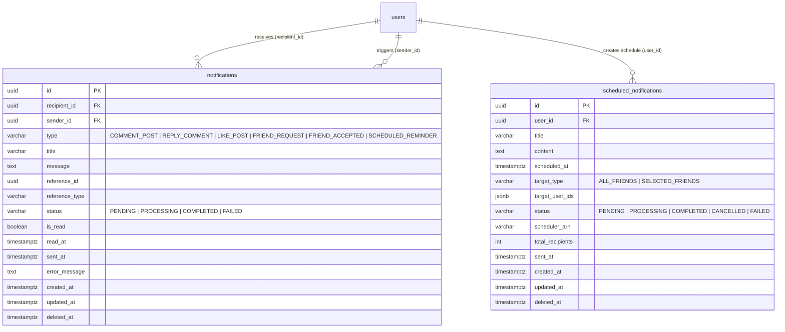

# Thiết kế chi tiết (Detail Design): Module Notification (Event-Driven Queue, Lambda Worker & API Callback)

Tài liệu thiết kế chi tiết kỹ thuật cho module **Notification** dựa trên [basic-design.md](file:///Users/macos/project/personal/aws/social/social-api/specs/notification/basic-design.md), tuân thủ các nguyên tắc kiến trúc và quy ước trong [plan.promt.md](file:///Users/macos/project/personal/aws/social/social-api/promts/plan.promt.md) và [implement.promt.md](file:///Users/macos/project/personal/aws/social/social-api/promts/implement.promt.md).

---

## 1. Cấu trúc file & thư mục triển khai

```text
social-api/
├── src/                                           # 💡 Core Application (NestJS Backend - Cloud Agnostic)
│   ├── database/
│   │   └── entities/
│   │       ├── notification.entity.ts             # Entity Notification kế thừa BaseEntity
│   │       └── scheduled-notification.entity.ts   # Entity ScheduledNotification kế thừa BaseEntity
│   ├── common/
│   │   ├── constants/
│   │   │   └── module.constant.ts                 # TABLE_NAMES: NOTIFICATIONS, SCHEDULED_NOTIFICATIONS
│   │   ├── guards/
│   │   │   ├── jwt-auth.guard.ts                  # Đã có - xác thực JWT Bearer
│   │   │   └── internal-api.guard.ts              # Guard kiểm tra x-internal-api-key cho Lambda Worker
│   │   ├── decorators/
│   │   │   └── current-user.decorator.ts          # Đã có - trích xuất user từ JWT Request
│   │   └── repositories/
│   │       └── base.repository.ts                 # Đã có - BaseRepository cho TypeORM
│   └── modules/
│       └── notification/
│           ├── notification.controller.ts         # Định tuyến /api/v1/notifications & /schedules & /notify-completed
│           ├── notification.module.ts             # Khai báo NotificationModule
│           ├── services/
│           │   ├── notification.service.ts        # Nghiệp vụ kích hoạt thông báo, cập nhật kết quả, đọc tin
│           │   ├── scheduled-notification.service.ts # Nghiệp vụ đặt lịch thông báo (AWS EventBridge Scheduler)
│           │   └── sqs-producer.service.ts        # Service đẩy message vào AWS SQS Queue
│           ├── repositories/
│           │   ├── notification.repository.ts     # Thao tác DB bảng notifications
│           │   └── scheduled-notification.repository.ts # Thao tác DB bảng scheduled_notifications
│           └── dto/
│               ├── get-notifications-query.dto.ts # Query params phân trang & lọc thông báo
│               ├── get-scheduled-notifications-query.dto.ts # Query params danh sách lịch hẹn thông báo
│               ├── create-scheduled-notification.dto.ts # DTO tạo lịch hẹn gửi thông báo cho bạn bè
│               ├── notify-completed.dto.ts        # DTO callback từ Lambda cập nhật trạng thái đã gửi
│               ├── notification-response.dto.ts   # DTO trả về chi tiết thông báo
│               └── scheduled-notification-response.dto.ts # DTO trả về chi tiết lịch hẹn
├── infra/                                         # ☁️ AWS Cloud Infrastructure & Serverless Handlers (Tách rời App)
│   └── lambda-handler/
│       ├── websocket/
│       │   ├── connect.ts                         # Lambda Handler route $connect (Xác thực JWT, lưu Redis)
│       │   ├── disconnect.ts                      # Lambda Handler route $disconnect (Dọn dẹp Redis)
│       │   └── default.ts                         # Lambda Handler route $default / ping (Keep-Alive)
│       ├── notification/
│       │   ├── consumer.ts                        # Lambda Handler SQS Consumer (Push WS & gọi callback API)
│       │   └── dlq-consumer.ts                    # Lambda Handler Dead Letter Queue (Ghi nhận FAILED)
│       └── utils/
│           ├── redis.util.ts                      # Singleton Redis client với auto-reconnect
│           └── jwt-verifier.util.ts               # Helper kiểm tra token JWT trong môi trường Lambda
└── sst.config.ts                                  # Cấu hình SST v3 kết nối hạ tầng AWS & Lambda Handlers
```

---

## 2. Chi tiết Entities & Database Schema

### 2.1. Cập nhật `src/common/constants/module.constant.ts`

Bổ sung các bảng thông báo vào hằng số tên bảng:

```typescript
export const TABLE_NAMES = {
  USERS: 'users',
  ROLES: 'roles',
  USER_ROLES: 'user_roles',
  POSTS: 'posts',
  POST_MEDIA: 'post_media',
  POST_LIKES: 'post_likes',
  COMMENTS: 'comments',
  LIKES: 'likes',
  FOLLOWS: 'follows',
  FRIENDSHIPS: 'friendships',
  NOTIFICATIONS: 'notifications',
  SCHEDULED_NOTIFICATIONS: 'scheduled_notifications',
} as const;
```

---

### 2.2. Enums của Module Notification

Định nghĩa tại `src/database/entities/notification.entity.ts` và `src/database/entities/scheduled-notification.entity.ts`:

```typescript
export enum NotificationType {
  COMMENT_POST = 'COMMENT_POST',           // Có bình luận mới vào bài viết
  REPLY_COMMENT = 'REPLY_COMMENT',         // Có phản hồi vào bình luận của mình
  LIKE_POST = 'LIKE_POST',                 // Có lượt thích bài viết
  FRIEND_REQUEST = 'FRIEND_REQUEST',       // Lời mời kết bạn mới
  FRIEND_ACCEPTED = 'FRIEND_ACCEPTED',     // Lời mời kết bạn được chấp nhận
  SCHEDULED_REMINDER = 'SCHEDULED_REMINDER'// Thông báo hẹn giờ từ một người bạn
}

export enum NotificationReferenceType {
  POST = 'POST',
  COMMENT = 'COMMENT',
  FRIEND_REQUEST = 'FRIEND_REQUEST',
  SCHEDULE_REMINDER = 'SCHEDULE_REMINDER',
}

export enum NotificationStatus {
  PENDING = 'PENDING',                     // Đã lưu bản ghi, job đang chờ trong SQS
  PROCESSING = 'PROCESSING',               // Lambda Worker đang tiếp nhận và gửi
  COMPLETED = 'COMPLETED',                 // Đã gửi thông báo thành công đến người nhận
  FAILED = 'FAILED',                       // Thất bại sau các lần retry
}

export enum ScheduleTargetType {
  ALL_FRIENDS = 'ALL_FRIENDS',             // Gửi cho toàn bộ bạn bè hiện tại
  SELECTED_FRIENDS = 'SELECTED_FRIENDS',   // Gửi cho danh sách bạn bè được chọn
}

export enum ScheduleNotificationStatus {
  PENDING = 'PENDING',
  PROCESSING = 'PROCESSING',
  COMPLETED = 'COMPLETED',
  CANCELLED = 'CANCELLED',
  FAILED = 'FAILED',
}

export enum NotificationDeliveryChannel {
  WEBSOCKET = 'WEBSOCKET',
  PUSH_NOTIFICATION = 'PUSH_NOTIFICATION',
  NONE = 'NONE',
}
```

---

### 2.3. Entity `Notification`: `src/database/entities/notification.entity.ts`

Kế thừa `BaseEntity` (`id: string (UUID)`, `createdAt`, `updatedAt`, `deletedAt`):

```typescript
import {
  Entity,
  Column,
  Index,
  ManyToOne,
  JoinColumn,
} from 'typeorm';
import { BaseEntity } from '../../shared/base.entity';
import { TABLE_NAMES } from '../../common/constants/module.constant';
import { User } from './user.entity';

export enum NotificationType {
  COMMENT_POST = 'COMMENT_POST',
  REPLY_COMMENT = 'REPLY_COMMENT',
  LIKE_POST = 'LIKE_POST',
  FRIEND_REQUEST = 'FRIEND_REQUEST',
  FRIEND_ACCEPTED = 'FRIEND_ACCEPTED',
  SCHEDULED_REMINDER = 'SCHEDULED_REMINDER',
}

export enum NotificationStatus {
  PENDING = 'PENDING',
  PROCESSING = 'PROCESSING',
  COMPLETED = 'COMPLETED',
  FAILED = 'FAILED',
}

@Entity({ name: TABLE_NAMES.NOTIFICATIONS || 'notifications' })
@Index('idx_notifications_recipient_created', ['recipientId', 'createdAt'])
@Index('idx_notifications_recipient_is_read', ['recipientId', 'isRead'])
@Index('idx_notifications_recipient_status', ['recipientId', 'status'])
export class Notification extends BaseEntity {
  @Index()
  @Column({ type: 'uuid', name: 'recipient_id' })
  recipientId: string;

  @ManyToOne(() => User, { onDelete: 'CASCADE' })
  @JoinColumn({ name: 'recipient_id' })
  recipient: User;

  @Index()
  @Column({ type: 'uuid', name: 'sender_id', nullable: true })
  senderId?: string | null;

  @ManyToOne(() => User, { onDelete: 'SET NULL', nullable: true })
  @JoinColumn({ name: 'sender_id' })
  sender?: User | null;

  @Column({
    type: 'varchar',
    length: 30,
    enum: NotificationType,
  })
  type: NotificationType;

  @Column({ type: 'varchar', length: 255 })
  title: string;

  @Column({ type: 'text' })
  message: string;

  @Index()
  @Column({ type: 'uuid', name: 'reference_id', nullable: true })
  referenceId?: string | null;

  @Column({ type: 'varchar', length: 50, name: 'reference_type', nullable: true })
  referenceType?: string | null;

  @Column({
    type: 'varchar',
    length: 20,
    enum: NotificationStatus,
    default: NotificationStatus.PENDING,
  })
  status: NotificationStatus;

  @Column({ type: 'boolean', name: 'is_read', default: false })
  isRead: boolean;

  @Column({ type: 'timestamptz', name: 'read_at', nullable: true })
  readAt?: Date | null;

  @Column({ type: 'timestamptz', name: 'sent_at', nullable: true })
  sentAt?: Date | null;

  @Column({ type: 'text', name: 'error_message', nullable: true })
  errorMessage?: string | null;
}
```

---

### 2.4. Entity `ScheduledNotification`: `src/database/entities/scheduled-notification.entity.ts`

```typescript
import {
  Entity,
  Column,
  Index,
  ManyToOne,
  JoinColumn,
} from 'typeorm';
import { BaseEntity } from '../../shared/base.entity';
import { TABLE_NAMES } from '../../common/constants/module.constant';
import { User } from './user.entity';

export enum ScheduleTargetType {
  ALL_FRIENDS = 'ALL_FRIENDS',
  SELECTED_FRIENDS = 'SELECTED_FRIENDS',
}

export enum ScheduleNotificationStatus {
  PENDING = 'PENDING',
  PROCESSING = 'PROCESSING',
  COMPLETED = 'COMPLETED',
  CANCELLED = 'CANCELLED',
  FAILED = 'FAILED',
}

@Entity({ name: TABLE_NAMES.SCHEDULED_NOTIFICATIONS || 'scheduled_notifications' })
@Index('idx_scheduled_notifications_user_scheduled', ['userId', 'scheduledAt'])
@Index('idx_scheduled_notifications_status', ['status'])
export class ScheduledNotification extends BaseEntity {
  @Index()
  @Column({ type: 'uuid', name: 'user_id' })
  userId: string;

  @ManyToOne(() => User, { onDelete: 'CASCADE' })
  @JoinColumn({ name: 'user_id' })
  user: User;

  @Column({ type: 'varchar', length: 255 })
  title: string;

  @Column({ type: 'text' })
  content: string;

  @Column({ type: 'timestamptz', name: 'scheduled_at' })
  scheduledAt: Date;

  @Column({
    type: 'varchar',
    length: 20,
    enum: ScheduleTargetType,
    name: 'target_type',
  })
  targetType: ScheduleTargetType;

  @Column({ type: 'jsonb', name: 'target_user_ids', nullable: true })
  targetUserIds?: string[] | null;

  @Column({
    type: 'varchar',
    length: 20,
    enum: ScheduleNotificationStatus,
    default: ScheduleNotificationStatus.PENDING,
  })
  status: ScheduleNotificationStatus;

  @Column({ type: 'varchar', length: 500, name: 'scheduler_arn', nullable: true })
  schedulerArn?: string | null;

  @Column({ type: 'int', name: 'total_recipients', nullable: true })
  totalRecipients?: number | null;

  @Column({ type: 'timestamptz', name: 'sent_at', nullable: true })
  sentAt?: Date | null;
}
```

---

### 2.5. Sơ đồ thực thể quan hệ (ERD)



---

## 3. Data Transfer Objects (DTO)

### 3.1. `src/modules/notification/dto/get-notifications-query.dto.ts`

```typescript
import { ApiPropertyOptional } from '@nestjs/swagger';
import { Type } from 'class-transformer';
import { IsBoolean, IsEnum, IsOptional } from 'class-validator';
import { PaginationQueryDto } from '../../../common/utils/pagination.dto';
import { NotificationStatus } from '../../../database/entities/notification.entity';

export class GetNotificationsQueryDto extends PaginationQueryDto {
  @ApiPropertyOptional({
    description: 'Chỉ lấy thông báo chưa đọc nếu true',
    example: false,
    default: false,
  })
  @IsOptional()
  @Type(() => Boolean)
  @IsBoolean()
  unreadOnly?: boolean = false;

  @ApiPropertyOptional({
    description: 'Lọc theo trạng thái gửi của thông báo',
    enum: NotificationStatus,
    default: NotificationStatus.COMPLETED,
  })
  @IsOptional()
  @IsEnum(NotificationStatus)
  status?: NotificationStatus = NotificationStatus.COMPLETED;
}
```

---

### 3.2. `src/modules/notification/dto/create-scheduled-notification.dto.ts`

```typescript
import { ApiProperty, ApiPropertyOptional } from '@nestjs/swagger';
import {
  IsArray,
  IsDateString,
  IsEnum,
  IsNotEmpty,
  IsOptional,
  IsString,
  IsUUID,
  Length,
  ValidateIf,
} from 'class-validator';
import { ScheduleTargetType } from '../../../database/entities/scheduled-notification.entity';

export class CreateScheduledNotificationDto {
  @ApiProperty({
    description: 'Tiêu đề thông báo gửi bạn bè',
    example: 'Nhắc hẹn cà phê cuối tuần này!',
    minLength: 3,
    maxLength: 255,
  })
  @IsNotEmpty({ message: 'Tiêu đề không được để trống' })
  @IsString()
  @Length(3, 255, { message: 'Tiêu đề phải từ 3 đến 255 ký tự' })
  title: string;

  @ApiProperty({
    description: 'Nội dung chi tiết thông báo',
    example: 'Tối thứ 7 này lúc 19h cả nhóm gặp nhau ở quán cũ nhé!',
    minLength: 5,
    maxLength: 2000,
  })
  @IsNotEmpty({ message: 'Nội dung không được để trống' })
  @IsString()
  @Length(5, 2000, { message: 'Nội dung phải từ 5 đến 2000 ký tự' })
  content: string;

  @ApiProperty({
    description: 'Thời điểm dự kiến phát thông báo (UTC, ISO-8601, tối thiểu sau hiện tại 5 phút)',
    example: '2026-10-10T12:00:00.000Z',
  })
  @IsNotEmpty({ message: 'Thời điểm gửi không được để trống' })
  @IsDateString({}, { message: 'scheduledAt phải là định dạng ISO-8601 hợp lệ' })
  scheduledAt: string;

  @ApiProperty({
    description: 'Đối tượng nhận thông báo',
    enum: ScheduleTargetType,
    example: ScheduleTargetType.ALL_FRIENDS,
  })
  @IsNotEmpty({ message: 'Phạm vi người nhận không được để trống' })
  @IsEnum(ScheduleTargetType, { message: 'targetType phải là ALL_FRIENDS hoặc SELECTED_FRIENDS' })
  targetType: ScheduleTargetType;

  @ApiPropertyOptional({
    description: 'Danh sách UUID bạn bè (bắt buộc khi targetType là SELECTED_FRIENDS)',
    example: ['78a9c140-5b43-41bb-aef3-018274cbef01'],
    type: [String],
  })
  @ValidateIf((o: CreateScheduledNotificationDto) => o.targetType === ScheduleTargetType.SELECTED_FRIENDS)
  @IsArray({ message: 'targetUserIds phải là một danh sách UUID' })
  @IsUUID('4', { each: true, message: 'Mỗi phần tử trong targetUserIds phải là UUID v4' })
  @IsNotEmpty({ message: 'Danh sách bạn bè không được rỗng khi chọn SELECTED_FRIENDS' })
  targetUserIds?: string[];
}
```

---

### 3.3. `src/modules/notification/dto/notify-completed.dto.ts`

DTO dành riêng cho Lambda Worker gọi callback sau khi gửi thông báo:

```typescript
import { ApiProperty, ApiPropertyOptional } from '@nestjs/swagger';
import {
  IsDateString,
  IsEnum,
  IsInt,
  IsNotEmpty,
  IsOptional,
  IsString,
  IsUUID,
  Min,
  ValidateIf,
} from 'class-validator';
import {
  NotificationDeliveryChannel,
  NotificationStatus,
} from '../../../database/entities/notification.entity';

export class NotifyCompletedDto {
  @ApiPropertyOptional({
    description: 'ID thông báo đơn lẻ nếu gửi thông báo tương tác',
    example: 'f516a8d0-990a-44c1-84de-c82098b67151',
  })
  @ValidateIf((o: NotifyCompletedDto) => !o.scheduleId)
  @IsUUID('4', { message: 'notificationId phải là UUID v4 hợp lệ' })
  notificationId?: string;

  @ApiPropertyOptional({
    description: 'ID lịch thông báo nếu là job của Scheduled Notification',
    example: '9d18e8a0-43aa-4e12-b912-3210ef87a012',
  })
  @ValidateIf((o: NotifyCompletedDto) => !o.notificationId)
  @IsUUID('4', { message: 'scheduleId phải là UUID v4 hợp lệ' })
  scheduleId?: string;

  @ApiProperty({
    description: 'Trạng thái xử lý sau khi Lambda thực thi gửi',
    enum: [NotificationStatus.COMPLETED, NotificationStatus.FAILED],
    example: NotificationStatus.COMPLETED,
  })
  @IsNotEmpty({ message: 'status không được để trống' })
  @IsEnum([NotificationStatus.COMPLETED, NotificationStatus.FAILED], {
    message: 'status phải là COMPLETED hoặc FAILED',
  })
  status: NotificationStatus.COMPLETED | NotificationStatus.FAILED;

  @ApiPropertyOptional({
    description: 'Kênh đã phát tán thông báo thành công',
    enum: NotificationDeliveryChannel,
    example: NotificationDeliveryChannel.WEBSOCKET,
  })
  @IsOptional()
  @IsEnum(NotificationDeliveryChannel)
  deliveredVia?: NotificationDeliveryChannel;

  @ApiPropertyOptional({
    description: 'Tổng số người nhận đã được gửi thành công (dành cho scheduled notification)',
    example: 25,
  })
  @IsOptional()
  @IsInt()
  @Min(0)
  totalRecipients?: number;

  @ApiProperty({
    description: 'Thời điểm thực tế gửi thông báo (ISO-8601)',
    example: '2026-10-03T14:15:00.000Z',
  })
  @IsNotEmpty({ message: 'sentAt không được để trống' })
  @IsDateString({}, { message: 'sentAt phải là chuỗi ISO-8601 hợp lệ' })
  sentAt: string;

  @ApiPropertyOptional({
    description: 'Chi tiết nguyên nhân nếu trạng thái là FAILED',
    example: 'WebSocket Connection ID stale & expired',
  })
  @IsOptional()
  @IsString()
  errorMessage?: string;
}
```

---

### 3.4. `src/modules/notification/dto/notification-response.dto.ts`

```typescript
import { ApiProperty, ApiPropertyOptional } from '@nestjs/swagger';
import {
  NotificationStatus,
  NotificationType,
} from '../../../database/entities/notification.entity';

export class SenderSummaryDto {
  @ApiProperty({ example: '78a9c140-5b43-41bb-aef3-018274cbef01' })
  id: string;

  @ApiProperty({ example: 'tran_thi_b' })
  username: string;

  @ApiProperty({ example: 'Trần Thị B' })
  fullName: string;

  @ApiPropertyOptional({ example: 'https://cdn.domain.com/avatars/user_b.jpg' })
  avatarUrl?: string | null;
}

export class NotificationResponseDto {
  @ApiProperty({ example: 'f516a8d0-990a-44c1-84de-c82098b67151' })
  id: string;

  @ApiProperty({ enum: NotificationType, example: NotificationType.COMMENT_POST })
  type: NotificationType;

  @ApiProperty({ example: 'Bình luận mới' })
  title: string;

  @ApiProperty({ example: 'Trần Thị B đã bình luận vào bài viết của bạn.' })
  message: string;

  @ApiProperty({ enum: NotificationStatus, example: NotificationStatus.COMPLETED })
  status: NotificationStatus;

  @ApiPropertyOptional({ type: SenderSummaryDto })
  sender?: SenderSummaryDto | null;

  @ApiPropertyOptional({ example: 'e4b3e811-9a42-4f36-8a71-6c1cf6ec32b9' })
  referenceId?: string | null;

  @ApiPropertyOptional({ example: 'POST' })
  referenceType?: string | null;

  @ApiProperty({ example: false })
  isRead: boolean;

  @ApiPropertyOptional({ example: null })
  readAt?: Date | null;

  @ApiPropertyOptional({ example: '2026-10-03T14:15:02.000Z' })
  sentAt?: Date | null;

  @ApiProperty({ example: '2026-10-03T14:15:00.000Z' })
  createdAt: Date;
}
```

---

### 3.5. `src/modules/notification/dto/scheduled-notification-response.dto.ts`

```typescript
import { ApiProperty, ApiPropertyOptional } from '@nestjs/swagger';
import {
  ScheduleNotificationStatus,
  ScheduleTargetType,
} from '../../../database/entities/scheduled-notification.entity';

export class ScheduledNotificationResponseDto {
  @ApiProperty({ example: '9d18e8a0-43aa-4e12-b912-3210ef87a012' })
  id: string;

  @ApiProperty({ example: 'b6a82741-2cbe-4c4f-a9cb-b61005d58ff3' })
  userId: string;

  @ApiProperty({ example: 'Nhắc hẹn cà phê cuối tuần này!' })
  title: string;

  @ApiProperty({ example: 'Tối thứ 7 này lúc 19h cả nhóm gặp nhau ở quán cũ nhé!' })
  content: string;

  @ApiProperty({ example: '2026-10-10T12:00:00.000Z' })
  scheduledAt: Date;

  @ApiProperty({ enum: ScheduleTargetType, example: ScheduleTargetType.ALL_FRIENDS })
  targetType: ScheduleTargetType;

  @ApiPropertyOptional({ example: [], type: [String] })
  targetUserIds?: string[] | null;

  @ApiProperty({ enum: ScheduleNotificationStatus, example: ScheduleNotificationStatus.PENDING })
  status: ScheduleNotificationStatus;

  @ApiPropertyOptional({ example: 25 })
  totalRecipients?: number | null;

  @ApiPropertyOptional({ example: null })
  sentAt?: Date | null;

  @ApiProperty({ example: '2026-10-03T14:10:00.000Z' })
  createdAt: Date;
}
```

---

## 4. Chi tiết Repositories

### 4.1. `src/modules/notification/repositories/notification.repository.ts`

Kế thừa `BaseRepository<Notification>`:

```typescript
import { Injectable } from '@nestjs/common';
import { InjectRepository } from '@nestjs/typeorm';
import { Repository, UpdateResult } from 'typeorm';
import { BaseRepository } from '../../../common/repositories/base.repository';
import {
  Notification,
  NotificationStatus,
} from '../../../database/entities/notification.entity';
import { GetNotificationsQueryDto } from '../dto/get-notifications-query.dto';

@Injectable()
export class NotificationRepository extends BaseRepository<Notification> {
  constructor(
    @InjectRepository(Notification)
    private readonly notiRepo: Repository<Notification>,
  ) {
    super(notiRepo);
  }

  async findNotificationsWithPagination(
    recipientId: string,
    query: GetNotificationsQueryDto,
  ): Promise<{ items: Notification[]; total: number; unreadCount: number }> {
    const page = Math.max(1, Number(query.page) || 1);
    const pageSize = Math.max(1, Math.min(100, Number(query.pageSize) || 10));
    const skip = (page - 1) * pageSize;

    const qb = this.notiRepo
      .createQueryBuilder('n')
      .leftJoinAndSelect('n.sender', 'sender')
      .where('n.recipientId = :recipientId', { recipientId })
      .andWhere('n.deletedAt IS NULL');

    if (query.status) {
      qb.andWhere('n.status = :status', { status: query.status });
    }

    if (query.unreadOnly) {
      qb.andWhere('n.isRead = :isRead', { isRead: false });
    }

    qb.orderBy('n.createdAt', 'DESC')
      .skip(skip)
      .take(pageSize);

    const [items, total] = await qb.getManyAndCount();

    const unreadCount = await this.notiRepo.count({
      where: {
        recipientId,
        isRead: false,
        status: NotificationStatus.COMPLETED,
      },
    });

    return { items, total, unreadCount };
  }

  async markAsRead(id: string, recipientId: string): Promise<boolean> {
    const result = await this.notiRepo.update(
      { id, recipientId, isRead: false },
      { isRead: true, readAt: new Date() },
    );
    return (result.affected ?? 0) > 0;
  }

  async markAllAsRead(recipientId: string): Promise<number> {
    const result = await this.notiRepo.update(
      { recipientId, isRead: false },
      { isRead: true, readAt: new Date() },
    );
    return result.affected ?? 0;
  }

  async updateDeliveryStatus(
    id: string,
    status: NotificationStatus,
    sentAt?: Date,
    errorMessage?: string,
  ): Promise<UpdateResult> {
    return this.notiRepo.update(
      { id },
      {
        status,
        sentAt: sentAt || new Date(),
        errorMessage: errorMessage || null,
      },
    );
  }
}
```

---

### 4.2. `src/modules/notification/repositories/scheduled-notification.repository.ts`

Kế thừa `BaseRepository<ScheduledNotification>`:

```typescript
import { Injectable } from '@nestjs/common';
import { InjectRepository } from '@nestjs/typeorm';
import { Repository } from 'typeorm';
import { BaseRepository } from '../../../common/repositories/base.repository';
import {
  ScheduledNotification,
  ScheduleNotificationStatus,
} from '../../../database/entities/scheduled-notification.entity';
import { PaginationQueryDto } from '../../../common/utils/pagination.dto';

@Injectable()
export class ScheduledNotificationRepository extends BaseRepository<ScheduledNotification> {
  constructor(
    @InjectRepository(ScheduledNotification)
    private readonly schedRepo: Repository<ScheduledNotification>,
  ) {
    super(schedRepo);
  }

  async findUserSchedules(
    userId: string,
    query: PaginationQueryDto,
  ): Promise<{ items: ScheduledNotification[]; total: number }> {
    const page = Math.max(1, Number(query.page) || 1);
    const pageSize = Math.max(1, Math.min(100, Number(query.pageSize) || 10));
    const skip = (page - 1) * pageSize;

    const [items, total] = await this.schedRepo.findAndCount({
      where: { userId },
      order: { scheduledAt: 'DESC' },
      skip,
      take: pageSize,
    });

    return { items, total };
  }

  async updateScheduleStatus(
    id: string,
    status: ScheduleNotificationStatus,
    sentAt?: Date,
    totalRecipients?: number,
  ): Promise<boolean> {
    const result = await this.schedRepo.update(
      { id },
      {
        status,
        sentAt: sentAt || new Date(),
        totalRecipients: totalRecipients ?? undefined,
      },
    );
    return (result.affected ?? 0) > 0;
  }
}
```

---

## 5. Chi tiết Dịch vụ Nghiệp vụ (Services)

### 5.1. Dịch vụ SQS Producer: `src/modules/notification/services/sqs-producer.service.ts`

Chịu trách nhiệm gửi message vào AWS SQS Queue:

```typescript
import { Injectable, Logger } from '@nestjs/common';
import { ConfigService } from '@nestjs/config';
import { SQSClient, SendMessageCommand } from '@aws-sdk/client-sqs';

export interface NotificationQueuePayload {
  eventId: string;
  eventType: 'NOTIFICATION_DISPATCH' | 'SCHEDULED_NOTIFICATION_DISPATCH';
  notificationId?: string;
  scheduleId?: string;
  recipientId?: string;
  senderId?: string | null;
  type?: string;
  title?: string;
  message?: string;
  referenceId?: string | null;
  referenceType?: string | null;
  createdAt: string;
}

@Injectable()
export class SqsProducerService {
  private readonly logger = new Logger(SqsProducerService.name);
  private readonly sqsClient: SQSClient;
  private readonly queueUrl: string;

  constructor(private readonly configService: ConfigService) {
    this.sqsClient = new SQSClient({
      region: this.configService.get<string>('AWS_REGION', 'ap-southeast-1'),
    });
    this.queueUrl = this.configService.get<string>(
      'NOTIFICATION_QUEUE_URL',
      'https://sqs.ap-southeast-1.amazonaws.com/123456789012/social-notification-queue',
    );
  }

  async pushToQueue(payload: NotificationQueuePayload): Promise<string | undefined> {
    try {
      const command = new SendMessageCommand({
        QueueUrl: this.queueUrl,
        MessageBody: JSON.stringify(payload),
        MessageAttributes: {
          EventType: {
            DataType: 'String',
            StringValue: payload.eventType,
          },
        },
      });

      const response = await this.sqsClient.send(command);
      this.logger.log(
        `Job enqueued successfully: EventId=${payload.eventId}, MessageId=${response.MessageId}`,
      );
      return response.MessageId;
    } catch (error) {
      this.logger.error(
        `Failed to enqueue notification job: EventId=${payload.eventId}`,
        error,
      );
      throw error;
    }
  }
}
```

---

### 5.2. Dịch vụ Thông báo: `src/modules/notification/services/notification.service.ts`

```typescript
import {
  BadRequestException,
  Injectable,
  Logger,
  NotFoundException,
} from '@nestjs/common';
import { v4 as uuidv4 } from 'uuid';
import {
  Notification,
  NotificationStatus,
  NotificationType,
} from '../../../database/entities/notification.entity';
import { NotificationRepository } from '../repositories/notification.repository';
import { SqsProducerService } from './sqs-producer.service';
import { GetNotificationsQueryDto } from '../dto/get-notifications-query.dto';
import { NotifyCompletedDto } from '../dto/notify-completed.dto';

export interface TriggerNotificationInput {
  recipientId: string;
  senderId?: string | null;
  type: NotificationType;
  title: string;
  message: string;
  referenceId?: string | null;
  referenceType?: string | null;
}

@Injectable()
export class NotificationService {
  private readonly logger = new Logger(NotificationService.name);

  constructor(
    private readonly notificationRepo: NotificationRepository,
    private readonly sqsProducer: SqsProducerService,
  ) {}

  /**
   * Kích hoạt thông báo khi người dùng thực hiện thao tác (comment, like, kết bạn, ...)
   * Lưu DB trạng thái PENDING -> Đẩy SQS Job -> Trả kết quả ngay (Decoupled, Async)
   */
  async triggerNotification(input: TriggerNotificationInput): Promise<Notification> {
    // 1. Tạo bản ghi trạng thái PENDING
    const notification = await this.notificationRepo.create({
      recipientId: input.recipientId,
      senderId: input.senderId,
      type: input.type,
      title: input.title,
      message: input.message,
      referenceId: input.referenceId,
      referenceType: input.referenceType,
      status: NotificationStatus.PENDING,
      isRead: false,
    });

    // 2. Đẩy job vào SQS Queue
    const eventId = `evt_${uuidv4()}`;
    await this.sqsProducer.pushToQueue({
      eventId,
      eventType: 'NOTIFICATION_DISPATCH',
      notificationId: notification.id,
      recipientId: notification.recipientId,
      senderId: notification.senderId,
      type: notification.type,
      title: notification.title,
      message: notification.message,
      referenceId: notification.referenceId,
      referenceType: notification.referenceType,
      createdAt: notification.createdAt.toISOString(),
    });

    return notification;
  }

  /**
   * Callback API được gọi bởi AWS Lambda Worker sau khi hoàn tất gửi thông báo
   */
  async markNotificationCompleted(dto: NotifyCompletedDto): Promise<{ success: boolean; id?: string }> {
    if (!dto.notificationId) {
      throw new BadRequestException('notificationId is required for single notification completion');
    }

    const notification = await this.notificationRepo.findById(dto.notificationId);
    if (!notification) {
      throw new NotFoundException(`Notification with ID ${dto.notificationId} not found`);
    }

    // Idempotency: Nếu đã COMPLETED từ trước thì bỏ qua để tránh ghi đè dữ liệu cũ
    if (notification.status === NotificationStatus.COMPLETED && dto.status === NotificationStatus.COMPLETED) {
      this.logger.warn(`Notification ${dto.notificationId} was already COMPLETED. Skipping update.`);
      return { success: true, id: notification.id };
    }

    await this.notificationRepo.updateDeliveryStatus(
      dto.notificationId,
      dto.status,
      new Date(dto.sentAt),
      dto.errorMessage,
    );

    this.logger.log(`Notification ${dto.notificationId} status updated to ${dto.status}`);
    return { success: true, id: dto.notificationId };
  }

  async getNotifications(recipientId: string, query: GetNotificationsQueryDto) {
    const { items, total, unreadCount } = await this.notificationRepo.findNotificationsWithPagination(
      recipientId,
      query,
    );

    const page = Math.max(1, Number(query.page) || 1);
    const pageSize = Math.max(1, Math.min(100, Number(query.pageSize) || 10));

    return {
      items: items.map((item) => ({
        id: item.id,
        type: item.type,
        title: item.title,
        message: item.message,
        status: item.status,
        sender: item.sender
          ? {
              id: item.sender.id,
              username: item.sender.username,
              fullName: item.sender.fullName,
              avatarUrl: item.sender.avatarUrl,
            }
          : null,
        referenceId: item.referenceId,
        referenceType: item.referenceType,
        isRead: item.isRead,
        readAt: item.readAt,
        sentAt: item.sentAt,
        createdAt: item.createdAt,
      })),
      meta: {
        totalItems: total,
        unreadCount,
        currentPage: page,
        pageSize,
        totalPages: Math.ceil(total / pageSize),
      },
    };
  }

  async markAsRead(id: string, recipientId: string): Promise<boolean> {
    const updated = await this.notificationRepo.markAsRead(id, recipientId);
    if (!updated) {
      throw new NotFoundException('Thông báo không tồn tại hoặc đã được đánh dấu đọc');
    }
    return true;
  }

  async markAllAsRead(recipientId: string): Promise<number> {
    return this.notificationRepo.markAllAsRead(recipientId);
  }
}
```

---

### 5.3. Dịch vụ Lên lịch Thông báo: `src/modules/notification/services/scheduled-notification.service.ts`

```typescript
import {
  BadRequestException,
  ForbiddenException,
  Injectable,
  Logger,
  NotFoundException,
} from '@nestjs/common';
import { ConfigService } from '@nestjs/config';
import {
  SchedulerClient,
  CreateScheduleCommand,
  DeleteScheduleCommand,
  FlexibleTimeWindowMode,
} from '@aws-sdk/client-scheduler';
import {
  ScheduledNotification,
  ScheduleNotificationStatus,
} from '../../../database/entities/scheduled-notification.entity';
import { ScheduledNotificationRepository } from '../repositories/scheduled-notification.repository';
import { CreateScheduledNotificationDto } from '../dto/create-scheduled-notification.dto';
import { PaginationQueryDto } from '../../../common/utils/pagination.dto';
import { NotifyCompletedDto } from '../dto/notify-completed.dto';

@Injectable()
export class ScheduledNotificationService {
  private readonly logger = new Logger(ScheduledNotificationService.name);
  private readonly schedulerClient: SchedulerClient;
  private readonly sqsQueueArn: string;
  private readonly schedulerRoleArn: string;

  constructor(
    private readonly scheduledRepo: ScheduledNotificationRepository,
    private readonly configService: ConfigService,
  ) {
    this.schedulerClient = new SchedulerClient({
      region: this.configService.get<string>('AWS_REGION', 'ap-southeast-1'),
    });
    this.sqsQueueArn = this.configService.get<string>(
      'NOTIFICATION_QUEUE_ARN',
      'arn:aws:sqs:ap-southeast-1:123456789012:social-notification-queue',
    );
    this.schedulerRoleArn = this.configService.get<string>(
      'EVENTBRIDGE_SCHEDULER_ROLE_ARN',
      'arn:aws:iam::123456789012:role/social-scheduler-role',
    );
  }

  async createSchedule(
    userId: string,
    dto: CreateScheduledNotificationDto,
  ): Promise<ScheduledNotification> {
    const scheduledDate = new Date(dto.scheduledAt);
    const now = new Date();
    const minLeadTimeMs = 5 * 60 * 1000; // Tối thiểu 5 phút trong tương lai

    if (scheduledDate.getTime() - now.getTime() < minLeadTimeMs) {
      throw new BadRequestException('Thời gian đặt lịch phải sau thời điểm hiện tại ít nhất 5 phút');
    }

    // 1. Tạo bản ghi PENDING trong database
    const schedule = await this.scheduledRepo.create({
      userId,
      title: dto.title,
      content: dto.content,
      scheduledAt: scheduledDate,
      targetType: dto.targetType,
      targetUserIds: dto.targetUserIds || [],
      status: ScheduleNotificationStatus.PENDING,
    });

    // 2. Tạo AWS EventBridge One-time Schedule bắn vào SQS
    const scheduleName = `scheduled-noti-${schedule.id}`;
    const scheduleExpression = `at(${scheduledDate.toISOString().replace('.000', '')})`;

    try {
      const command = new CreateScheduleCommand({
        Name: scheduleName,
        ScheduleExpression: scheduleExpression,
        FlexibleTimeWindow: { Mode: FlexibleTimeWindowMode.OFF },
        Target: {
          Arn: this.sqsQueueArn,
          RoleArn: this.schedulerRoleArn,
          Input: JSON.stringify({
            eventId: `sched_evt_${schedule.id}`,
            eventType: 'SCHEDULED_NOTIFICATION_DISPATCH',
            scheduleId: schedule.id,
            userId,
            title: schedule.title,
            content: schedule.content,
            targetType: schedule.targetType,
            targetUserIds: schedule.targetUserIds,
            createdAt: schedule.createdAt.toISOString(),
          }),
        },
      });

      const response = await this.schedulerClient.send(command);
      schedule.schedulerArn = response.ScheduleArn;
      await this.scheduledRepo.update(schedule.id, { schedulerArn: response.ScheduleArn });

      this.logger.log(`EventBridge schedule created: ${response.ScheduleArn}`);
      return schedule;
    } catch (error) {
      this.logger.error(`Failed to register EventBridge schedule for ${schedule.id}`, error);
      await this.scheduledRepo.update(schedule.id, { status: ScheduleNotificationStatus.FAILED });
      throw new BadRequestException('Không thể đăng ký lịch gửi thông báo trên AWS');
    }
  }

  async listSchedules(userId: string, query: PaginationQueryDto) {
    const { items, total } = await this.scheduledRepo.findUserSchedules(userId, query);
    const page = Math.max(1, Number(query.page) || 1);
    const pageSize = Math.max(1, Math.min(100, Number(query.pageSize) || 10));

    return {
      items,
      meta: {
        totalItems: total,
        currentPage: page,
        pageSize,
        totalPages: Math.ceil(total / pageSize),
      },
    };
  }

  async cancelSchedule(userId: string, scheduleId: string): Promise<boolean> {
    const schedule = await this.scheduledRepo.findById(scheduleId);
    if (!schedule) {
      throw new NotFoundException('Không tìm thấy lịch hẹn thông báo');
    }

    if (schedule.userId !== userId) {
      throw new ForbiddenException('Bạn không có quyền hủy lịch hẹn này');
    }

    if (schedule.status !== ScheduleNotificationStatus.PENDING) {
      throw new BadRequestException('Chỉ có thể hủy lịch hẹn đang ở trạng thái PENDING');
    }

    // Xóa schedule trên EventBridge
    try {
      const scheduleName = `scheduled-noti-${schedule.id}`;
      await this.schedulerClient.send(new DeleteScheduleCommand({ Name: scheduleName }));
    } catch (err) {
      this.logger.warn(`Could not delete schedule ${schedule.id} from EventBridge (might have fired or not found)`, err);
    }

    await this.scheduledRepo.update(schedule.id, { status: ScheduleNotificationStatus.CANCELLED });
    return true;
  }

  async completeSchedule(dto: NotifyCompletedDto): Promise<boolean> {
    if (!dto.scheduleId) {
      throw new BadRequestException('scheduleId is required');
    }

    return this.scheduledRepo.updateScheduleStatus(
      dto.scheduleId,
      dto.status === 'COMPLETED' ? ScheduleNotificationStatus.COMPLETED : ScheduleNotificationStatus.FAILED,
      new Date(dto.sentAt),
      dto.totalRecipients,
    );
  }
}
```

---

## 6. Thiết kế chi tiết Hệ thống Lambda Handlers (Lambda Handlers Architecture & Implementation)

Hệ thống xử lý thông báo được vận hành bởi hai nhóm **AWS Lambda Handlers** chính:
1. **Nhóm WebSocket Lifecycle Handlers (AWS API Gateway WebSocket Routes)**: Quản lý trạng thái kết nối, xác thực người dùng và lưu trữ `connectionId` vào Redis.
2. **Nhóm SQS Asynchronous Worker Handlers (Event-Driven Background Processing)**: Tiêu thụ message từ hàng đợi SQS, bắn thông báo thời gian thực qua WebSocket, thực hiện fan-out thông báo lập lịch và gọi callback API `notify-completed` để cập nhật trạng thái trong ứng dụng.

```mermaid
flowchart TD
    subgraph "1. WebSocket Lifecycle Handlers"
        Client[Client App] -->|ws://.../?token=xxx| ConnectH[connect.handler ($connect)]
        ConnectH -->|Verify JWT| JWT[JWT Secret]
        ConnectH -->|SADD connectionId| Redis[(Redis)]
        Client -->|Disconnect/Close| DisconnectH[disconnect.handler ($disconnect)]
        DisconnectH -->|SREM connectionId| Redis
        Client -->|ping| DefaultH[default.handler ($default)]
        DefaultH -->|pong| Client
    end

    subgraph "2. SQS Background Worker Handlers"
        SQSQueue[AWS SQS: NotificationQueue] -->|SQSEvent (Batch 1-10)| ConsumerH[consumer.handler]
        ConsumerH -->|1. SMEMBERS connectionIds| Redis
        ConsumerH -->|2. postToConnection| ApiGwWs[AWS API Gateway WS]
        ApiGwWs -->|Push Real-time| Client
        ConsumerH -->|3. POST notify-completed| NestAPI[Social API Backend]
        ConsumerH -.->|Report Failed ID| SQSQueue
        
        SQSQueue -.->|After 3 retries| DLQ[AWS SQS: NotificationDLQ]
        DLQ -->|Dead Letters| DlqH[dlq-consumer.handler]
        DlqH -->|Mark FAILED| NestAPI
    end
```

---

### 6.1. Shared Utilities cho Lambda Handlers

#### 6.1.1. `infra/lambda-handler/utils/redis.util.ts`
Khởi tạo kết nối Redis dạng Singleton ngoài phạm vi Handler để tái sử dụng Connection Pool giữa các lần thực thi ấm (Warm Execution Contexts):

```typescript
import Redis from 'ioredis';

let redisInstance: Redis | null = null;

export function getRedisClient(): Redis {
  if (!redisInstance) {
    redisInstance = new Redis({
      host: process.env.REDIS_HOST || 'localhost',
      port: Number(process.env.REDIS_PORT) || 6379,
      password: process.env.REDIS_PASSWORD || undefined,
      lazyConnect: false,
      enableReadyCheck: true,
      maxRetriesPerRequest: 3,
      retryStrategy: (times) => {
        if (times > 5) return null; // Dừng retry nếu quá 5 lần
        return Math.min(times * 100, 2000);
      },
    });

    redisInstance.on('error', (err) => {
      console.error('[Redis Client Error]:', err);
    });

    redisInstance.on('connect', () => {
      console.log('[Redis Client Connected]');
    });
  }

  return redisInstance;
}
```

#### 6.1.2. `infra/lambda-handler/utils/jwt-verifier.util.ts`
Xác thực Token JWT từ chuỗi kết nối WebSocket trong môi trường Lambda:

```typescript
import * as jwt from 'jsonwebtoken';

export interface DecodedUserToken {
  sub: string;        // User ID (UUID v4)
  email?: string;
  role?: string;
}

export function verifyWebSocketToken(token: string): DecodedUserToken | null {
  try {
    const secret = process.env.JWT_ACCESS_SECRET || 'jwt-secret-key';
    const decoded = jwt.verify(token, secret) as any;
    return {
      sub: decoded.sub || decoded.id,
      email: decoded.email,
      role: decoded.role,
    };
  } catch (error) {
    console.warn('[JWT Verify Failed]:', (error as Error).message);
    return null;
  }
}
```

---

### 6.2. Bộ WebSocket Route Handlers

#### 6.2.1. Route `$connect`: `infra/lambda-handler/websocket/connect.ts`
Bắt sự kiện bắt tay (handshake) kết nối WebSocket:
- Trích xuất JWT token từ `queryStringParameters.token` hoặc `Sec-WebSocket-Protocol`.
- Xác thực chữ ký token. Nếu hợp lệ:
  - Lưu vào Redis Set: `ws:user:{userId}:connections` -> `connectionId`.
  - Lưu Reverse Mapping: `ws:conn:{connectionId}:user` -> `userId` (TTL 24 giờ).
- Nếu không hợp lệ: Trả về HTTP 401 từ chối kết nối.

```typescript
import { APIGatewayRequestContext, APIGatewayProxyEvent } from 'aws-lambda';
import { getRedisClient } from '../utils/redis.util';
import { verifyWebSocketToken } from '../utils/jwt-verifier.util';

export const handler = async (event: APIGatewayProxyEvent) => {
  const connectionId = event.requestContext.connectionId;
  console.log(`[WebSocket Connect Attempt] ConnectionId: ${connectionId}`);

  // 1. Trích xuất token từ Query String hoặc Sec-WebSocket-Protocol Header
  const token =
    event.queryStringParameters?.token ||
    event.headers?.['Sec-WebSocket-Protocol'] ||
    event.headers?.['sec-websocket-protocol'];

  if (!token) {
    console.warn(`[WebSocket Reject] Missing token for ConnectionId: ${connectionId}`);
    return { statusCode: 401, body: 'Unauthorized: Missing auth token' };
  }

  // 2. Xác thực JWT
  const user = verifyWebSocketToken(token);
  if (!user || !user.sub) {
    console.warn(`[WebSocket Reject] Invalid token for ConnectionId: ${connectionId}`);
    return { statusCode: 401, body: 'Unauthorized: Invalid auth token' };
  }

  const userId = user.sub;

  try {
    const redis = getRedisClient();
    // 3. Ghi nhận connection vào Redis
    const pipeline = redis.pipeline();
    pipeline.sadd(`ws:user:${userId}:connections`, connectionId!);
    pipeline.set(`ws:conn:${connectionId}:user`, userId, 'EX', 86400); // 24h TTL
    await pipeline.exec();

    console.log(`[WebSocket Connected] UserId: ${userId}, ConnectionId: ${connectionId}`);

    return {
      statusCode: 200,
      body: 'Connected successfully',
      headers: event.headers?.['sec-websocket-protocol']
        ? { 'Sec-WebSocket-Protocol': event.headers['sec-websocket-protocol'] }
        : {},
    };
  } catch (error) {
    console.error(`[WebSocket Connect Error] ConnectionId: ${connectionId}`, error);
    return { statusCode: 500, body: 'Internal Server Error during connection initialization' };
  }
};
```

#### 6.2.2. Route `$disconnect`: `infra/lambda-handler/websocket/disconnect.ts`
Bắt sự kiện khi client đóng kết nối hoặc rớt mạng:
- Đọc `userId` từ Reverse Mapping `ws:conn:{connectionId}:user`.
- Xóa `connectionId` khỏi Redis Set của user.
- Xóa key `ws:conn:{connectionId}:user`.

```typescript
import { APIGatewayProxyEvent } from 'aws-lambda';
import { getRedisClient } from '../utils/redis.util';

export const handler = async (event: APIGatewayProxyEvent) => {
  const connectionId = event.requestContext.connectionId;
  console.log(`[WebSocket Disconnect] ConnectionId: ${connectionId}`);

  try {
    const redis = getRedisClient();
    const userId = await redis.get(`ws:conn:${connectionId}:user`);

    const pipeline = redis.pipeline();
    if (userId) {
      pipeline.srem(`ws:user:${userId}:connections`, connectionId!);
      console.log(`[WebSocket Cleanup] Removed connection ${connectionId} for User: ${userId}`);
    }
    pipeline.del(`ws:conn:${connectionId}:user`);
    await pipeline.exec();

    return { statusCode: 200, body: 'Disconnected successfully' };
  } catch (error) {
    console.error(`[WebSocket Disconnect Error] ConnectionId: ${connectionId}`, error);
    return { statusCode: 200, body: 'Disconnect recorded with errors' };
  }
};
```

#### 6.2.3. Route `$default` & `ping`: `infra/lambda-handler/websocket/default.ts`
Xử lý các frame dữ liệu client gửi lên (Keep-Alive Heartbeat `ping` -> `pong`):

```typescript
import { APIGatewayProxyEvent } from 'aws-lambda';
import {
  ApiGatewayManagementApiClient,
  PostToConnectionCommand,
} from '@aws-sdk/client-apigatewaymanagementapi';

const apiGwClient = new ApiGatewayManagementApiClient({
  endpoint: process.env.WEBSOCKET_ENDPOINT,
});

export const handler = async (event: APIGatewayProxyEvent) => {
  const connectionId = event.requestContext.connectionId;
  let body: any = {};

  try {
    if (event.body) {
      body = JSON.parse(event.body);
    }
  } catch {
    body = { action: 'unknown' };
  }

  // Xử lý Heartbeat ping -> pong
  if (body.action === 'ping') {
    await apiGwClient.send(
      new PostToConnectionCommand({
        ConnectionId: connectionId!,
        Data: Buffer.from(JSON.stringify({ action: 'pong', timestamp: Date.now() })),
      }),
    );
    return { statusCode: 200, body: 'PONG' };
  }

  return { statusCode: 200, body: 'Received' };
};
```

---

### 6.3. Chi tiết SQS Notification Consumer Worker Handler

File `infra/lambda-handler/notification/consumer.ts`:
- **Chuẩn AWS SQS Partial Batch Failures**: Sử dụng interface `SQSBatchResponse` chứa `batchItemFailures: [{ itemIdentifier }]`. Nếu trong 10 records có 1 record lỗi, SQS **chỉ retry duy nhất record lỗi đó**, không làm ảnh hưởng hay gửi trùng các message đã thành công.
- Tra cứu danh sách kết nối WebSocket từ Redis.
- Bắn frame dữ liệu `NOTIFICATION_RECEIVED` qua AWS API Gateway WebSocket `@connections`.
- Tự động bắt lỗi `GoneException` (HTTP 410) để dọn dẹp các connectionId đã chết khỏi Redis.
- **Thực hiện gọi API Callback `POST /api/v1/notifications/notify-completed`** với header `x-internal-api-key` để cập nhật trạng thái `COMPLETED` trong Database của App.

```typescript
import { SQSEvent, SQSRecord, SQSBatchResponse } from 'aws-lambda';
import {
  ApiGatewayManagementApiClient,
  PostToConnectionCommand,
  GoneException,
} from '@aws-sdk/client-apigatewaymanagementapi';
import axios from 'axios';
import { getRedisClient } from '../utils/redis.util';

const apiGwClient = new ApiGatewayManagementApiClient({
  endpoint: process.env.WEBSOCKET_ENDPOINT,
});

const API_INTERNAL_URL = process.env.API_INTERNAL_URL || 'http://localhost:3000/api/v1';
const INTERNAL_API_SECRET = process.env.INTERNAL_API_SECRET || 'internal-secret-token';

export const handler = async (event: SQSEvent): Promise<SQSBatchResponse> => {
  const batchItemFailures: { itemIdentifier: string }[] = [];
  console.log(`[Notification Consumer] Processing batch of ${event.Records.length} records`);

  for (const record of event.Records) {
    try {
      await processSingleRecord(record);
    } catch (err: any) {
      console.error(`[Record Error] Failed processing record ${record.messageId}:`, err);
      // Ghi nhận message lỗi để SQS chỉ retry duy nhất message này
      batchItemFailures.push({ itemIdentifier: record.messageId });
    }
  }

  return { batchItemFailures };
};

async function processSingleRecord(record: SQSRecord): Promise<void> {
  const payload = JSON.parse(record.body);
  const { eventType, notificationId, recipientId, scheduleId, targetUserIds, targetType } = payload;
  const redis = getRedisClient();

  let deliveredVia = 'NONE';
  let isSuccess = false;
  let errorMessage: string | null = null;
  let totalRecipients = 0;

  try {
    if (eventType === 'NOTIFICATION_DISPATCH') {
      // -------------------------------------------------------------
      // 1. XỬ LÝ THÔNG BÁO TƯƠNG TÁC ĐƠN LẺ
      // -------------------------------------------------------------
      const redisKey = `ws:user:${recipientId}:connections`;
      const connectionIds = await redis.smembers(redisKey);

      if (connectionIds && connectionIds.length > 0) {
        const frameData = Buffer.from(
          JSON.stringify({
            event: 'NOTIFICATION_RECEIVED',
            data: {
              id: notificationId,
              type: payload.type,
              title: payload.title,
              message: payload.message,
              referenceId: payload.referenceId,
              referenceType: payload.referenceType,
              createdAt: payload.createdAt,
            },
          }),
        );

        // Gửi tới tất cả thiết bị trực tuyến của người nhận
        const pushPromises = connectionIds.map(async (connId) => {
          try {
            await apiGwClient.send(
              new PostToConnectionCommand({
                ConnectionId: connId,
                Data: frameData,
              }),
            );
            deliveredVia = 'WEBSOCKET';
          } catch (postErr: any) {
            if (postErr instanceof GoneException || postErr?.$metadata?.httpStatusCode === 410) {
              console.warn(`[Stale Connection] Cleaning up ${connId} for user ${recipientId}`);
              await redis.srem(redisKey, connId);
            } else {
              console.error(`[Push Error] Failed posting to connection ${connId}:`, postErr);
            }
          }
        });

        await Promise.allSettled(pushPromises);
      } else {
        console.log(`[User Offline] Recipient ${recipientId} has no active WebSocket connections.`);
        // Tùy chọn: Gửi FCM Push Notification tại đây
      }

      isSuccess = true;
    } else if (eventType === 'SCHEDULED_NOTIFICATION_DISPATCH') {
      // -------------------------------------------------------------
      // 2. XỬ LÝ PHÁT TÁN THÔNG BÁO LẬP LỊCH CHO BẠN BÈ (FAN-OUT)
      // -------------------------------------------------------------
      console.log(`[Scheduled Dispatch] Executing schedule ${scheduleId}`);
      let friendIds: string[] = [];

      if (targetType === 'SELECTED_FRIENDS' && Array.isArray(targetUserIds)) {
        friendIds = targetUserIds;
      } else {
        // Truy vấn danh sách bạn bè qua Internal API
        try {
          const friendRes = await axios.get(
            `${API_INTERNAL_URL}/friends/accepted-ids?userId=${payload.userId}`,
            {
              headers: { 'x-internal-api-key': INTERNAL_API_SECRET },
              timeout: 5000,
            },
          );
          friendIds = friendRes.data?.data || [];
        } catch (apiErr) {
          console.warn('[Fetch Friends Fallback] Using empty list', apiErr);
        }
      }

      totalRecipients = friendIds.length;
      const frameData = Buffer.from(
        JSON.stringify({
          event: 'NOTIFICATION_RECEIVED',
          data: {
            scheduleId,
            type: 'SCHEDULED_REMINDER',
            title: payload.title,
            message: payload.content,
            createdAt: new Date().toISOString(),
          },
        }),
      );

      // Fan-out theo từng mẻ (batch 50 bạn bè) để không làm ngộp WebSocket API
      const BATCH_SIZE = 50;
      for (let i = 0; i < friendIds.length; i += BATCH_SIZE) {
        const batch = friendIds.slice(i, i + BATCH_SIZE);
        await Promise.allSettled(
          batch.map(async (fId) => {
            const fConnIds = await redis.smembers(`ws:user:${fId}:connections`);
            if (fConnIds && fConnIds.length > 0) {
              for (const cId of fConnIds) {
                try {
                  await apiGwClient.send(
                    new PostToConnectionCommand({ ConnectionId: cId, Data: frameData }),
                  );
                } catch (err: any) {
                  if (err instanceof GoneException) {
                    await redis.srem(`ws:user:${fId}:connections`, cId);
                  }
                }
              }
            }
          }),
        );
      }

      deliveredVia = 'WEBSOCKET';
      isSuccess = true;
    }
  } catch (error: any) {
    isSuccess = false;
    errorMessage = error?.message || 'Unexpected worker error occurred';
    throw error; // Ném lỗi để ghi nhận batchItemFailures
  } finally {
    // -------------------------------------------------------------
    // 3. GỌI API CALLBACK NOTIFY-COMPLETED ĐỂ CẬP NHẬT TRẠNG THÁI APP
    // -------------------------------------------------------------
    await sendNotifyCompletedCallback({
      notificationId,
      scheduleId,
      status: isSuccess ? 'COMPLETED' : 'FAILED',
      deliveredVia,
      totalRecipients,
      sentAt: new Date().toISOString(),
      errorMessage,
    });
  }
}

async function sendNotifyCompletedCallback(body: {
  notificationId?: string;
  scheduleId?: string;
  status: string;
  deliveredVia?: string;
  totalRecipients?: number;
  sentAt: string;
  errorMessage?: string | null;
}): Promise<void> {
  try {
    const endpoint = `${API_INTERNAL_URL}/notifications/notify-completed`;
    await axios.post(endpoint, body, {
      headers: {
        'Content-Type': 'application/json',
        'x-internal-api-key': INTERNAL_API_SECRET,
      },
      timeout: 5000,
    });
    console.log(`[Callback Success] Updated status ${body.status} for ID: ${body.notificationId || body.scheduleId}`);
  } catch (error: any) {
    console.error(`[Callback Failed]:`, error?.response?.data || error.message);
  }
}
```

---

### 6.4. Chi tiết SQS Dead Letter Queue (DLQ) Consumer Handler

File `infra/lambda-handler/notification/dlq-consumer.ts`:
- Handler chuyên biệt kích hoạt khi message thất bại quá 3 lần retry và rơi vào `social-notification-dlq`.
- Thực hiện gọi callback API `POST /api/v1/notifications/notify-completed` với trạng thái `FAILED` kèm thông tin lỗi chi tiết.
- Đảm bảo cơ sở dữ liệu không bị treo vĩnh viễn ở trạng thái `PENDING` hay `PROCESSING`.

```typescript
import { SQSEvent, SQSRecord } from 'aws-lambda';
import axios from 'axios';

const API_INTERNAL_URL = process.env.API_INTERNAL_URL || 'http://localhost:3000/api/v1';
const INTERNAL_API_SECRET = process.env.INTERNAL_API_SECRET || 'internal-secret-token';

export const handler = async (event: SQSEvent): Promise<void> => {
  console.error(`[DLQ Alert] Received ${event.Records.length} poison pill messages from Dead Letter Queue!`);

  for (const record of event.Records) {
    try {
      const payload = JSON.parse(record.body);
      const { notificationId, scheduleId, eventId } = payload;
      const receiveCount = record.attributes?.ApproximateReceiveCount || 'unknown';

      console.error(
        `[DLQ Record] EventId: ${eventId}, NotificationId: ${notificationId}, ScheduleId: ${scheduleId}, Retries: ${receiveCount}`,
      );

      // Gọi API đánh dấu thất bại chính thức cho bản ghi trong DB
      await axios.post(
        `${API_INTERNAL_URL}/notifications/notify-completed`,
        {
          notificationId,
          scheduleId,
          status: 'FAILED',
          deliveredVia: 'NONE',
          sentAt: new Date().toISOString(),
          errorMessage: `Message moved to DLQ after ${receiveCount} failed retries. MessageId: ${record.messageId}`,
        },
        {
          headers: {
            'Content-Type': 'application/json',
            'x-internal-api-key': INTERNAL_API_SECRET,
          },
          timeout: 5000,
        },
      );

      console.log(`[DLQ Mark Failed] Successfully marked ID ${notificationId || scheduleId} as FAILED in database`);
    } catch (err: any) {
      console.error(`[DLQ Processing Error] Failed to handle DLQ message: ${record.messageId}`, err);
    }
  }
};
```

---

### 6.5. Tối ưu hóa Môi trường Chạy AWS Lambda (Performance & Concurrency Tuning)

| Cấu hình | Khuyến nghị | Lý do thiết kế |
| :--- | :---: | :--- |
| **Memory Size** | `256 MB` - `512 MB` | Đảm bảo đủ CPU và băng thông mạng (Network I/O) cho việc gửi song song hàng chục connection WebSocket mà không lãng phí chi phí RAM. |
| **Timeout** | `30 giây` | Đủ thời gian cho fan-out và gọi HTTP callback, phù hợp với SQS `VisibilityTimeout` (30 giây). |
| **Reserved Concurrency** | `50 - 100` | Tránh trường hợp có bão thông báo (burst spikes) làm nghẽn kết nối tới Redis Server và Backend API Server. |
| **Batch Size (SQS)** | `10 messages` | Tối ưu hóa số lần kích hoạt Lambda (giảm chi phí gọi Lambda tới 90%) khi hệ thống có tải cao. |
| **Batch Window (SQS)** | `2 giây` | Đợi gom tối đa 10 messages trong 2 giây trước khi trigger Lambda, nâng cao hiệu quả gộp mẻ. |
| **Report Batch Item Failures** | `true` | Bắt buộc bật để SQS chỉ retry lại duy nhất record bị lỗi, tránh xử lý trùng lặp. |

---

## 7. Guard Bảo mật API Nội bộ (`InternalApiGuard`)

Tạo tại `src/common/guards/internal-api.guard.ts`:

```typescript
import {
  CanActivate,
  ExecutionContext,
  Injectable,
  UnauthorizedException,
} from '@nestjs/common';
import { ConfigService } from '@nestjs/config';

@Injectable()
export class InternalApiGuard implements CanActivate {
  constructor(private readonly configService: ConfigService) {}

  canActivate(context: ExecutionContext): boolean {
    const request = context.switchToHttp().getRequest();
    const internalSecret = this.configService.get<string>('INTERNAL_API_SECRET', 'internal-secret-token');
    const incomingKey = request.headers['x-internal-api-key'];

    if (!incomingKey || incomingKey !== internalSecret) {
      throw new UnauthorizedException('Yêu cầu không hợp lệ: Không có quyền truy cập API nội bộ');
    }

    return true;
  }
}
```

---

## 8. Controller & Định tuyến API (`src/modules/notification/notification.controller.ts`)

```typescript
import {
  Body,
  Controller,
  Delete,
  Get,
  HttpCode,
  HttpStatus,
  Param,
  ParseUUIDPipe,
  Patch,
  Post,
  Query,
  UseGuards,
} from '@nestjs/common';
import {
  ApiBearerAuth,
  ApiHeader,
  ApiOperation,
  ApiResponse,
  ApiTags,
} from '@nestjs/swagger';
import { CurrentUser } from '../../common/decorators/current-user.decorator';
import { JwtAuthGuard } from '../../common/guards/jwt-auth.guard';
import { InternalApiGuard } from '../../common/guards/internal-api.guard';
import { PaginationQueryDto } from '../../common/utils/pagination.dto';
import { NotificationService } from './services/notification.service';
import { ScheduledNotificationService } from './services/scheduled-notification.service';
import { GetNotificationsQueryDto } from './dto/get-notifications-query.dto';
import { CreateScheduledNotificationDto } from './dto/create-scheduled-notification.dto';
import { NotifyCompletedDto } from './dto/notify-completed.dto';
import { NotificationResponseDto } from './dto/notification-response.dto';
import { ScheduledNotificationResponseDto } from './dto/scheduled-notification-response.dto';

@ApiTags('notifications')
@Controller('notifications')
export class NotificationController {
  constructor(
    private readonly notificationService: NotificationService,
    private readonly scheduledService: ScheduledNotificationService,
  ) {}

  // ---------------------------------------------------------
  // 1. NHÓM API THÔNG BÁO THƯỜNG
  // ---------------------------------------------------------

  @Get()
  @UseGuards(JwtAuthGuard)
  @ApiBearerAuth()
  @ApiOperation({ summary: 'Lấy danh sách thông báo của người dùng hiện tại (hỗ trợ phân trang, lọc)' })
  @ApiResponse({ status: 200, description: 'Danh sách thông báo thành công' })
  async getNotifications(
    @CurrentUser('id') userId: string,
    @Query() query: GetNotificationsQueryDto,
  ) {
    const data = await this.notificationService.getNotifications(userId, query);
    return {
      statusCode: HttpStatus.OK,
      data,
    };
  }

  @Patch(':id/read')
  @UseGuards(JwtAuthGuard)
  @ApiBearerAuth()
  @ApiOperation({ summary: 'Đánh dấu một thông báo là đã đọc' })
  @ApiResponse({ status: 200, description: 'Đã đọc thành công' })
  async markAsRead(
    @CurrentUser('id') userId: string,
    @Param('id', new ParseUUIDPipe({ version: '4' })) id: string,
  ) {
    await this.notificationService.markAsRead(id, userId);
    return {
      statusCode: HttpStatus.OK,
      message: 'Đã đánh dấu thông báo là đã đọc',
    };
  }

  @Patch('read-all')
  @UseGuards(JwtAuthGuard)
  @ApiBearerAuth()
  @ApiOperation({ summary: 'Đánh dấu tất cả thông báo của người dùng là đã đọc' })
  @ApiResponse({ status: 200, description: 'Đã đánh dấu tất cả thành công' })
  async markAllAsRead(@CurrentUser('id') userId: string) {
    const count = await this.notificationService.markAllAsRead(userId);
    return {
      statusCode: HttpStatus.OK,
      message: `Đã đánh dấu ${count} thông báo là đã đọc`,
    };
  }

  // ---------------------------------------------------------
  // 2. API CALLBACK TỪ LAMBDA WORKER (NOTIFY-COMPLETED)
  // ---------------------------------------------------------

  @Post('notify-completed')
  @HttpCode(HttpStatus.OK)
  @UseGuards(InternalApiGuard)
  @ApiHeader({
    name: 'x-internal-api-key',
    description: 'Mã xác thực gọi nội bộ từ AWS Lambda Worker',
    required: true,
  })
  @ApiOperation({
    summary: 'Webhook/Callback API dành riêng cho AWS Lambda Worker cập nhật trạng thái đã gửi thông báo',
  })
  @ApiResponse({ status: 200, description: 'Cập nhật trạng thái thông báo thành công' })
  @ApiResponse({ status: 401, description: 'Không có quyền truy cập nội bộ' })
  async notifyCompleted(@Body() dto: NotifyCompletedDto) {
    if (dto.notificationId) {
      await this.notificationService.markNotificationCompleted(dto);
    }

    if (dto.scheduleId) {
      await this.scheduledService.completeSchedule(dto);
    }

    return {
      statusCode: HttpStatus.OK,
      message: 'Cập nhật trạng thái thông báo thành công',
      data: {
        id: dto.notificationId || dto.scheduleId,
        status: dto.status,
        sentAt: dto.sentAt,
      },
    };
  }

  // ---------------------------------------------------------
  // 3. NHÓM API LẬP LỊCH THÔNG BÁO CHO BẠN BÈ
  // ---------------------------------------------------------

  @Post('schedules')
  @UseGuards(JwtAuthGuard)
  @ApiBearerAuth()
  @ApiOperation({ summary: 'Tạo một lịch hẹn gửi thông báo cho bạn bè vào thời điểm xác định' })
  @ApiResponse({ status: 201, description: 'Tạo lịch hẹn thành công', type: ScheduledNotificationResponseDto })
  async createSchedule(
    @CurrentUser('id') userId: string,
    @Body() dto: CreateScheduledNotificationDto,
  ) {
    const data = await this.scheduledService.createSchedule(userId, dto);
    return {
      statusCode: HttpStatus.CREATED,
      data,
    };
  }

  @Get('schedules')
  @UseGuards(JwtAuthGuard)
  @ApiBearerAuth()
  @ApiOperation({ summary: 'Lấy danh sách các lịch thông báo do người dùng hiện tại đã tạo' })
  @ApiResponse({ status: 200, description: 'Danh sách lịch hẹn' })
  async listSchedules(
    @CurrentUser('id') userId: string,
    @Query() query: PaginationQueryDto,
  ) {
    const data = await this.scheduledService.listSchedules(userId, query);
    return {
      statusCode: HttpStatus.OK,
      data,
    };
  }

  @Delete('schedules/:id')
  @UseGuards(JwtAuthGuard)
  @ApiBearerAuth()
  @ApiOperation({ summary: 'Hủy bỏ lịch hẹn thông báo trước khi nó kích hoạt' })
  @ApiResponse({ status: 200, description: 'Hủy lịch hẹn thành công' })
  async cancelSchedule(
    @CurrentUser('id') userId: string,
    @Param('id', new ParseUUIDPipe({ version: '4' })) scheduleId: string,
  ) {
    await this.scheduledService.cancelSchedule(userId, scheduleId);
    return {
      statusCode: HttpStatus.OK,
      message: 'Hủy lịch hẹn thông báo thành công',
    };
  }
}
```

---

## 9. Khai báo Module (`src/modules/notification/notification.module.ts`)

```typescript
import { Module } from '@nestjs/common';
import { TypeOrmModule } from '@nestjs/typeorm';
import { ConfigModule } from '@nestjs/config';
import { Notification } from '../../database/entities/notification.entity';
import { ScheduledNotification } from '../../database/entities/scheduled-notification.entity';
import { NotificationController } from './notification.controller';
import { NotificationService } from './services/notification.service';
import { ScheduledNotificationService } from './services/scheduled-notification.service';
import { SqsProducerService } from './services/sqs-producer.service';
import { NotificationRepository } from './repositories/notification.repository';
import { ScheduledNotificationRepository } from './repositories/scheduled-notification.repository';
import { InternalApiGuard } from '../../common/guards/internal-api.guard';

@Module({
  imports: [
    TypeOrmModule.forFeature([Notification, ScheduledNotification]),
    ConfigModule,
  ],
  controllers: [NotificationController],
  providers: [
    NotificationService,
    ScheduledNotificationService,
    SqsProducerService,
    NotificationRepository,
    ScheduledNotificationRepository,
    InternalApiGuard,
  ],
  exports: [NotificationService, ScheduledNotificationService],
})
export class NotificationModule {}
```

---

## 10. Cấu hình Hạ tầng SST v3 (`sst.config.ts`)

Cấu hình chi tiết toàn bộ các tài nguyên AWS và Lambda Handlers trong `sst.config.ts`:

```typescript
// sst.config.ts (Đoạn cấu hình Notification WebSocket & SQS Lambda Handlers)

// 1. WebSocket API Gateway kèm các Routes Handlers ($connect, $disconnect, $default)
const notificationWs = new sst.aws.ApiGatewayWebSocket("NotificationWebSocket", {
  transform: {
    api: {
      name: "social-notification-ws",
    },
  },
});

// Route $connect: Xác thực JWT & lưu connectionId vào Redis
notificationWs.route("$connect", {
  handler: "infra/lambda-handler/websocket/connect.handler",
  environment: {
    REDIS_HOST: process.env.REDIS_HOST || "localhost",
    REDIS_PORT: process.env.REDIS_PORT || "6379",
    REDIS_PASSWORD: process.env.REDIS_PASSWORD || "",
    JWT_ACCESS_SECRET: process.env.JWT_ACCESS_SECRET || "jwt-secret-key",
  },
});

// Route $disconnect: Dọn dẹp connectionId khi client ngắt kết nối
notificationWs.route("$disconnect", {
  handler: "infra/lambda-handler/websocket/disconnect.handler",
  environment: {
    REDIS_HOST: process.env.REDIS_HOST || "localhost",
    REDIS_PORT: process.env.REDIS_PORT || "6379",
    REDIS_PASSWORD: process.env.REDIS_PASSWORD || "",
  },
});

// Route $default & ping: Xử lý ping/pong keep-alive
notificationWs.route("$default", {
  handler: "infra/lambda-handler/websocket/default.handler",
  environment: {
    WEBSOCKET_ENDPOINT: notificationWs.managementEndpoint,
  },
  permissions: [
    {
      actions: ["execute-api:ManageConnections"],
      resources: ["*"],
    },
  ],
});

// 2. Dead Letter Queue (DLQ) hứng tin nhắn lỗi quá 3 lần retry
const notificationDlq = new sst.aws.Queue("NotificationDLQ", {
  transform: {
    queue: {
      queueName: "social-notification-dlq",
    },
  },
});

// 3. SQS DLQ Consumer: Tự động gọi API cập nhật trạng thái FAILED trong CSDL
notificationDlq.subscribe({
  handler: "infra/lambda-handler/notification/dlq-consumer.handler",
  environment: {
    API_INTERNAL_URL: process.env.API_INTERNAL_URL || "https://api.internal.domain.com/api/v1",
    INTERNAL_API_SECRET: process.env.INTERNAL_API_SECRET || "internal-secret-token",
  },
});

// 4. Notification SQS Queue chính
const notificationQueue = new sst.aws.Queue("NotificationQueue", {
  dlq: {
    queue: notificationDlq.arn,
    retry: 3,
  },
  transform: {
    queue: {
      queueName: "social-notification-queue",
      visibilityTimeout: 30, // 30s xử lý cho mỗi batch
    },
  },
});

// 5. Notification SQS Consumer Worker (Xử lý batch, báo partial failures, gửi WS & gọi callback API)
notificationQueue.subscribe({
  handler: "infra/lambda-handler/notification/consumer.handler",
  batch: {
    size: 10,
    window: "2 seconds",
    response: "reportBatchItemFailures", // Kích hoạt báo lỗi từng record
  },
  environment: {
    WEBSOCKET_ENDPOINT: notificationWs.managementEndpoint,
    API_INTERNAL_URL: process.env.API_INTERNAL_URL || "https://api.internal.domain.com/api/v1",
    INTERNAL_API_SECRET: process.env.INTERNAL_API_SECRET || "internal-secret-token",
    REDIS_HOST: process.env.REDIS_HOST || "localhost",
    REDIS_PORT: process.env.REDIS_PORT || "6379",
    REDIS_PASSWORD: process.env.REDIS_PASSWORD || "",
  },
  permissions: [
    {
      actions: ["execute-api:ManageConnections"],
      resources: ["*"],
    },
  ],
});
```

---

## 11. Ma trận Kiểm thử (Test Cases Matrix)

| STT | Tên ca kiểm thử | Điều kiện đầu vào | Kết quả mong đợi | Loại Test |
| :---: | :--- | :--- | :--- | :---: |
| **TC-01** | `triggerNotification` lưu DB & đẩy vào SQS | Gọi `triggerNotification(senderId, recipientId, type)` | Lưu bản ghi `Notification` với status `PENDING`, gọi `SqsProducerService.pushToQueue()` thành công | Unit |
| **TC-02** | `notifyCompleted` cập nhật trạng thái hợp lệ | Lambda gửi `POST /api/v1/notifications/notify-completed` với `notificationId`, `status: COMPLETED`, header đúng | Bản ghi cập nhật `status = COMPLETED`, `sent_at = NOW()`, trả về 200 OK | Integration |
| **TC-03** | `notifyCompleted` bị chặn khi thiếu `x-internal-api-key` | Request gọi tới endpoint callback thiếu header bảo mật | Trả về `401 Unauthorized` | Security |
| **TC-04** | `notifyCompleted` Idempotency | Gọi `notifyCompleted` lần thứ 2 cho bản ghi đã `COMPLETED` | Bỏ qua ghi đè, trả về 200 OK thành công mà không lỗi | Unit |
| **TC-05** | WebSocket `$connect` thành công | Client gửi kết nối với JWT Token hợp lệ trong query string `?token=...` | Handler trả về `200`, lưu `connectionId` vào Redis Set `ws:user:{userId}:connections` | Integration |
| **TC-06** | WebSocket `$connect` từ chối khi token sai | Client gửi kết nối không có token hoặc token hết hạn | Handler trả về `401 Unauthorized`, không lưu vào Redis | Security |
| **TC-07** | WebSocket `$disconnect` dọn dẹp Redis | Client ngắt kết nối hoặc đóng tab | Handler xóa `connectionId` khỏi Redis Set của user và xóa mapping `ws:conn:{id}:user` | Integration |
| **TC-08** | SQS Partial Batch Failures reporting | Batch 5 messages, trong đó 1 message lỗi format | Handler trả về `{ batchItemFailures: [{ itemIdentifier: failedId }] }`, 4 messages kia thành công, SQS chỉ retry đúng message lỗi | Worker Unit |
| **TC-09** | Lambda Worker dọn dẹp stale connection | Bắn WebSocket tới connectionId đã ngắt kết nối (ném `GoneException`) | Lambda bắt `GoneException`, tự động xóa connectionId khỏi Redis | Worker Unit |
| **TC-10** | DLQ Consumer xử lý poison message | Message thất bại quá 3 lần retry rơi vào DLQ | DLQ Handler gọi callback API đánh dấu `status: FAILED` kèm chi tiết lỗi trong CSDL | E2E |
| **TC-11** | `createSchedule` thành công | `scheduledAt` sau thời điểm hiện tại 15 phút, `targetType: ALL_FRIENDS` | Lưu `ScheduledNotification` `PENDING`, tạo AWS EventBridge schedule, trả về 201 | Integration |
| **TC-12** | `cancelSchedule` trước khi kích hoạt | User tạo lịch gọi `DELETE /api/v1/notifications/schedules/:id` khi đang `PENDING` | Gọi xóa EventBridge Schedule, cập nhật DB thành `CANCELLED`, trả về 200 OK | Integration |
