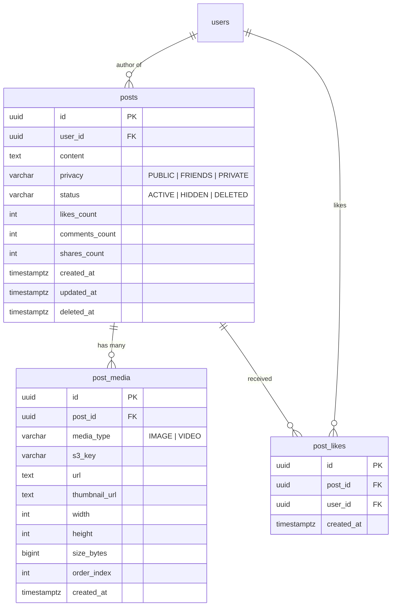
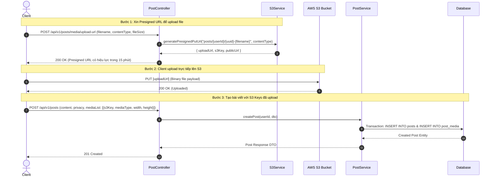
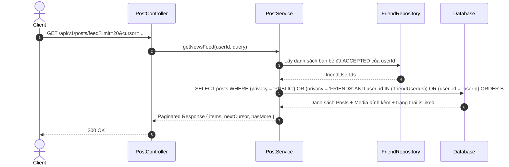
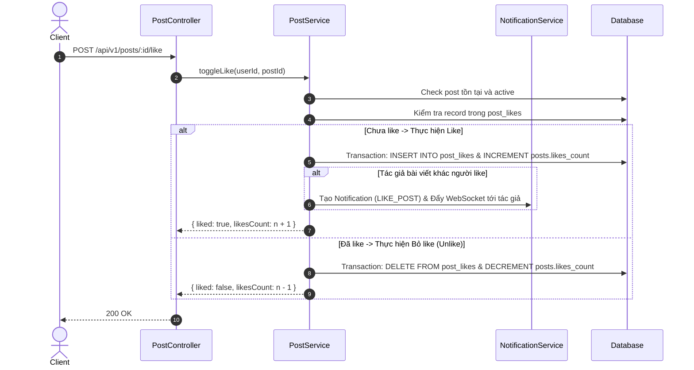

# Thiết kế cơ bản (Basic Design): Module Post (Quản lý Bài viết)

Tài liệu thiết kế cơ bản cho chức năng quản lý bài viết (**Post Management**), tích hợp tải lên tệp đa phương tiện (ảnh, video) qua **AWS S3 Presigned URL**, quyền riêng tư và tương tác bài viết cho hệ thống Social Network API.

---

## 1. Tổng quan & Mục tiêu

Module **Post** chịu trách nhiệm cung cấp các tính năng cốt lõi của mạng xã hội liên quan đến tạo và hiển thị nội dung:
- Cho phép người dùng tạo bài viết với nội dung văn bản (text) và đính kèm nhiều hình ảnh/video.
- Tích hợp **AWS S3 Presigned URL** giúp client tải trực tiếp hình ảnh/video lên S3 mà không gây nghẽn băng thông backend API.
- Hỗ trợ thiết lập quyền riêng tư cho bài viết: Công khai (`PUBLIC`), Bạn bè (`FRIENDS`), Riêng tư (`PRIVATE`).
- Cung cấp danh sách bài viết trên Bảng tin (News Feed) theo thuật toán thời gian thực và phân trang Cursor-based Pagination.
- Hỗ trợ các tương tác cơ bản: Chỉnh sửa, Xóa bài viết (Soft Delete), Thả tim (Like/Unlike bài viết).

---

## 2. Mô hình dữ liệu (Data Model)

Kế thừa cấu trúc từ `BaseEntity` (`id` UUID v4, `created_at`, `updated_at`, `deleted_at`).

### 2.1. Bảng `posts` (Bài viết)

| Tên cột | Kiểu dữ liệu | Bắt buộc | Khóa / Chỉ mục | Mô tả / Giá trị mặc định |
| :--- | :--- | :---: | :---: | :--- |
| `id` | UUID | Có | PK | Khóa chính tự sinh (UUID v4) |
| `user_id` | UUID | Có | FK, Index | ID tác giả bài viết (tham chiếu `users.id`) |
| `content` | TEXT | Không | - | Nội dung văn bản của bài viết |
| `privacy` | VARCHAR(20) | Có | Index | Quyền riêng tư: `PUBLIC`, `FRIENDS`, `PRIVATE` (mặc định: `PUBLIC`) |
| `status` | VARCHAR(20) | Có | Index | Trạng thái: `ACTIVE`, `HIDDEN`, `DELETED` (mặc định: `ACTIVE`) |
| `likes_count` | INT | Có | - | Số lượng lượt thích (mặc định: `0`) |
| `comments_count` | INT | Có | - | Số lượng bình luận (mặc định: `0`) |
| `shares_count` | INT | Có | - | Số lượng lượt chia sẻ (mặc định: `0`) |
| `created_at` | TIMESTAMPTZ | Có | Index (DESC) | Thời gian tạo bài viết |
| `updated_at` | TIMESTAMPTZ | Có | - | Thời gian chỉnh sửa bài viết |
| `deleted_at` | TIMESTAMPTZ | Không | - | Thời gian xóa mềm |

### 2.2. Bảng `post_media` (Tệp đính kèm bài viết - Lưu trên S3)

| Tên cột | Kiểu dữ liệu | Bắt buộc | Khóa / Chỉ mục | Mô tả / Giá trị mặc định |
| :--- | :--- | :---: | :---: | :--- |
| `id` | UUID | Có | PK | Khóa chính tự sinh (UUID v4) |
| `post_id` | UUID | Có | FK, Index | ID bài viết (tham chiếu `posts.id`, ON DELETE CASCADE) |
| `media_type` | VARCHAR(20) | Có | - | Loại media: `IMAGE`, `VIDEO`, `DOCUMENT` |
| `s3_key` | VARCHAR(500) | Có | - | S3 Key lưu trữ trong S3 Bucket (`posts/{userId}/{filename}`) |
| `url` | TEXT | Có | - | Đường dẫn công khai hoặc S3 Object URL |
| `thumbnail_url` | TEXT | Không | - | Ảnh đại diện thumbnail (đối với video) |
| `width` | INT | Không | - | Chiều rộng ảnh/video (pixels) |
| `height` | INT | Không | - | Chiều cao ảnh/video (pixels) |
| `size_bytes` | BIGINT | Không | - | Dung lượng tệp tính bằng bytes |
| `order_index` | INT | Có | - | Thứ tự hiển thị trong album ảnh/video (mặc định: `0`) |
| `created_at` | TIMESTAMPTZ | Có | - | Thời gian tải lên |

### 2.3. Bảng `post_likes` (Lượt thích bài viết)

| Tên cột | Kiểu dữ liệu | Bắt buộc | Khóa / Chỉ mục | Mô tả / Giá trị mặc định |
| :--- | :--- | :---: | :---: | :--- |
| `id` | UUID | Có | PK | Khóa chính tự sinh (UUID v4) |
| `post_id` | UUID | Có | FK, Composite UK | ID bài viết được thích |
| `user_id` | UUID | Có | FK, Composite UK | ID người dùng thích bài viết |
| `created_at` | TIMESTAMPTZ | Có | - | Thời gian thích |

*Ràng buộc duy nhất*: `UNIQUE(post_id, user_id)` để đảm bảo 1 người chỉ like 1 bài viết 1 lần.

### 2.4. Các Enums liên quan

```typescript
export enum PostPrivacy {
  PUBLIC = 'PUBLIC',
  FRIENDS = 'FRIENDS',
  PRIVATE = 'PRIVATE',
}

export enum PostStatus {
  ACTIVE = 'ACTIVE',
  HIDDEN = 'HIDDEN',
  DELETED = 'DELETED',
}

export enum MediaType {
  IMAGE = 'IMAGE',
  VIDEO = 'VIDEO',
  DOCUMENT = 'DOCUMENT',
}
```

### 2.5. Sơ đồ thực thể quan hệ (ERD)



---

## 3. Luồng xử lý nghiệp vụ (Business Workflows)

### 3.1. Luồng Tạo bài viết kèm Media qua AWS S3 Presigned URL



### 3.2. Luồng Lấy Bảng tin (News Feed)



### 3.3. Luồng Like / Unlike Bài viết



---

## 4. Đặc tả API Endpoints

Tiền tố chung: `/api/v1/posts`

### 4.1. `POST /api/v1/posts/media/upload-url`
- **Mô tả**: Lấy URL Presigned S3 để upload ảnh/video cho bài viết.
- **Quyền truy cập**: Authenticated (`Bearer <accessToken>`).
- **Request Body**:
  ```json
  {
    "fileName": "vacation.jpg",
    "contentType": "image/jpeg",
    "fileSize": 2048500
  }
  ```
- **Validation**:
  - `contentType`: Phải thuộc định dạng cho phép: `image/jpeg`, `image/png`, `image/webp`, `video/mp4`, `video/quicktime`.
  - `fileSize`: Tối đa 50MB đối với video, tối đa 10MB đối với hình ảnh.
- **Response**: `200 OK`
  ```json
  {
    "statusCode": 200,
    "data": {
      "uploadUrl": "https://social-bucket-366518187546.s3.amazonaws.com/posts/b6a82741.../vacation.jpg?X-Amz-Signature=...",
      "s3Key": "posts/b6a82741-2cbe-4c4f-a9cb-b61005d58ff3/uuid-vacation.jpg",
      "fileUrl": "https://social-bucket-366518187546.s3.amazonaws.com/posts/b6a82741-2cbe-4c4f-a9cb-b61005d58ff3/uuid-vacation.jpg",
      "expiresIn": 900
    }
  }
  ```

---

### 4.2. `POST /api/v1/posts`
- **Mô tả**: Tạo bài viết mới kèm danh sách media đã tải lên S3.
- **Quyền truy cập**: Authenticated (`Bearer <accessToken>`).
- **Request Body**:
  ```json
  {
    "content": "Hôm nay thời tiết thật đẹp cùng bạn bè!",
    "privacy": "PUBLIC",
    "media": [
      {
        "s3Key": "posts/b6a82741.../uuid-vacation.jpg",
        "mediaType": "IMAGE",
        "url": "https://social-bucket-366518187546.s3.amazonaws.com/posts/b6a82741.../uuid-vacation.jpg",
        "width": 1920,
        "height": 1080,
        "sizeBytes": 2048500,
        "orderIndex": 0
      }
    ]
  }
  ```
- **Response**: `201 Created`
  ```json
  {
    "statusCode": 201,
    "data": {
      "id": "e4b3e811-9a42-4f36-8a71-6c1cf6ec32b9",
      "author": {
        "id": "b6a82741-2cbe-4c4f-a9cb-b61005d58ff3",
        "username": "user123",
        "fullName": "Nguyen Van A",
        "avatarUrl": "https://..."
      },
      "content": "Hôm nay thời tiết thật đẹp cùng bạn bè!",
      "privacy": "PUBLIC",
      "likesCount": 0,
      "commentsCount": 0,
      "sharesCount": 0,
      "isLiked": false,
      "media": [
        {
          "id": "7fa1bc82-0192-4f2a-8c65-b1a9e88029d1",
          "mediaType": "IMAGE",
          "url": "https://social-bucket-366518187546.s3.amazonaws.com/...",
          "orderIndex": 0
        }
      ],
      "createdAt": "2026-10-02T17:00:00.000Z",
      "updatedAt": "2026-10-02T17:00:00.000Z"
    }
  }
  ```

---

### 4.3. `GET /api/v1/posts/feed`
- **Mô tả**: Lấy danh sách bài viết trang chủ News Feed theo phân trang Cursor.
- **Quyền truy cập**: Authenticated (`Bearer <accessToken>`).
- **Query Params**:
  - `limit`: Số bài viết mỗi trang (mặc định: `10`, tối đa: `50`).
  - `cursor`: UUID hoặc timestamp của bài viết trước đó để lấy trang tiếp theo.
- **Response**: `200 OK`
  ```json
  {
    "statusCode": 200,
    "data": {
      "items": [
        {
          "id": "e4b3e811-9a42-4f36-8a71-6c1cf6ec32b9",
          "author": {
            "id": "b6a82741-2cbe-4c4f-a9cb-b61005d58ff3",
            "username": "user123",
            "fullName": "Nguyen Van A",
            "avatarUrl": "https://..."
          },
          "content": "Hôm nay thời tiết thật đẹp cùng bạn bè!",
          "privacy": "PUBLIC",
          "likesCount": 15,
          "commentsCount": 3,
          "isLiked": true,
          "media": [],
          "createdAt": "2026-10-02T17:00:00.000Z"
        }
      ],
      "pagination": {
        "nextCursor": "e4b3e811-9a42-4f36-8a71-6c1cf6ec32b9",
        "hasMore": true
      }
    }
  }
  ```

---

### 4.4. `GET /api/v1/posts/:id`
- **Mô tả**: Xem chi tiết bài viết (kiểm tra quyền riêng tư của người xem).
- **Quyền truy cập**: Authenticated (`Bearer <accessToken>`).
- **Response**: `200 OK` hoặc `403 Forbidden` / `404 Not Found`.

---

### 4.5. `PATCH /api/v1/posts/:id`
- **Mô tả**: Chỉnh sửa nội dung và quyền riêng tư bài viết (chỉ chủ bài viết mới được sửa).
- **Quyền truy cập**: Authenticated (`Bearer <accessToken>`).
- **Request Body**:
  ```json
  {
    "content": "Nội dung cập nhật...",
    "privacy": "FRIENDS"
  }
  ```
- **Response**: `200 OK`

---

### 4.6. `DELETE /api/v1/posts/:id`
- **Mô tả**: Xóa bài viết (Soft Delete, cập nhật `deleted_at`).
- **Quyền truy cập**: Authenticated (`Bearer <accessToken>`).
- **Response**: `200 OK`

---

### 4.7. `POST /api/v1/posts/:id/like`
- **Mô tả**: Bật/Tắt thích bài viết (Toggle Like/Unlike).
- **Quyền truy cập**: Authenticated (`Bearer <accessToken>`).
- **Response**: `200 OK`
  ```json
  {
    "statusCode": 200,
    "data": {
      "liked": true,
      "likesCount": 16
    }
  }
  ```

---

## 5. Kiến trúc & Bảo mật S3

1. **Bảo vệ S3 Presigned URL**:
   - URL tải lên giới hạn thời gian tồn tại `15 phút`.
   - Tiền tố đường dẫn được phân lập theo người dùng: `posts/{userId}/{uuid}-{fileName}` ngăn chặn ghi đè tệp người khác.
2. **Quyền riêng tư bài viết**:
   - Áp dụng kiểm tra quan hệ bạn bè từ module Friend trước khi cho phép xem bài viết có `privacy = 'FRIENDS'`.
3. **Hiệu năng cơ sở dữ liệu**:
   - Đánh index kết hợp trên `(user_id, created_at DESC)` và `(privacy, created_at DESC)`.
   - Cursor pagination tránh độ trễ cao của `OFFSET` lớn trong PostgreSQL.
